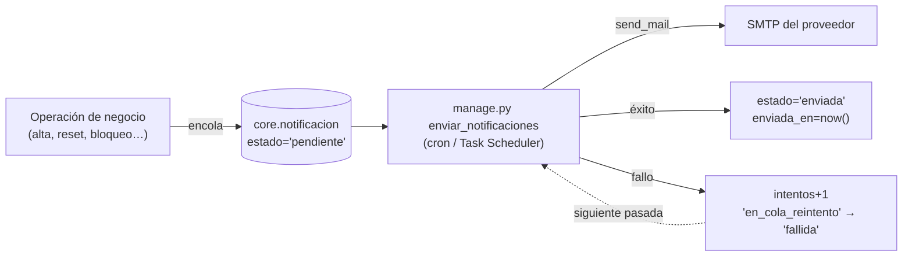

# NovaERP — Conectar el servicio de correo (RF-25)

Guía operativa para pasar del backend de consola (desarrollo) a entrega real por
SMTP. Cubre configuración, proveedores, cómo programar el worker, cómo leer la
cola y qué hacer cuando algo no sale.

> Requisitos: el `.env` ya configurado (ver [`.env.example`](../.env.example) y
> el paso 5 del [README](../README.md)). **No hace falta instalar nada**: se usa
> el framework de correo de Django, que ya viene con el proyecto.

---

## 1. Cómo funciona

El envío es **asíncrono a propósito**. Ninguna operación de negocio espera al
servidor de correo: si el SMTP está caído, el alta de usuario igual se completa.



Dos piezas, y las dos tienen que estar bien para que llegue un correo:

| Pieza | Qué es | Si falta |
|---|---|---|
| **Configuración SMTP** | Las variables `EMAIL_*` del `.env` | Los correos se encolan pero nunca salen (o se imprimen en consola) |
| **El worker** | `manage.py enviar_notificaciones`, programado | La cola crece y nadie la drena |

Es el error más común del despliegue: configurar el SMTP y olvidar programar el
worker. La cola se llena en silencio y nadie se entera hasta que un usuario
reclama que no le llegó su enlace.

---

## 2. Qué correos emite el sistema

Todos se encolan igual y salen por el mismo worker:

| Disparador | Asunto | Contiene |
|---|---|---|
| Alta de tenant (RF-01) | Activación de su cuenta NovaERP | Token de activación, 24 h. Enlaza a `/activar-organizacion`, **no** a `/activar`: el admin inicial activa usuario y tenant en cascada, y `/activar` exige que el tenant ya esté activo. |
| Reenvío de activación (tenant) | Activación de su cuenta NovaERP | Token nuevo (rota el anterior), 24 h. Mismo destino que el de alta. |
| Alta de usuario (RF-05) | Activación de su cuenta NovaERP | Token de activación, 24 h |
| Cambio de correo (RF-07) | Confirme su nueva dirección NovaERP | Token de verificación, 24 h |
| Reenvío de activación (usuario) | El que corresponda a su estado: activación si está `pendiente`, confirmación si está `pendiente_verificacion` | Token nuevo (rota el anterior), 24 h |
| Restablecer contraseña (RF-18) | Restablecimiento de contraseña NovaERP | Token de un solo uso, **1 h** |
| Cuenta bloqueada (RF-25 / RF-16) | Alerta de seguridad: cuenta bloqueada | Sin credenciales: solo el evento y la referencia a la bitácora |

**Solo RF-18 depende realmente del correo.** El alta de tenant y de usuario
devuelven el token en la respuesta de la API (conveniencia de desarrollo), así
que puedes activar cuentas sin SMTP. El restablecimiento de contraseña no: si el
correo no sale, el usuario queda sin forma de recuperar su acceso.

---

## 3. Configuración por entorno

### 3.1 Desarrollo — consola (por defecto)

```dotenv
EMAIL_BACKEND=django.core.mail.backends.console.EmailBackend
```

El worker imprime el correo completo en el terminal y marca la notificación como
`enviada`. No sale nada a la red. Es lo que quieres para trabajar.

### 3.2 Desarrollo — archivos en disco

Útil si necesitas revisar los correos después, o si el terminal se te llena:

```dotenv
EMAIL_BACKEND=django.core.mail.backends.filebased.EmailBackend
EMAIL_FILE_PATH=C:/nova/back2/novaerp-backend/tmp/correos
```

Cada envío queda como un `.log` en esa carpeta. Créala antes; Django no la crea.

> `EMAIL_FILE_PATH` no está en `settings.py`. Si usas este backend, añádelo a
> mano junto a las demás `EMAIL_*`.

### 3.3 Despliegue — SMTP real

```dotenv
EMAIL_BACKEND=django.core.mail.backends.smtp.EmailBackend
EMAIL_HOST=smtp.tu-proveedor.com
EMAIL_PORT=587
EMAIL_HOST_USER=tu-usuario
EMAIL_HOST_PASSWORD=tu-secreto
EMAIL_USE_TLS=True
EMAIL_USE_SSL=False
EMAIL_TIMEOUT=20
DEFAULT_FROM_EMAIL=no-reply@tudominio.com
```

Tres cosas que se equivocan siempre:

1. **`EMAIL_USE_TLS` y `EMAIL_USE_SSL` son excluyentes.** TLS va con el puerto
   587 (STARTTLS: la conexión empieza en claro y se cifra); SSL con el 465 (TLS
   implícito desde el primer byte). Poner ambos en `True` ahora revienta al
   arrancar con un mensaje explícito, en vez de fallar al primer envío.
2. **`DEFAULT_FROM_EMAIL` debe ser un buzón que el proveedor te autoriza a usar.**
   No es un campo decorativo: si mandas desde `no-reply@tudominio.com` por un
   SMTP que solo autoriza `otra-cosa@proveedor.com`, el correo se rechaza o cae
   directo en spam.
3. **`EMAIL_TIMEOUT` no es opcional en la práctica.** Sin él, un SMTP que acepta
   la conexión pero no responde cuelga la pasada del worker para siempre y la
   cola deja de drenarse por completo.

---

## 4. Proveedores concretos

| Proveedor | `EMAIL_HOST` | Puerto | `EMAIL_HOST_USER` | Contraseña |
|---|---|---|---|---|
| **Gmail / Google Workspace** | `smtp.gmail.com` | 587 (TLS) | tu dirección completa | **App Password**, no la del correo |
| **Microsoft 365** | `smtp.office365.com` | 587 (TLS) | tu dirección completa | la de la cuenta (o App Password si hay MFA) |
| **SendGrid** | `smtp.sendgrid.net` | 587 (TLS) | literalmente `apikey` | la API key |
| **Mailgun** | `smtp.mailgun.org` | 587 (TLS) | `postmaster@tu-dominio.mailgun.org` | la SMTP password del dominio |
| **Amazon SES** | `email-smtp.<region>.amazonaws.com` | 587 (TLS) | SMTP username de SES | SMTP password de SES |
| **Postfix local** | `localhost` | 25 | *(vacío)* | *(vacío)* |

### Gmail: el paso que falta

Google **no acepta tu contraseña normal** por SMTP desde 2022. Necesitas:

1. Activar la verificación en dos pasos en la cuenta.
2. Generar una *App Password* (contraseña de aplicación) de 16 caracteres.
3. Usar esa en `EMAIL_HOST_PASSWORD`, sin espacios.

Sirve para pruebas y volumen bajo. Para producción real usa un proveedor
transaccional (SendGrid, Mailgun, SES): Gmail limita el envío diario y no te da
reportes de entrega.

### Amazon SES: el sandbox

Una cuenta SES nueva está en *sandbox*: **solo puede enviar a direcciones
verificadas**. Si tus correos "se envían" pero no llegan a usuarios reales, es
casi siempre esto. Hay que pedir la salida del sandbox por consola de AWS.

---

## 5. Probar la conexión antes de depender de ella

Prueba directa al SMTP, sin pasar por la cola:

```bash
python manage.py shell -c "from django.core.mail import send_mail; send_mail('Prueba NovaERP', 'Si lees esto, el SMTP responde.', None, ['tu-correo@ejemplo.com'], fail_silently=False)"
```

`None` como remitente hace que Django use `DEFAULT_FROM_EMAIL`, que es lo mismo
que hace el worker. `fail_silently=False` es lo importante: sin eso los errores
se tragan y parece que funcionó.

Qué significa cada fallo:

| Error | Causa |
|---|---|
| `SMTPAuthenticationError` | Usuario/contraseña mal. En Gmail: no usaste App Password. |
| `SMTPSenderRefused` | `DEFAULT_FROM_EMAIL` no está autorizado por el proveedor. |
| `SMTPRecipientsRefused` | Destinatario rechazado (en SES: sandbox). |
| `ConnectionRefusedError` | Host/puerto mal, o un firewall bloquea la salida. |
| `SSLError` / `wrong version number` | TLS y SSL confundidos: revisa puerto vs. bandera. |
| Se cuelga y no vuelve | Falta `EMAIL_TIMEOUT`, y el puerto está filtrado. |

---

## 6. Programar el worker

El comando procesa la cola una vez y termina. Hay que ejecutarlo periódicamente.

```bash
python manage.py enviar_notificaciones
```

Acepta `--limite N` para acotar cuántas procesa por pasada (útil si la cola se
acumuló y no quieres saturar el SMTP de golpe).

### Linux — cron cada minuto

```cron
* * * * * cd /srv/novaerp-backend && /srv/novaerp-backend/venv/bin/python manage.py enviar_notificaciones >> /var/log/novaerp/correo.log 2>&1
```

### Linux — systemd timer (preferible)

`/etc/systemd/system/novaerp-correo.service`:

```ini
[Unit]
Description=NovaERP - worker de notificaciones (RF-25)

[Service]
Type=oneshot
WorkingDirectory=/srv/novaerp-backend
ExecStart=/srv/novaerp-backend/venv/bin/python manage.py enviar_notificaciones
User=novaerp
```

`/etc/systemd/system/novaerp-correo.timer`:

```ini
[Unit]
Description=Drena la cola de notificaciones cada minuto

[Timer]
OnBootSec=1min
OnUnitActiveSec=1min
AccuracySec=10s

[Install]
WantedBy=timers.target
```

```bash
sudo systemctl enable --now novaerp-correo.timer
sudo systemctl list-timers novaerp-correo.timer
```

Sobre cron: el timer no se solapa consigo mismo (`Type=oneshot` espera a que
termine), registra en journald y sobrevive a reinicios de forma explícita.

### Windows — Task Scheduler

```powershell
$accion = New-ScheduledTaskAction `
  -Execute "C:\nova\back2\novaerp-backend\venv\Scripts\python.exe" `
  -Argument "manage.py enviar_notificaciones" `
  -WorkingDirectory "C:\nova\back2\novaerp-backend"

$disparador = New-ScheduledTaskTrigger -Once -At (Get-Date) `
  -RepetitionInterval (New-TimeSpan -Minutes 1)

Register-ScheduledTask -TaskName "NovaERP - correo" `
  -Action $accion -Trigger $disparador `
  -Description "RF-25: drena core.notificacion cada minuto"
```

`-WorkingDirectory` es obligatorio: sin él, el proceso arranca en `system32`, no
encuentra `manage.py` y la tarea falla en silencio.

Para ver si corre: `Get-ScheduledTaskInfo -TaskName "NovaERP - correo"`.

---

## 7. Operar la cola

La cola es una tabla; puedes consultarla con SQL.

**Estado general:**

```sql
SELECT estado, count(*), max(created_at) AS mas_reciente
  FROM core.notificacion
 GROUP BY estado;
```

**Qué está atorado y por qué:**

```sql
SELECT id, asunto, intentos, estado, created_at
  FROM core.notificacion
 WHERE estado IN ('pendiente', 'en_cola_reintento', 'fallida')
 ORDER BY created_at DESC
 LIMIT 20;
```

### Los cuatro estados

| Estado | Significa |
|---|---|
| `pendiente` | Recién encolada, el worker no la ha tomado |
| `en_cola_reintento` | Falló, se reintentará en la siguiente pasada |
| `enviada` | El SMTP la aceptó (**no** garantiza que llegó al buzón) |
| `fallida` | Agotó los 3 intentos. **No se reintenta más.** |

### Reintentar las fallidas

Tras arreglar el SMTP, las `fallida` no se recuperan solas. Hay que reencolarlas:

```sql
UPDATE core.notificacion
   SET estado = 'pendiente', intentos = 0
 WHERE estado = 'fallida'
   AND created_at > now() - interval '24 hours';
```

El filtro de fecha importa: reencolar notificaciones viejas manda tokens **ya
vencidos**, que solo generan confusión en quien los recibe.

### Cuidado con el reintento rápido

El worker no tiene *backoff*: con cron cada minuto y un SMTP caído, una
notificación quema sus 3 intentos en 3 minutos y queda `fallida` para siempre.
Si sabes que el proveedor va a estar caído un rato, **detén el worker** en vez de
dejarlo consumir los reintentos contra una pared.

---

## 8. Entregabilidad: que no caiga en spam

Que el SMTP acepte el correo (`estado='enviada'`) no significa que llegue a la
bandeja de entrada. Para un dominio propio necesitas los tres registros DNS:

| Registro | Para qué | Ejemplo |
|---|---|---|
| **SPF** | Declara qué servidores pueden enviar por tu dominio | `v=spf1 include:sendgrid.net ~all` |
| **DKIM** | Firma criptográfica de cada correo | Lo da el proveedor; se publica como CNAME o TXT |
| **DMARC** | Qué hacer si SPF/DKIM fallan, y a dónde reportar | `v=DMARC1; p=none; rua=mailto:dmarc@tudominio.com` |

Empieza DMARC en `p=none` (solo observar). Súbelo a `quarantine` y luego a
`reject` cuando los reportes confirmen que todo tu correo legítimo pasa.

Consejos que importan aquí en concreto:

- **Un dominio dedicado o subdominio** para el transaccional (`mail.tudominio.com`)
  protege la reputación del dominio principal.
- Los correos de NovaERP son **texto plano**, sin enlaces acortados ni imágenes:
  eso ya juega a favor de la entregabilidad.
- Los asuntos de activación y "alerta de seguridad" son los que más se filtran.
  Verifica específicamente esos dos en Gmail y Outlook antes de dar por bueno el
  despliegue.

---

## 9. Diagnóstico rápido

| Síntoma | Revisa |
|---|---|
| La cola crece y nada cambia de estado | El worker no está programado, o corre desde el directorio equivocado |
| Todo sale `enviada` pero no llega nada | `EMAIL_BACKEND` sigue en `console` |
| `enviada` real pero no llega | SPF/DKIM ausentes (spam), o SES en sandbox |
| Todo pasa a `fallida` de inmediato | Credenciales SMTP mal — pruébalas con el `send_mail` de §5 |
| Una sola notificación falla siempre | Puede no tener destinatario (`usuario_id` nulo) |
| El worker se cuelga | Falta `EMAIL_TIMEOUT`; mátalo y añádelo |
| Funciona en dev, falla como servicio | El servicio no lee el `.env` — ahora se carga por ruta absoluta, pero verifica que el archivo exista junto a `manage.py` |

Para ver qué pasa en cada pasada, sube el detalle del registro:

```dotenv
LOG_LEVEL=DEBUG
```

---

## 10. Limitaciones conocidas

Cosas ciertas del estado actual, para que no te sorprendan:

- **Solo canal `email`.** La tabla admite `webhook` y `slack`, pero el worker los
  rechaza: no existe configuración de canal por tenant en el esquema de Fase 0.
- **Sin backoff exponencial.** Tres intentos a la cadencia del cron, y a `fallida`.
- **Los tokens viajan en el cuerpo y se quedan en la tabla.** `core.notificacion.cuerpo`
  guarda el token de activación **en claro**, y la fila no se borra tras enviarse.
  Quien pueda leer esa tabla puede activar cuentas ajenas mientras el token siga
  vigente. Mitiga: los tokens caducan (24 h / 1 h) y son de un solo uso, pero
  conviene una purga periódica:

  ```sql
  DELETE FROM core.notificacion
   WHERE estado = 'enviada'
     AND enviada_en < now() - interval '30 days';
  ```

  Restringir el acceso de lectura a `core.notificacion` al rol de la aplicación
  es igual de importante que restringirlo a `core.usuario`.
- **`enviada` significa "el SMTP la aceptó"**, no "el destinatario la recibió".
  No hay tracking de rebotes; para eso hace falta el webhook del proveedor.
- **El worker no tiene bloqueo entre instancias.** Dos ejecuciones simultáneas
  pueden tomar la misma notificación y enviarla dos veces. Con un solo scheduler
  no ocurre; si escalas a varias máquinas, programa el worker en **una sola**.

---

## 11. Lista de verificación del despliegue

```
[ ] EMAIL_BACKEND = ...smtp.EmailBackend  (no console)
[ ] EMAIL_HOST / PORT / USER / PASSWORD completos
[ ] EMAIL_USE_TLS xor EMAIL_USE_SSL (uno de los dos, nunca ambos)
[ ] EMAIL_TIMEOUT definido
[ ] DEFAULT_FROM_EMAIL es un buzón autorizado por el proveedor
[ ] La prueba de §5 llega a un buzón real
[ ] SPF, DKIM y DMARC publicados en el DNS del dominio
[ ] El worker está programado (cron / timer / Task Scheduler) y se ve corriendo
[ ] Programado en UNA sola máquina
[ ] Alguien vigila: SELECT count(*) FROM core.notificacion WHERE estado='fallida'
```

Ese último `SELECT` es el que conviene poner en un tablero. Es la única señal
temprana de que el correo dejó de funcionar antes de que un usuario lo reporte.
