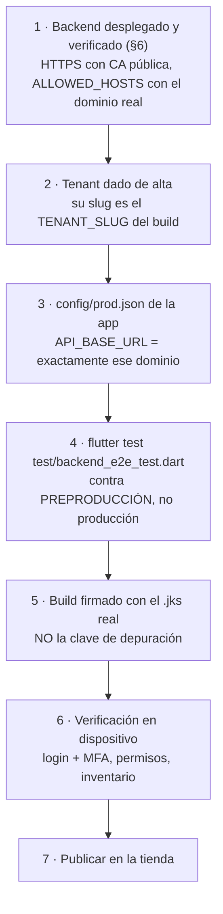
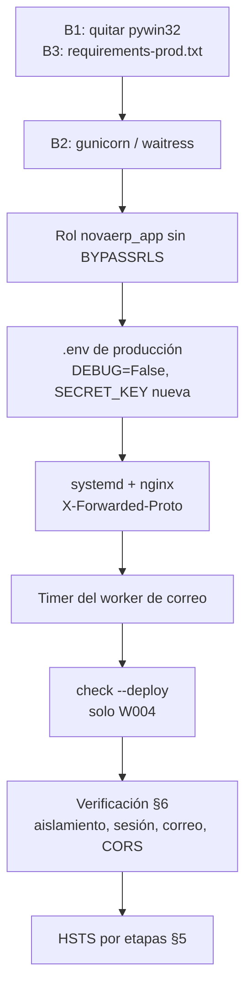

# NovaERP — Guía de despliegue

Guía operativa para llevar el backend de desarrollo a un servidor. Cubre el
estado real del proyecto, lo que hay que corregir **antes** de publicar, el
procedimiento paso a paso y la verificación posterior.

> Documentos hermanos:
> [`README.md`](../README.md) (instalación y desarrollo) ·
> [`.env.example`](../.env.example) (todas las variables) ·
> [`docs/DESPLIEGUE-CORREO.md`](DESPLIEGUE-CORREO.md) (SMTP y worker de correo) ·
> [`novaerp-mobile/DESPLIEGUE-MOVIL.md`](../../novaerp-mobile/DESPLIEGUE-MOVIL.md)
> (la app Flutter; **§8 de esta guía** cubre cómo empatar ambos despliegues).

---

## 0. Veredicto: ¿está listo?

**La aplicación sí; el paquete de despliegue no todavía.** El código y la
configuración están preparados para producción, pero faltan tres piezas de
empaquetado sin las cuales el despliegue no arranca en un servidor Linux.

### Lo que ya está resuelto

| Área | Estado | Evidencia |
|---|---|---|
| Configuración por entorno | ✅ | `settings.py` lee todo del `.env`; un solo archivo para todos los entornos |
| Defaults seguros | ✅ | `DEBUG=False` por defecto; falta de `SECRET_KEY`/`ALLOWED_HOSTS`/`CORS`/DB revienta con `ImproperlyConfigured` en el arranque, no sirve inseguro en silencio |
| `manage.py check --deploy` | ✅ | Limpio salvo `security.W004` (HSTS), que es **intencional** — ver §5 |
| Endurecimiento HTTPS | ✅ | `SECURE_SSL_REDIRECT`, `CSRF_COOKIE_SECURE`, `NOSNIFF`, `X_FRAME_OPTIONS=DENY`, HSTS por etapas |
| Aislamiento multi-tenant | ✅ | RLS en el motor + GUCs `app.current_tenant_id` / `app.is_sysadmin` publicados con `set_config(..., is_local=true)` |
| Conexiones persistentes | ✅ | `CONN_MAX_AGE=60` es **seguro** aquí: los GUCs son de transacción (`is_local=true`), se descartan al commit y no se filtran entre peticiones que reutilizan la conexión |
| Esquema de base de datos | ✅ | Fuente de verdad en `db.sql` + `sql/`; modelos `managed=False` (80 tablas), sin migraciones que aplicar ni tablas `django_*` |
| Timeouts | ✅ | `statement_timeout` en la DB (30 s) y `EMAIL_TIMEOUT` (20 s) |
| Secretos fuera del repo | ✅ | `.env` en `.gitignore`; `.env.example` documentado |
| Correo asíncrono | ✅ | Cola en `core.notificacion` + worker `enviar_notificaciones` |
| Logging | ✅ | A consola, para que lo recoja systemd/Docker |

### Lo que falta — bloqueantes

| # | Problema | Impacto |
|---|---|---|
| **B1** | `requirements.txt` incluye `pywin32==312` | **`pip install -r requirements.txt` falla en Linux.** No existe distribución para esa plataforma. El despliegue se detiene aquí. |
| **B2** | No hay servidor WSGI de producción | `runserver` **no** debe usarse en producción (un solo hilo, sin límites, sin manejo de carga). No hay `gunicorn` ni `waitress` en las dependencias. |
| **B3** | `requirements.txt` mezcla herramientas de desarrollo | `repomix`, `mcp`, `tree-sitter*`, `detect-secrets`, `tiktoken`, `prompt_toolkit`, `questionary`, `pyperclip` y sus dependencias no los usa la aplicación. Son ~30 paquetes de superficie de ataque y peso innecesarios en el servidor. |
| **B4** | `SECRET_KEY` no se puede rotar sin bloquear a todos los usuarios | La clave cifra los `mfa_secret`, y el login no maneja un secreto ilegible: bloqueo permanente. El único mecanismo de emergencia ante una filtración hoy no es ejecutable. **Detalle y mitigación en §7.1** |

### Lo que falta — recomendable (no bloquea)

| # | Hueco | Por qué importa |
|---|---|---|
| R1 | No hay endpoint de salud (`/health`) | El balanceador, el monitor y el orquestador necesitan un chequeo barato para saber si la instancia está viva |
| R2 | No hay `Dockerfile` / unidad `systemd` / config de nginx | El procedimiento queda manual; §4 lo cubre con plantillas |
| R3 | `tests.py` son plantillas vacías en las 10 apps | No hay puerta automática antes de publicar. La app móvil sí trae suite (`flutter test`, 27 pruebas, más `backend_e2e_test.dart` contra un backend real): úsela como verificación de integración |
| R4 | Cadena de timeouts no monótona con la app móvil | La app se rinde a los 20 s y la base sigue hasta 30 s: errores fantasma y **riesgo de duplicar movimientos de inventario** al reintentar. Se corrige con una variable del `.env` — **§8.3** |

**Resuelva B1–B3 (§1) y el backend queda desplegable.** B4 no impide publicar,
pero deje resuelto el plan de §7.1 antes de que haga falta.

---

## 1. Corregir los bloqueantes

### B1 + B3 — Dependencias reales de la aplicación

El código de la aplicación solo importa: `django`, `corsheaders`, `psycopg`,
`dotenv`, `jwt`, `cryptography`, `reportlab`. Todo lo demás en el
`requirements.txt` actual es herramienta de desarrollo o dependencia transitiva
de esa herramienta.

Cree **`requirements-prod.txt`** con lo que el servidor realmente necesita:

```
# --- Aplicación ---
Django==6.0.7
django-cors-headers==4.9.0
psycopg==3.3.4
psycopg-binary==3.3.4
python-dotenv==1.2.2
PyJWT==2.13.0
cryptography==49.0.0
reportlab==5.0.0
pillow==12.3.0          # reportlab lo necesita para imágenes en los PDF

# --- Servidor de aplicación (B2) ---
gunicorn==23.0.0        # Linux
# waitress==3.0.2       # Windows (gunicorn no corre en Windows)

# --- Transitivas fijadas ---
asgiref==3.11.1
sqlparse==0.5.5
tzdata==2026.3
cffi==2.1.0
pycparser==3.0
```

> `pywin32` desaparece: es específico de Windows y no lo usa la aplicación.
> Si despliega **en Windows**, use `waitress` en vez de `gunicorn` (§4B).

Valide que el conjunto es suficiente en un entorno limpio antes de publicar:

```bash
python -m venv /tmp/verifica && /tmp/verifica/bin/pip install -r requirements-prod.txt && DJANGO_SETTINGS_MODULE=novaerp_backend.settings /tmp/verifica/bin/python manage.py check
```

Mantenga el `requirements.txt` actual para desarrollo, o renómbrelo a
`requirements-dev.txt` con `-r requirements-prod.txt` en la primera línea.

### B2 — Servidor de aplicación

`WSGI_APPLICATION` ya apunta a `novaerp_backend.wsgi.application`, así que
gunicorn funciona sin tocar código. Los parámetros base:

```bash
gunicorn novaerp_backend.wsgi:application --bind 127.0.0.1:8000 --workers 3 --timeout 60 --access-logfile - --error-logfile -
```

| Parámetro | Criterio |
|---|---|
| `--workers` | `2 × núcleos + 1`. Con 1 núcleo → 3. **Ojo:** cada worker mantiene su propio pool de conexiones; `workers × CONN_MAX_AGE` no debe superar `max_connections` de PostgreSQL |
| `--timeout 60` | Por encima del `statement_timeout` de la DB (30 s), para que la consulta muera antes que el worker |
| `--bind 127.0.0.1` | Solo local: el tráfico entra por el reverse proxy, nunca directo |
| `--access-logfile -` | A stdout, para que lo recoja systemd/Docker (coherente con `LOGGING`) |

> No use `uvicorn` aunque aparezca en `requirements.txt`: está ahí como
> dependencia transitiva de `mcp` (herramienta de desarrollo), no como decisión
> de arquitectura. El proyecto es WSGI síncrono con `psycopg` bloqueante.

### R1 — Endpoint de salud (recomendado)

Sin él, el balanceador solo puede comprobar TCP, que sigue respondiendo aunque
la base de datos esté caída. Un chequeo mínimo en `core/views.py`:

```python
from django.db import connection
from django.http import JsonResponse


def health(request):
    """Chequeo de vida para balanceador y monitor. Público a propósito."""
    try:
        with connection.cursor() as cur:
            cur.execute("SELECT 1")
        return JsonResponse({"estado": "ok"})
    except Exception:
        return JsonResponse({"estado": "degradado"}, status=503)
```

Y en `core/urls.py`: `path('api/health/', views.health, name='health')` — con
barra final, como el resto de las rutas del proyecto.

El `JWTCustomMiddleware` no bloquea (deja los identificadores en `None` y cada
vista decide), así que el endpoint queda público sin cambios en el middleware.
Si el balanceador consulta por IP y no por dominio, añada esa IP a
`ALLOWED_HOSTS` o Django rechazará el chequeo con 400.

---

## 2. Antes de tocar el servidor

- [ ] `requirements-prod.txt` creado y validado en entorno limpio (§1)
- [ ] `SECRET_KEY` de producción generada, **distinta** de la de desarrollo:
      `python -c "import secrets; print(secrets.token_urlsafe(64))"`
- [ ] Dominio de la API definido y DNS apuntando al servidor
- [ ] Certificado TLS emitido (Let's Encrypt o el corporativo)
- [ ] Rol de PostgreSQL de aplicación creado **sin `BYPASSRLS`** (§3)
- [ ] Credenciales SMTP obtenidas y probadas
      ([`DESPLIEGUE-CORREO.md`](DESPLIEGUE-CORREO.md))
- [ ] Origen del frontend en producción conocido (para `CORS_ALLOWED_ORIGINS`)
- [ ] Política de respaldos de la base decidida (§7)

---

## 3. Base de datos

### 3.1 Crear la base y el esquema

Con un rol **superusuario** (instala extensiones y crea el esquema):

```bash
psql -U postgres -c "CREATE DATABASE novaerp;"
psql -U postgres -d novaerp -v ON_ERROR_STOP=1 -f db.sql
for f in $(ls sql/*.sql | sort); do psql -U postgres -d novaerp -v ON_ERROR_STOP=1 -f "$f"; done
```

`ON_ERROR_STOP=1` es obligatorio: sin él, `psql` sigue tras un error y deja el
esquema a medias sin avisar. Los archivos de `sql/` se aplican **en orden
alfabético**, que es el cronológico (`2026-07-23…` → `2026-08-03…`).

### 3.2 Rol de aplicación — el punto crítico

**El aislamiento entre tenants depende de esto.** RLS está activo (`ENABLE` +
`FORCE ROW LEVEL SECURITY`) sobre todas las tablas, pero **un superusuario omite
RLS por completo**. Si la aplicación se conecta como `postgres`, las políticas
no se evalúan y cualquier tenant puede leer datos de otro.

```sql
CREATE ROLE novaerp_app LOGIN PASSWORD '<contraseña-fuerte>';
-- Sin CREATEDB, sin SUPERUSER, sin BYPASSRLS.

GRANT CONNECT ON DATABASE novaerp TO novaerp_app;
GRANT USAGE ON SCHEMA core, ventas, inventario, compras, finanzas,
                      rrhh, proyectos, bpm, bi, reglas TO novaerp_app;
GRANT SELECT, INSERT, UPDATE, DELETE ON ALL TABLES IN SCHEMA
      core, ventas, inventario, compras, finanzas,
      rrhh, proyectos, bpm, bi, reglas TO novaerp_app;
GRANT USAGE, SELECT ON ALL SEQUENCES IN SCHEMA
      core, ventas, inventario, compras, finanzas,
      rrhh, proyectos, bpm, bi, reglas TO novaerp_app;
```

No conceda DDL: los modelos son `managed=False` y la aplicación nunca altera el
esquema. Verifique que el rol quedó bien:

```sql
SELECT rolname, rolsuper, rolbypassrls FROM pg_roles WHERE rolname = 'novaerp_app';
-- Ambas columnas deben ser 'f'. Si rolbypassrls es 't', el aislamiento NO existe.
```

### 3.3 Conexiones

`CONN_MAX_AGE=60` mantiene conexiones abiertas. Dimensione:

```
workers de gunicorn × 1 conexión  +  1 (worker de correo)  ≤  max_connections − reservadas
```

Con 3 workers son 4 conexiones — holgado frente al `max_connections=100` por
defecto. Si escala a varias instancias, revise la cuenta o ponga PgBouncer en
modo *transaction* delante (compatible: los GUCs son de transacción).

---

## 4. El `.env` de producción

Cree el archivo **en el servidor**, nunca en el repositorio. Permisos
restrictivos: `chmod 600 .env && chown novaerp:novaerp .env`.

```ini
# --- Django ---
DEBUG=False
SECRET_KEY=<64+ caracteres, generada para ESTE entorno>
ALLOWED_HOSTS=api.suempresa.com
CORS_ALLOWED_ORIGINS=https://app.suempresa.com
USE_X_FORWARDED_FOR=True          # solo con reverse proxy de confianza delante

# --- PostgreSQL ---
DB_NAME=novaerp
DB_USER=novaerp_app               # NO postgres
DB_PASSWORD=<contraseña del rol>
DB_HOST=localhost
DB_PORT=5432
DB_CONN_MAX_AGE=60
DB_SSLMODE=require                # 'require' o superior si la base está en otra máquina
DB_STATEMENT_TIMEOUT_MS=30000

# --- Correo (RF-25) ---
EMAIL_BACKEND=django.core.mail.backends.smtp.EmailBackend
EMAIL_HOST=smtp.proveedor.com
EMAIL_PORT=587
EMAIL_HOST_USER=<usuario>
EMAIL_HOST_PASSWORD=<contraseña>
EMAIL_USE_TLS=True
EMAIL_USE_SSL=False
DEFAULT_FROM_EMAIL=no-reply@suempresa.com
EMAIL_TIMEOUT=20

# --- Sesiones ---
SYSADMIN_JWT_EXPIRACION_HORAS=8

# --- HTTPS ---
SECURE_SSL_REDIRECT=True
SECURE_HSTS_SECONDS=0             # súbalo por etapas, ver §5
CSRF_TRUSTED_ORIGINS=https://app.suempresa.com

# --- Regional y diagnóstico ---
LANGUAGE_CODE=es-mx
TIME_ZONE=America/Mexico_City
LOG_LEVEL=INFO
LOG_LEVEL_SQL=WARNING
STATIC_ROOT=/var/www/novaerp/static
```

⚠️ **`USE_X_FORWARDED_FOR=True` sin un proxy de confianza delante es un agujero
de auditoría**: cualquier cliente puede falsear la IP que queda registrada en la
bitácora (RF-20). Actívelo solo cuando nginx (o el balanceador) reescriba la
cabecera. Es además la señal que habilita `SECURE_PROXY_SSL_HEADER`; **sin ella,
`SECURE_SSL_REDIRECT=True` detrás de un proxy entra en bucle de redirección**
(Django ve HTTP, redirige a HTTPS, el proxy vuelve a entregar HTTP…).

---

## 4A. Despliegue en Linux (systemd + nginx)

### Instalación

```bash
sudo useradd --system --home /opt/novaerp --shell /usr/sbin/nologin novaerp
sudo mkdir -p /opt/novaerp && sudo chown novaerp:novaerp /opt/novaerp
sudo -u novaerp git clone <repo> /opt/novaerp
cd /opt/novaerp
sudo -u novaerp python3 -m venv .venv
sudo -u novaerp .venv/bin/pip install -r requirements-prod.txt
# crear .env aquí (§4), chmod 600
sudo -u novaerp .venv/bin/python manage.py collectstatic --noinput
sudo -u novaerp .venv/bin/python manage.py check --deploy
sudo -u novaerp .venv/bin/python manage.py crear_sysadmin --email root@suempresa.com
```

### `/etc/systemd/system/novaerp.service`

```ini
[Unit]
Description=NovaERP API
After=network.target postgresql.service

[Service]
Type=notify
User=novaerp
Group=novaerp
WorkingDirectory=/opt/novaerp
ExecStart=/opt/novaerp/.venv/bin/gunicorn novaerp_backend.wsgi:application \
    --bind 127.0.0.1:8000 --workers 3 --timeout 60 \
    --access-logfile - --error-logfile -
Restart=always
RestartSec=5
NoNewPrivileges=true
PrivateTmp=true
ProtectSystem=strict
ProtectHome=true
ReadWritePaths=/var/www/novaerp

[Install]
WantedBy=multi-user.target
```

### El worker de correo

Sin esto la cola crece y nadie la drena — **es el olvido más común del
despliegue**. Dos unidades:

`/etc/systemd/system/novaerp-correo.service`
```ini
[Unit]
Description=NovaERP - drenar cola de notificaciones

[Service]
Type=oneshot
User=novaerp
WorkingDirectory=/opt/novaerp
ExecStart=/opt/novaerp/.venv/bin/python manage.py enviar_notificaciones
```

`/etc/systemd/system/novaerp-correo.timer`
```ini
[Unit]
Description=NovaERP - drenar cola cada minuto

[Timer]
OnBootSec=1min
OnUnitActiveSec=1min

[Install]
WantedBy=timers.target
```

```bash
sudo systemctl daemon-reload
sudo systemctl enable --now novaerp.service novaerp-correo.timer
```

### nginx

```nginx
server {
    listen 443 ssl http2;
    server_name api.suempresa.com;

    ssl_certificate     /etc/letsencrypt/live/api.suempresa.com/fullchain.pem;
    ssl_certificate_key /etc/letsencrypt/live/api.suempresa.com/privkey.pem;
    ssl_protocols TLSv1.2 TLSv1.3;

    client_max_body_size 10M;

    location / {
        proxy_pass http://127.0.0.1:8000;
        proxy_set_header Host              $host;
        proxy_set_header X-Real-IP         $remote_addr;
        proxy_set_header X-Forwarded-For   $proxy_add_x_forwarded_for;
        proxy_set_header X-Forwarded-Proto $scheme;   # imprescindible con USE_X_FORWARDED_FOR
        proxy_read_timeout 60s;
    }
}

server {
    listen 80;
    server_name api.suempresa.com;
    return 301 https://$host$request_uri;
}
```

`X-Forwarded-Proto` es lo que evita el bucle de redirección descrito en §4.

---

## 4B. Despliegue en Windows (waitress + IIS)

`gunicorn` no funciona en Windows. Use `waitress`:

```powershell
.\.venv\Scripts\waitress-serve.exe --listen=127.0.0.1:8000 --threads=8 novaerp_backend.wsgi:application
```

- **Servicio**: registre el comando con [NSSM](https://nssm.cc/) o
  `New-Service` para que arranque solo y se reinicie ante fallos.
- **Reverse proxy**: IIS con *URL Rewrite* + *Application Request Routing*
  (ARR), reenviando `X-Forwarded-For` y `X-Forwarded-Proto`.
- **Worker de correo**: Task Scheduler cada minuto ejecutando
  `.venv\Scripts\python.exe manage.py enviar_notificaciones` — el detalle está
  en [`DESPLIEGUE-CORREO.md`](DESPLIEGUE-CORREO.md).

---

## 5. HSTS: subirlo por etapas

`manage.py check --deploy` avisa con `security.W004` porque
`SECURE_HSTS_SECONDS=0`. **Es intencional, no un descuido.** HSTS le dice al
navegador «este dominio solo por HTTPS, y recuérdalo N segundos». Con un
certificado roto y un valor alto, el dominio queda inaccesible durante todo ese
tiempo y no hay forma de revertirlo desde el servidor: el navegador ya lo
memorizó.

| Etapa | Valor | Cuándo |
|---|---|---|
| 1 | `0` | Primer despliegue. La advertencia W004 es esperada |
| 2 | `3600` (1 h) | HTTPS funcionando 24 h sin incidentes |
| 3 | `86400` (1 día) | Una semana estable |
| 4 | `31536000` (1 año) | Certificado con renovación automática probada |

`SECURE_HSTS_INCLUDE_SUBDOMAINS` y `SECURE_HSTS_PRELOAD` solo en la etapa 4, y
solo si **todos** los subdominios sirven HTTPS.

---

## 6. Verificación posterior

Como no hay suite de pruebas automatizada (R3), esta lista es la puerta.

### 6.1 Configuración

```bash
sudo -u novaerp /opt/novaerp/.venv/bin/python manage.py check --deploy
```

Debe salir **solo** `security.W004` (HSTS). Cualquier otra advertencia se
investiga antes de abrir el tráfico.

### 6.2 Arranque y proxy

```bash
systemctl status novaerp.service
curl -I http://api.suempresa.com               # → 301 a https
curl -sS https://api.suempresa.com/api/health/ # → {"estado":"ok"} (si implementó R1)
```

### 6.3 Aislamiento entre tenants — la prueba que no se salta

```sql
SELECT rolbypassrls FROM pg_roles WHERE rolname = current_user;  -- debe ser 'f'
```

Luego, con dos tenants dados de alta, autentíquese como usuario del tenant A y
pida un recurso del tenant B: debe responder 404/403, **nunca** el dato.

### 6.4 Autenticación y sesión

El login es de **dos fases** (RF-16): la contraseña no devuelve un token, sino
un reto de segundo factor. Los campos son `tenant_slug`, `correo` y `password`
— no `email`, y `tenant_slug` es obligatorio.

```bash
# Fase 1 — devuelve {"reto":"…","mfa":"otp"|"enroll"}, NO un token
curl -sS -X POST https://api.suempresa.com/api/auth/login/ \
  -H 'Content-Type: application/json' \
  -d '{"tenant_slug":"suempresa","correo":"admin@suempresa.com","password":"..."}'

# Fase 2 — canjea el reto por el token de sesión
curl -sS -X POST https://api.suempresa.com/api/auth/otp/ \
  -H 'Content-Type: application/json' \
  -d '{"reto":"<el reto de la fase 1>","codigo":"123456"}'

# Contexto del usuario autenticado
curl -sS https://api.suempresa.com/api/core/me/ -H 'Authorization: Bearer <token>'
```

En el primer acceso de un usuario, la fase 1 responde `mfa: "enroll"` e incluye
`secret` y `otpauth_uri` **una sola vez**.

- Tras `POST /api/auth/logout/`, el **mismo token** debe dar 401: la sesión se
  valida contra la fila persistida, no solo contra la firma del JWT.
- El portal de plataforma es una superficie distinta:
  `POST /api/admin/login/` → `GET /api/admin/me/`. Un token de tenant **no**
  debe servir en `/api/admin/`, ni al revés.

> Una prueba de humo que envíe `{"email":…,"password":…}` recibe un 400 y, si
> solo se comprueba «respondió algo», daría por bueno un despliegue roto.

### 6.5 Correo

```bash
sudo -u novaerp /opt/novaerp/.venv/bin/python manage.py shell -c \
  "from django.core.mail import send_mail; send_mail('Prueba','Cuerpo',None,['usted@suempresa.com'])"
sudo systemctl list-timers novaerp-correo.timer   # debe aparecer activo
```

Y confirme que la cola se drena:

```sql
SELECT estado, count(*) FROM core.notificacion GROUP BY estado;
```

Si `pendiente` solo crece, el worker no está corriendo.

### 6.6 CORS

Desde el navegador, en el origen real del frontend. Un `CORS_ALLOWED_ORIGINS`
con barra final o con el esquema equivocado es el fallo más frecuente: un origen
es **esquema + host + puerto**, sin ruta ni `/` al final.

> Esta prueba **solo aplica al frontend web**. La app móvil es un cliente
> nativo, no envía `Origin` y CORS no la afecta — verificarla desde el móvil no
> demuestra nada. Ver §8.2.

---

## 7. Operación

| Tarea | Cómo |
|---|---|
| **Logs** | `journalctl -u novaerp.service -f`. Un 500 aparece bajo el logger `django.request` |
| **Respaldos** | `pg_dump -Fc novaerp > novaerp_$(date +%F).dump` diario. **Pruebe la restauración**: un respaldo no verificado no es un respaldo |
| **Rotar `SECRET_KEY`** | ⚠️ **No la rote sin leer §7.1.** No solo cierra sesiones: deja a todos los usuarios sin poder autenticarse **de forma permanente** |
| **Bitácora (RF-20)** | `core.log_auditoria` es la fuente legal de eventos, independiente de los logs de operación. Inclúyala en los respaldos y no la purgue sin política escrita |
| **Actualizar el esquema** | Los nuevos `.sql` de `sql/` se aplican con el rol **superusuario**, no con `novaerp_app` (no tiene DDL a propósito) |

### 7.1 Rotar `SECRET_KEY` bloquea el sistema — leer antes de tocarla

`SECRET_KEY` no solo firma los JWT. [`core/utils/secretos.py`](../core/utils/secretos.py)
deriva de ella —por SHA-256— la clave Fernet con la que se cifra el `mfa_secret`
de cada usuario. Al rotarla, esos secretos dejan de descifrarse.

El diseño preveía degradar con elegancia: el docstring de `descifrar()` dice que
un secreto ilegible se trate como «sin secreto» y fuerce re-enrolamiento.
**Eso nunca se cableó.** `auth_service.autenticar()` decide la rama mirando el
campo crudo, no el valor descifrado:

```python
# core/services/auth_service.py:148
if usuario.mfa_secret is None or not usuario.mfa_enrolado:
```

Con un secreto **presente pero ilegible**, el login se va por la rama OTP;
`validar_otp` lo descifra a `None` (línea 214), ningún código puede validar
jamás, y **cada intento suma al contador de bloqueo**. Si el único
`TENANT_ADMIN` activo cae en ese estado, no queda nadie que pueda resetear el
MFA: el tenant muere.

**Mientras no se corrija:**

- No rote `SECRET_KEY` sin un plan de reseteo masivo de MFA.
- No copie datos entre entornos: los `mfa_secret` de desarrollo no se descifran
  con la clave de producción.
- Si tiene que rotarla, en la **misma** ventana de mantenimiento:

  ```sql
  UPDATE core.usuario SET mfa_secret = NULL, mfa_enrolado = FALSE;
  ```

  Todos re-enrolan en su siguiente acceso: molesto, pero recuperable.

La corrección de fondo es que `autenticar()` decida la rama según si el secreto
es *utilizable*, no según si es `NULL`. **Recomendado hacerlo antes de
publicar**: convierte el único mecanismo de emergencia ante una filtración
(rotar la clave) en una operación que hoy no se puede ejecutar.

### Procedimiento de actualización

```bash
sudo -u novaerp git -C /opt/novaerp pull
sudo -u novaerp /opt/novaerp/.venv/bin/pip install -r requirements-prod.txt
# aplicar los sql/ nuevos con el rol superusuario, si los hay
sudo -u novaerp /opt/novaerp/.venv/bin/python manage.py collectstatic --noinput
sudo -u novaerp /opt/novaerp/.venv/bin/python manage.py check --deploy
sudo systemctl restart novaerp.service
curl -sS https://api.suempresa.com/api/health/
```

Respalde la base **antes** de aplicar cualquier `.sql`: no hay migraciones de
Django, así que tampoco hay reversión automática.

---

## 8. Empatar con la app móvil (Flutter)

El frontend principal de este despliegue es una app **Flutter nativa**
(`novaerp-mobile`), no una web. Su guía propia es
[`DESPLIEGUE-MOVIL.md`](../../novaerp-mobile/DESPLIEGUE-MOVIL.md); aquí va solo
lo que obliga a coordinar los dos lados.

### 8.1 ¿Sirve este tipo de front? Sí

| Verificación | Resultado |
|---|---|
| Paridad de endpoints | ✅ Los 17 endpoints de `lib/core/config/api_constants.dart` existen en el backend, con la misma ruta y barra final |
| Contrato de login | ✅ La app implementa el login de dos fases (`/login/` → reto → `/otp/` → token) con `tenant_slug`/`correo`/`password` |
| Transporte del token | ✅ `Authorization: Bearer` por interceptor de Dio — no cookies, así que no hay dependencia de sesión de Django |
| Manejo del 401 | ✅ Central: el backend revoca del lado servidor (RF-17/RF-19) y la app cierra sesión al recibirlo |
| Almacenamiento del token | ✅ Keychain / EncryptedSharedPreferences, no texto plano |
| HTTPS | ✅ El tráfico en claro solo se permite en el build de depuración |

Un cliente nativo encaja **mejor** que una SPA con la arquitectura del backend:
la autenticación ya es por `Authorization` y sin estado de sesión Django.

### 8.2 Lo que cambia respecto de un frontend web

| Punto | Web | Móvil nativo |
|---|---|---|
| **CORS** | Obligatorio y crítico | **No aplica.** Un cliente nativo no envía `Origin`; `CORS_ALLOWED_ORIGINS` le es indiferente |
| **Certificado TLS** | Un autofirmado se puede aceptar «una vez» | **Rechazo duro.** Debe ser de una CA pública (Let's Encrypt sirve) o hay que empaquetarlo en la app |
| **`SECURE_SSL_REDIRECT`** | Relevante | Irrelevante: la app solo habla `https://` en release |
| **Actualizar el cliente** | Instantáneo al desplegar | **Días.** Revisión de tienda + el usuario decide cuándo actualizar |
| **Alta de un tenant nuevo** | Inmediata | Requiere **un build nuevo**: `TENANT_SLUG` se fija en compilación |

⚠️ **Ojo con `CORS_ALLOWED_ORIGINS`**: `settings.py` la exige con `DEBUG=False`
y **el backend no arranca sin ella** (§0). Si algún día el móvil fuera el único
cliente, esa exigencia obligaría a inventar un valor ficticio. Hoy no es
problema —hay frontend web, y `ACTIVACION_URL_BASE` apunta a él—, pero no ponga
un origen falso «para que arranque»: liste el del frontend web real.

### 8.3 Desajuste de tiempos de espera — corregir

La cadena de timeouts **no es monótona**, y eso produce fallos que parecen
aleatorios:

| Capa | Valor actual |
|---|---|
| Dio `connectTimeout` | 15 s |
| Dio `receiveTimeout` | **20 s** |
| `statement_timeout` de PostgreSQL | **30 s** |
| `--timeout` de gunicorn | 60 s |
| `proxy_read_timeout` de nginx | 60 s |

El cliente se rinde a los 20 s mientras el servidor sigue trabajando hasta 30 s.
Consecuencias reales en los endpoints pesados (`kardex`, `valuacion`,
`bitacora/export`, `reportes/actividad`):

- El usuario ve un error de red aunque la operación **sí se completó**.
- En los `POST` (`movimientos`, `ajustes`, `transferencias`) el usuario reintenta
  y **duplica el movimiento de inventario**. No hay clave de idempotencia.

Haga la cadena monótona — que cada capa se rinda antes que la de fuera:

```
statement_timeout (15 s)  <  Dio receiveTimeout (20 s)  <  gunicorn (60 s)  <  nginx (60 s)
```

Lo más barato es bajar el `.env` del backend, sin tocar la app ni republicarla:

```ini
DB_STATEMENT_TIMEOUT_MS=15000
```

Así la base corta la consulta y el backend devuelve un 500 limpio y auditable
**antes** de que la app abandone. Si algún reporte legítimamente tarda más de
15 s, la solución no es subir el timeout: es paginarlo o volverlo asíncrono.

### 8.4 Compatibilidad del API: la restricción de fondo

Con un frontend web, «desplegar» actualiza a todos los clientes a la vez. Con
una app nativa **no**: durante semanas habrá versiones viejas en la calle. El
procedimiento de actualización de §7 asume lo primero.

Regla a partir de ahora: **los cambios del API son aditivos.**

- ✅ Añadir campos a una respuesta, añadir endpoints, añadir parámetros opcionales.
- ❌ Renombrar o eliminar campos, volver obligatorio un parámetro que no lo era,
  cambiar el tipo o el significado de un valor, mover una ruta.
- Si un cambio rompe: publique la ruta nueva **junto a** la vieja, dé la app por
  actualizada solo cuando la telemetría de la tienda lo confirme, y retire la
  vieja después.

Sin esto, un despliegue del backend deja inutilizables los teléfonos que aún no
actualizaron, y no hay forma de revertirlo desde el servidor salvo redesplegando
la versión anterior del API.

### 8.5 Orden de publicación



Tres puntos donde el orden importa:

1. **El backend va primero.** La app no arranca contra un backend que no existe,
   y `API_BASE_URL` tiene que coincidir **exactamente** con un host de
   `ALLOWED_HOSTS` o Django responde 400 con HTML antes de mirar la ruta.
2. **El tenant antes del build.** `TENANT_SLUG` se compila; si el slug cambia
   después, hay que recompilar y volver a pasar por tienda.
3. **`test/backend_e2e_test.dart` escribe datos reales** — crea almacenes,
   registra movimientos y da de alta usuarios. Contra producción, solo las
   pruebas de consulta.

### 8.6 Pendientes de la app que tocan al backend

| Pendiente (móvil) | Qué lo resuelve del lado backend |
|---|---|
| Las alertas de stock devuelven UUID en crudo; la app pagina el catálogo para resolver nombres | Resolver los nombres en `serialize_alerta` |
| La bitácora devuelve `usuario_id` en crudo | Igual, en el serializador de bitácora |
| Falta firmar el release con el `.jks` real | — (es del lado móvil, pero **bloquea publicar**) |

Ambos son cambios **aditivos** (§8.4): añadir el nombre junto al UUID no rompe a
las versiones ya instaladas.

---

## 9. Resumen



Los errores que más cuestan, por orden de gravedad:

1. **Rotar `SECRET_KEY` sin resetear el MFA** (§7.1) — bloqueo permanente de
   todos los usuarios; si cae el único `TENANT_ADMIN`, el tenant es
   irrecuperable.
2. **Conectar la aplicación como `postgres`** — RLS se omite y el aislamiento
   entre tenants deja de existir, sin ningún síntoma visible.
3. **Olvidar el worker de correo** — la cola crece en silencio y nadie se entera
   hasta que un usuario no puede restablecer su contraseña.
4. **`SECURE_SSL_REDIRECT=True` sin `X-Forwarded-Proto`** — bucle de
   redirección, la API entera inaccesible.
5. **Un cambio no aditivo del API** (§8.4) — deja inutilizables los teléfonos que
   aún no actualizaron, y no se revierte desde el servidor.
