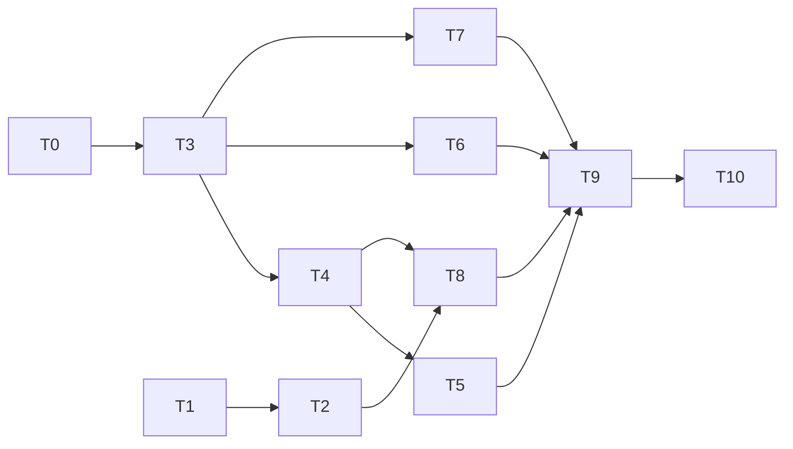

# Sprint — Reportes de Ventas (RV-01 … RV-06)

Plan de programación del módulo de reportería del dominio **Ventas / CRM**.
Documento de planificación: define alcance, contrato, cambios de esquema, tareas y
criterios de aceptación **antes** de escribir código.

- **Fecha de planificación:** 2026-08-03
- **Duración estimada:** 10 días hábiles (sprint de 2 semanas)
- **Precondición:** Módulo 8 (RF-26–44) cerrado y verificado end-to-end.

---

## 1. Contexto y numeración

El alcance de la ERS v3.0 (RF-01–64) está **completo** y **no contiene reportería de
ventas**: el Módulo 7 (RF-23–25) solo cubre el reporte de actividad de usuarios del
núcleo, y el Módulo 8 llega hasta la nota de crédito (RF-44).

Por eso este sprint es una **extensión post-ERS**, con numeración propia `RV-01…RV-06`
para no colisionar con los RF de la especificación ni con los RF-65–93 de fases
futuras. Cuando se incorporen a una ERS v3.1, se renumeran ahí.

**Estado del arte verificado** (lo que ya existe y se reutiliza):

| Insumo | Dónde |
|---|---|
| Patrón de reporte JSON + export CSV/PDF | `core/services/auditoria_service.py` (`reporte_actividad`, `exportar_actividad`, `_pdf_tabla`, `_csv_bytes`, `_respuesta_archivo`) |
| Autorización declarativa por endpoint | `core/utils/permissions.py` (`PermissionRequiredMixin`, `exigir_permiso`) |
| Alcance por objeto (propias vs. todas) | `ventas/services/oportunidad_service.py` (`_scope`, `PERMISO_VER_TODO`) |
| Auditoría de exportación (evento `EXPORT`) | `exportar_bitacora()`, patrón RF-24/RN02 |
| Aislamiento multi-tenant | `core/utils/auth.py` (`get_tenant`, `tenant_scoped`) |
| Paginación estándar | `core/utils/pagination.py` |

---

## 2. Decisiones tomadas

| # | Decisión | Motivo |
|---|---|---|
| **D1** | **Se añade `vendedor_id` a `cotizacion`, `pedido_venta` y `factura_venta`** por migración SQL aditiva. | Hoy el único responsable comercial es `oportunidad.responsable_id`, y la cadena `factura → pedido → cotizacion → oportunidad` tiene **dos FK nulables**: derivar la atribución dejaría un cubo "sin asignar" grande e inestable. Con columna propia, la atribución es exacta y sobrevive a los pedidos directos. |
| **D2** | **La antigüedad de cartera (RV-05) se mide en días desde la emisión**, no en días vencidos. | `cuenta_por_cobrar` no tiene `fecha_vencimiento` y `cliente` no tiene `dias_credito`. Se documenta explícitamente en la respuesta y en el archivo exportado; la antigüedad real de vencidos queda para el sprint de Finanzas. |
| **D3** | Permisos nuevos dedicados: `ventas:reportes:leer` y `ventas:reportes:exportar`. | Un reporte cruza clientes, pedidos y facturas: exigir los permisos de cada recurso haría el endpoint inutilizable. La exportación es un permiso aparte porque saca datos del sistema (mismo criterio que RF-24). |
| **D4** | Las utilidades de exportación se extraen a **`core/utils/export.py`**. | Ventas no debe importar del servicio de auditoría. Refactor previo, sin cambio funcional. |
| **D5** | Agregación al vuelo con el ORM (`.values().annotate()`), **sin tablas ni vistas materializadas**. | El volumen de fase 1 no lo justifica; se resuelve con índices (T1). Si las mediciones lo exigen, la vista materializada es un cambio posterior aislado. |
| **D6** | Los cubos temporales se calculan en **UTC** (`TIME_ZONE='UTC'`, `fecha_emision` es `timestamptz`). | No existe zona horaria por tenant. Se documenta; añadirla es otro sprint. |

---

## 3. Reglas de negocio del módulo

| Regla | Definición |
|---|---|
| **RN-01 · Venta neta** | `venta_neta = Σ total(facturas en estado emitida + con_nota_credito) − Σ monto(notas de crédito)`. Las facturas `cancelada` quedan **fuera** de todo agregado. |
| **RN-02 · Periodo de la nota de crédito** | Una NC se imputa al periodo de **su propia fecha** (`nota_credito.created_at`), no al de la factura que corrige. Así un periodo ya reportado no cambia retroactivamente. |
| **RN-03 · Ranking de productos es bruto** | `nota_credito` **no tiene líneas**: una devolución no se puede atribuir a un producto. RV-03 reporta importe facturado sin descontar NC, y lo declara en la respuesta (`"nota": "…"`) y en la cabecera del CSV/PDF. |
| **RN-04 · Alcance por vendedor** | Todo reporte con dimensión de vendedor respeta `ventas:pipeline:ver_todo`: sin ese permiso, el actor solo se ve a sí mismo. Reutiliza el criterio ya implementado en el pipeline (RF-31). |
| **RN-05 · Rango obligatorio y acotado** | `desde` y `hasta` son obligatorios; `desde ≤ hasta`; el rango no puede exceder **366 días** (→ `422`). Evita que un reporte sin filtros barra toda la historia del tenant. |
| **RN-06 · Atribución de vendedor** | Al crear cotización, pedido o factura, `vendedor_id` = el actor de la petición. Se acepta un `vendedor_id` distinto en el payload **solo** si el actor tiene `ventas:pipeline:ver_todo` (→ `403` si no). |
| **RN-07 · Exportación auditada** | Cada exportación registra un evento `EXPORT` en `core.log_auditoria` **antes** de entregar el archivo, con el reporte y los filtros usados (mismo patrón que RF-24/RN02). |

---

## 4. Catálogo de reportes

Todos cuelgan de `/api/ventas/reportes/`, exigen `ventas:reportes:leer`, aceptan
`?formato=csv|pdf` (que además exige `ventas:reportes:exportar`) y comparten el sobre
de respuesta:

```json
{
  "rango":      {"desde": "2026-07-01", "hasta": "2026-07-31"},
  "filtros":    {"cliente_id": null, "vendedor_id": null},
  "totales":    {"venta_neta": "1250340.55", "num_facturas": 412},
  "resultados": [ ... ],
  "generado_en": "2026-08-03T12:00:00+00:00"
}
```

> No se usa el sobre paginado `{count, page, …}`: un agregado no es una página. Solo
> RV-05 (detalle por factura) admite paginación además del agregado.

### RV-01 · Ventas por periodo

`GET /api/ventas/reportes/ventas-por-periodo/`

| Parámetro | Valores | Nota |
|---|---|---|
| `desde`, `hasta` | fecha ISO | obligatorios (RN-05) |
| `agrupar` | `dia` · `semana` · `mes` | default `mes` |
| `cliente_id`, `vendedor_id` | UUID | opcionales |

**Fuente:** `factura_venta` + `nota_credito`. **Dos consultas agrupadas por cubo**
(facturas y NC) fusionadas en Python — un JOIN duplicaría importes cuando una factura
tiene más de una NC.

**Por cubo:** `periodo`, `num_facturas`, `subtotal`, `impuestos`, `total_facturado`,
`notas_credito`, `venta_neta`, `ticket_promedio`.

### RV-02 · Ranking de clientes

`GET /api/ventas/reportes/clientes/` · `?desde&hasta&limit=10&orden=monto|volumen`

Por cliente: `cliente_id`, `razon_social`, `num_facturas`, `total_facturado`,
`notas_credito`, `venta_neta`, `participacion_pct`, `ultima_compra`.

### RV-03 · Ranking de productos

`GET /api/ventas/reportes/productos/` · `?desde&hasta&limit=10&orden=monto|cantidad`

**Fuente:** `factura_linea → pedido_linea → producto`, acotado a facturas no canceladas.
Por producto: `producto_id`, `sku`, `nombre`, `cantidad`, `importe`,
`participacion_pct`, `num_facturas`. Aplica **RN-03**.

### RV-04 · Embudo comercial

`GET /api/ventas/reportes/embudo/` · `?desde&hasta&vendedor_id`

Conteos y montos por etapa del ciclo: oportunidades creadas / ganadas / perdidas,
cotizaciones emitidas / aprobadas / rechazadas / vencidas, pedidos confirmados /
cancelados, facturas emitidas. Más `tasa_conversion` entre eslabones y el desglose de
`motivos_perdida`. Aplica **RN-04**.

### RV-05 · Cartera / antigüedad de saldos

`GET /api/ventas/reportes/cartera/` · `?corte&cliente_id&detalle=true`

**Fuente:** `finanzas.cuenta_por_cobrar` con `saldo > 0`. Cubos por días transcurridos
desde `created_at`: `0-30`, `31-60`, `61-90`, `90+` (**D2**: días desde emisión, no
vencidos — la respuesta lo declara en `"criterio"`).

Por cliente: `saldo_total` y el importe en cada cubo. Con `?detalle=true`, listado
paginado por factura.

### RV-06 · Desempeño de vendedores

`GET /api/ventas/reportes/vendedores/` · `?desde&hasta`

Por vendedor (`core.usuario`): oportunidades ganadas/perdidas, `tasa_conversion`,
cotizaciones emitidas vs. aprobadas, pedidos confirmados, **facturación neta atribuida**
(posible gracias a **D1**). Las filas sin atribución se agrupan en un cubo
`sin_asignar` explícito. Aplica **RN-04**.

---

## 5. Contrato de errores

| Código | Cuándo |
|---|---|
| `400` | Parámetro mal formado: `formato` distinto de csv/pdf, `agrupar` fuera del enum, `limit` no numérico, fecha no ISO. |
| `401` | Sin token, token expirado, o el tenant del JWT ya no existe. |
| `403` | Falta `ventas:reportes:leer` (o `:exportar` al pedir archivo). También al intentar fijar un `vendedor_id` ajeno sin `ventas:pipeline:ver_todo` (RN-06). |
| `422` | Regla de negocio: `desde > hasta`, rango mayor a 366 días (RN-05). |

---

## 6. Cambios de esquema (migración SQL)

Un solo archivo idempotente, `sql/2026-08-XX_rv01_06_reportes_ventas.sql`, siguiendo el
patrón de `sql/2026-07-25_rf30_44_ventas.sql`.

### 6.1 Atribución de vendedor (D1)

```
ALTER TABLE ventas.cotizacion     ADD COLUMN IF NOT EXISTS vendedor_id UUID REFERENCES core.usuario(id);
ALTER TABLE ventas.pedido_venta   ADD COLUMN IF NOT EXISTS vendedor_id UUID REFERENCES core.usuario(id);
ALTER TABLE ventas.factura_venta  ADD COLUMN IF NOT EXISTS vendedor_id UUID REFERENCES core.usuario(id);
```

Nulable a propósito: el histórico anterior al sprint no tiene atribución y debe seguir
siendo legible. **Backfill** por la cadena existente, best-effort:

1. `cotizacion.vendedor_id ← oportunidad.responsable_id` (cuando hay oportunidad ligada).
2. `pedido_venta.vendedor_id ← cotizacion.vendedor_id` (cuando hay cotización ligada).
3. `factura_venta.vendedor_id ← pedido_venta.vendedor_id`.

Lo que quede en `NULL` aparece como `sin_asignar` en RV-06.

### 6.2 Permisos (D3)

```
('ventas', 'reportes', 'leer',     'RV-01..06 Consultar reportes de ventas'),
('ventas', 'reportes', 'exportar', 'RV-01..06 Exportar reportes de ventas a CSV/PDF'),
```

`ON CONFLICT DO NOTHING`, igual que el catálogo RBAC de RF-10.

### 6.3 Índices

Hoy **no existe ningún índice** en `factura_venta`, `factura_linea`, `cotizacion`,
`pedido_venta`, `nota_credito` ni `cuenta_por_cobrar` (solo PK y unique de folio). Sin
esto, todo reporte por rango de fechas hace seq scan:

```
idx_factura_venta_tenant_fecha    ON ventas.factura_venta(tenant_id, fecha_emision)
idx_factura_venta_tenant_cliente  ON ventas.factura_venta(tenant_id, cliente_id)
idx_factura_venta_tenant_vendedor ON ventas.factura_venta(tenant_id, vendedor_id)
idx_factura_linea_factura         ON ventas.factura_linea(factura_id)
idx_nota_credito_tenant_fecha     ON ventas.nota_credito(tenant_id, created_at)
idx_cotizacion_tenant_estado      ON ventas.cotizacion(tenant_id, estado, created_at)
idx_pedido_tenant_estado          ON ventas.pedido_venta(tenant_id, estado, created_at)
idx_cxc_tenant_pendiente          ON finanzas.cuenta_por_cobrar(tenant_id) WHERE saldo > 0
```

---

## 7. Cambios de código

| Archivo | Cambio |
|---|---|
| `core/utils/export.py` | **Nuevo.** `pdf_tabla()`, `csv_bytes()`, `respuesta_archivo()`, `FORMATOS_EXPORT`, más un helper de metadatos (tenant, actor, fecha, filtros). Extraídos de `auditoria_service`. |
| `core/services/auditoria_service.py` | Importa de `core/utils/export.py`; se eliminan las privadas duplicadas. Sin cambio funcional. |
| `ventas/services/reporte_service.py` | **Nuevo.** Validación de rango/parámetros, sobre común, y una función por reporte (`ventas_por_periodo`, `ranking_clientes`, `ranking_productos`, `embudo`, `cartera`, `desempeno_vendedores`) más su `exportar_*`. |
| `ventas/views.py` | Seis vistas `PermissionRequiredMixin` con el patrón de `ReporteActividadView`: sin `?formato` → JSON; con `?formato` → archivo. |
| `ventas/urls.py` | Seis rutas bajo `api/ventas/reportes/`. |
| `ventas/models.py` | Campo `vendedor` (FK a `core.Usuario`, nulable) en `Cotizacion`, `PedidoVenta` y `FacturaVenta`. |
| `ventas/services/cotizacion_service.py` | `crear_cotizacion()`: fija `vendedor_id` (RN-06) en el `Cotizacion.objects.create(...)`. |
| `ventas/services/pedido_service.py` | `crear_pedido()`: ídem; hereda de la cotización si viene de una. |
| `ventas/services/factura_service.py` | `generar_factura()`: ídem; hereda del pedido. |

Los tres serializadores (`serialize_cotizacion`, `serialize_pedido`, `serialize_factura`)
exponen `vendedor_id` para que el frontend pueda mostrarlo.

---

## 8. Backlog del sprint

| # | Tarea | Días | Depende de | Estado |
|---|---|---|---|---|
| **T0** | Refactor: extraer `core/utils/export.py` y reapuntar auditoría | 0.5 | — | ✅ 2026-08-04 |
| **T1** | Migración SQL: permisos + índices | 0.5 | — | ✅ aplicada en dev |
| **T2** | Migración SQL: `vendedor_id` + backfill · modelos · servicios de creación (RN-06) | 1.0 | T1 | ✅ 2026-08-04 |
| **T3** | `reporte_service`: validación de rango, filtros, sobre común, export genérico | 0.5 | T0 | ✅ 2026-08-04 |
| **T4** | RV-01 ventas por periodo (+ export) | 1.0 | T3 | ✅ 2026-08-04 |
| **T5** | RV-02 + RV-03 rankings | 1.0 | T4 | ✅ 2026-08-04 |
| **T6** | RV-04 embudo | 1.0 | T3 | ✅ 2026-08-04 |
| **T7** | RV-05 cartera | 1.0 | T3 | ✅ 2026-08-04 |
| **T8** | RV-06 desempeño de vendedores | 1.0 | T2, T4 | ✅ 2026-08-04 |
| **T9** | Suites de prueba contra PostgreSQL real | 1.5 | T4–T8 | ✅ 2026-08-04 |
| **T10** | Documentación: `docs/api/FLUJO-VENTAS-REPORTES.md`, `openapi.yaml`, `test.http`, índice del README | 1.0 | T9 | ✅ 2026-08-04 |
| | **Total** | **10.0** | | |

### Fixtures persistentes de prueba (T9)

El diseño append-only impide borrar usuarios y tenants con historial de auditoría,
y el trigger `validar_usuario_rol_minimo` (RF-07/RN04) impide además quitarle a un
usuario su último rol. Por eso la suite de seguridad **reutiliza** tres fixtures de
nombre fijo en vez de crear y borrar en cada corrida:

| Fixture | Para qué |
|---|---|
| tenant `rv-test` | segundo tenant, para verificar el aislamiento |
| `rv-ciego@acme.com` | rol propio **sin ningún permiso** → verifica el 403 |
| `rv-lector@acme.com` | rol propio con **solo** `ventas:reportes:leer` → verifica el 403 de exportación y RN-04 |

Los datos de negocio (clientes, pedidos, facturas, CxC) sí son únicos por corrida y
se borran al final.

> **Cuidado al escribir pruebas:** `Usuario.objects.filter(estado="activo").first()`
> ya **no** devuelve al TENANT_ADMIN de forma fiable — desde que existen estos
> fixtures hay varios usuarios activos y sin `order_by` el resultado es arbitrario.
> Selecciona al admin por su rol de sistema
> (`core_usuario_rol_usuario_set__rol__es_sistema=True`). Tres falsos fallos de la
> primera corrida de T9 venían exactamente de ahí.

> **Hallazgo de T6:** las funciones base de RV-01/02/03 leían `?vendedor_id=`
> directo de la petición, así que **un vendedor sin `ver_todo` veía la facturación
> de toda la empresa**. Corregido con `vendedor_efectivo()`, que es ahora el único
> punto por el que puede entrar esa dimensión; el sobre expone `alcance_vendedor`
> para que el consumidor sepa a qué quedó acotado el reporte.

> **Desviación de RV-05 (mejora sobre el plan):** el saldo se reconstruye **a la
> fecha de corte** (`monto_original` − abonos anteriores al corte) en vez de leer
> `cuenta_por_cobrar.saldo`, que es el saldo de hoy. Pedir el corte de un mes
> pasado con el saldo vivo habría devuelto cifras contaminadas por cobros
> posteriores. La limitación de D2 (antigüedad por días desde emisión) se mantiene.

> **Hallazgo de T2:** `resolver_vendedor()` valida que el `vendedor_id` explícito
> sea un usuario **del mismo tenant**. Sin esa validación, la FK global a
> `core.usuario` permitía atribuir una venta a un usuario de otra organización
> (y un id inexistente reventaba como `IntegrityError` 500 en vez de `422`).



**Ruta crítica:** T1 → T2 → T8 → T9 → T10. Si T2 se retrasa, RV-06 es lo primero que
sale del sprint (los otros cinco reportes no dependen de la atribución).

---

## 9. Definition of Done

Por cada reporte, sin excepción:

- [ ] Endpoint JSON con el sobre común y montos como **string decimal**.
- [ ] Export `?formato=csv|pdf` con metadatos (tenant, actor, fecha, filtros) y evento `EXPORT` auditado (RN-07).
- [ ] Permiso exigido y **403 verificado** con un usuario sin él.
- [ ] **Aislamiento por tenant verificado**: datos de un segundo tenant no aparecen jamás.
- [ ] Alcance por vendedor verificado donde aplique (RN-04).
- [ ] Rango validado: `422` con rango invertido y con rango > 366 días.
- [ ] Exactitud de los agregados comprobada **contra datos sembrados a mano**, incluyendo al menos una nota de crédito y una factura cancelada (RN-01, RN-02).
- [ ] Documentado en los cuatro sitios de T10.

**Cierre del sprint:** `python manage.py check` limpio, suites verdes contra la base
real, y `report.md` actualizado con la sección del módulo RV.

---

## 10. Riesgos

| Riesgo | Mitigación |
|---|---|
| El backfill de `vendedor_id` deja mucho histórico en `NULL` | Es esperado y visible: cubo `sin_asignar` explícito en RV-06, nunca repartido ni escondido. |
| Doble conteo al cruzar facturas con notas de crédito | Consultas separadas por cubo y fusión en Python; caso de prueba obligatorio con 2 NC sobre la misma factura. |
| Reportes lentos al crecer el volumen | Índices en T1; si aún así se degrada, vista materializada con refresco programado (fuera de este sprint). |
| Interpretación errónea de la antigüedad de cartera | El campo `criterio` en la respuesta y la cabecera del CSV/PDF declaran "días desde emisión" (D2). |

## 11. Fuera de alcance

- Dashboards y KPIs visuales (Módulo BI, RF-89+).
- Reportes de Compras, Inventario y Finanzas (sprints propios).
- Antigüedad real de vencidos: exige `cliente.dias_credito` y `cuenta_por_cobrar.fecha_vencimiento` (sprint de Finanzas).
- Programación de reportes por correo, y zona horaria por tenant.
