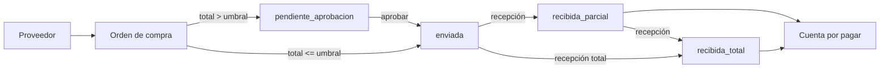
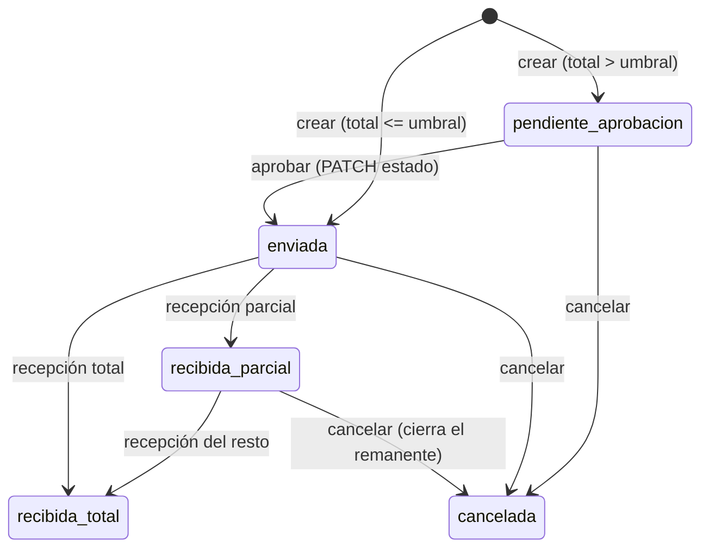
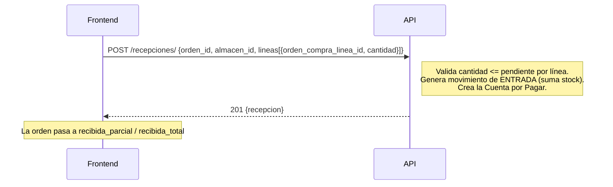

# NovaERP — Flujo de la aplicación: Compras

Flujo del abastecimiento: proveedor → orden de compra → recepción de mercancía →
cuenta por pagar. La **recepción** es el paso que mueve el inventario y genera la
deuda automáticamente.

> Prerrequisitos: [GUIA-FRONTEND.md](./GUIA-FRONTEND.md) · Referencia: [openapi.yaml](./openapi.yaml).
> Todas las rutas cuelgan de `/api/compras/`.

---

## 1. La cadena de abastecimiento de un vistazo

---

## 2. Proveedores (catálogo base)

| Acción | Endpoint | Permiso |
|---|---|---|
| Listar / buscar | `GET /proveedores/` | `compras:proveedores:leer` |
| Registrar | `POST /proveedores/` | `compras:proveedores:crear` |
| Editar / baja | `PATCH`·`DELETE /proveedores/{id}/` | `compras:proveedores:editar` / `:eliminar` |
| Historial de compras | `GET /proveedores/{id}/historial/` | `compras:proveedores:leer` |

`rfc_o_id_fiscal` es único por tenant.

---

## 3. Órdenes de compra

- **Folio autogenerado** (`OC-000123`). El cuerpo lleva `proveedor_id` + `lineas`
  (`producto_id`, `cantidad`, `costo_unitario`).
- **Umbral de aprobación (RF-52):** si el **total supera el umbral** del tenant
  (`config-aprobacion`), la orden nace en `pendiente_aprobacion` y **no puede recibirse**
  hasta pasar a `enviada`. La aprobación es un **PATCH** que cambia `estado` a `enviada`
  (no hay motor de workflow: es una aprobación manual).
- **Editar** solo mientras no tenga recepciones y no esté cerrada/cancelada.
- **Cancelar** cierra la orden para no admitir más recepciones; lo ya recibido queda intacto.

| Acción | Endpoint | Permiso |
|---|---|---|
| Listar | `GET /ordenes/` | `compras:ordenes:leer` |
| Crear | `POST /ordenes/` | `compras:ordenes:crear` |
| Editar / aprobar (→ enviada) | `PATCH /ordenes/{id}/` | `compras:ordenes:editar` (aprobar: `:aprobar`) |
| Detalle | `GET /ordenes/{id}/` | `compras:ordenes:leer` |
| Cancelar | `POST /ordenes/{id}/cancelar/` | `compras:ordenes:cancelar` |

Cada línea expone `cantidad` y `cantidad_recibida` (para mostrar lo pendiente por recibir).

---

## 4. Recepción de mercancía (el paso que mueve todo)

- Solo se recibe contra una orden **`enviada`** o **`recibida_parcial`**.
- La cantidad por línea **no puede exceder lo pendiente** (→ `422`).
- Efectos automáticos: **suma stock** (movimiento de entrada en inventario) y crea la
  **cuenta por pagar** vinculada a la orden y al proveedor.
- La orden avanza a `recibida_parcial` o `recibida_total` según la cobertura de las líneas.

| Acción | Endpoint | Permiso |
|---|---|---|
| Listar | `GET /recepciones/` | `compras:recepciones:leer` |
| Registrar | `POST /recepciones/` | `compras:recepciones:crear` |

---

## 5. Cuentas por pagar y configuración

| Acción | Endpoint | Permiso |
|---|---|---|
| Listar cuentas por pagar | `GET /cuentas-por-pagar/` | `compras:cuentas_por_pagar:leer` |
| Ver umbral de aprobación | `GET /config-aprobacion/` | `compras:config_aprobacion:leer` |
| Editar umbral | `PATCH /config-aprobacion/` | `compras:config_aprobacion:editar` |

- Las **CxP se crean solas** en cada recepción; este listado es de solo lectura desde
  Compras (la gestión de pagos es de Finanzas, fuera del alcance actual).

---

## 6. Reglas que el FE debe reflejar

- **La recepción es irreversible en su efecto de stock:** suma inventario y crea deuda. No
  hay “deshacer recepción”; una corrección se hace con un ajuste de inventario.
- **Umbral → aprobación manual:** si una orden nace `pendiente_aprobacion`, muestra el botón
  “Aprobar” (PATCH a `enviada`) para quien tenga `compras:ordenes:aprobar`, y **bloquea
  recepciones** hasta entonces.
- **Costos como string** (decimales): parséalos con librería decimal.
