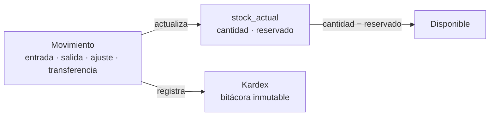
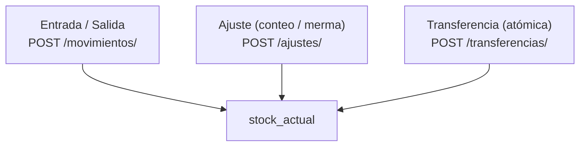
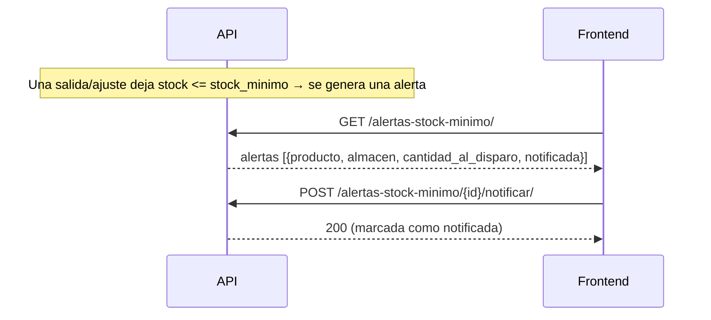

# NovaERP — Flujo de la aplicación: Inventario

Flujo del control de existencias: productos y almacenes, movimientos que alteran el
stock, y las consultas (stock disponible, kardex, valuación, alertas). El **kardex**
es la fuente de verdad: una bitácora **inmutable** de movimientos.

> Prerrequisitos: [GUIA-FRONTEND.md](./GUIA-FRONTEND.md) · Referencia: [openapi.yaml](./openapi.yaml).
> Todas las rutas cuelgan de `/api/inventario/`.

---

## 1. Modelo mental

- El **stock nunca se edita directo**: se registra un **movimiento** y el sistema actualiza
  `stock_actual` y el kardex. Para corregir un error, se hace un **ajuste**, no se borra nada.
- **`disponible = cantidad − reservado`.** Lo `reservado` son pedidos de venta confirmados
  (lo maneja el módulo Ventas; aquí solo se consulta).
- **Ninguna salida** puede dejar la `cantidad` por debajo de cero (→ `422`).

---

## 2. Catálogos: productos y almacenes

| Acción | Endpoint | Permiso |
|---|---|---|
| Productos: listar / buscar | `GET /productos/` | `inventario:productos:leer` |
| Productos: registrar | `POST /productos/` | `inventario:productos:crear` |
| Productos: editar / descontinuar | `PATCH`·`DELETE /productos/{id}/` | `inventario:productos:editar` / `:eliminar` |
| Almacenes: listar | `GET /almacenes/` | `inventario:almacenes:leer` |
| Almacenes: registrar | `POST /almacenes/` | `inventario:almacenes:crear` |
| Almacenes: editar / baja | `PATCH`·`DELETE /almacenes/{id}/` | `inventario:almacenes:editar` / `:eliminar` |

- `sku` único por tenant; `precio_venta` y `costo_referencia` ≥ 0. `stock_minimo` dispara las
  alertas (§5).

---

## 3. Movimientos que alteran el stock

### Movimiento manual (entrada / salida)
`POST /movimientos/ {tipo:"entrada"|"salida", producto_id, almacen_id, cantidad, costo_unitario?}`
- Una **salida** valida que haya stock suficiente **antes** (no deja negativo → `422`).
- Permiso: `inventario:movimientos:crear` (leer: `inventario:movimientos:leer`).

### Ajuste (conteo físico / merma)
`POST /ajustes/ {motivo:"conteo_fisico"|"merma"|"otro", producto_id, almacen_id, cantidad}`
- La `cantidad` puede ser **positiva o negativa** (≠ 0). Se aplica de inmediato y queda
  registrado con quién lo capturó.
- Permiso: `inventario:ajustes:crear` / `:leer`.

### Transferencia entre almacenes
`POST /transferencias/ {producto_id, almacen_origen_id, almacen_destino_id, cantidad}`
- Salida del origen + entrada al destino, **atómica** (o ambas o ninguna). Valida stock en
  el origen.
- Permiso: `inventario:transferencias:crear` / `:leer`.

---

## 4. Consultas de stock

| Consulta | Endpoint | Permiso | Qué devuelve |
|---|---|---|---|
| Stock disponible | `GET /stock-disponible/` | `inventario:stock:leer` | `cantidad`, `reservado`, `disponible` por producto/almacén |
| Kardex | `GET /kardex/` | `inventario:kardex:leer` | Bitácora de movimientos (inmutable); filtros `?producto_id= ?almacen_id=` |
| Valuación | `GET /valuacion/` | `inventario:valuacion:leer` | `cantidad × costo_referencia` = valor por producto/almacén |

---

## 5. Alertas de stock mínimo

- Las alertas se **generan solas** cuando un movimiento deja el stock en o por debajo del
  `stock_minimo` del producto.
- `POST …/{id}/notificar/` marca la alerta como atendida (para no volver a resaltarla).
- Permiso: `inventario:alertas:leer` / `:notificar`.

---

## 6. Reglas que el FE debe reflejar

- **Nada de editar stock a mano.** Toda variación es un movimiento/ajuste/transferencia; el
  kardex es append-only.
- **Salida nunca deja negativo** (→ `422`): valida en la UI antes de enviar y maneja el error.
- **`disponible` es lo vendible**, no `cantidad`. Muestra `disponible` en pantallas de venta.
- **Transferencia = todo o nada:** si falla, ni salió ni entró.
- **Cantidades/costos como string** (decimales): parséalos con librería decimal.
