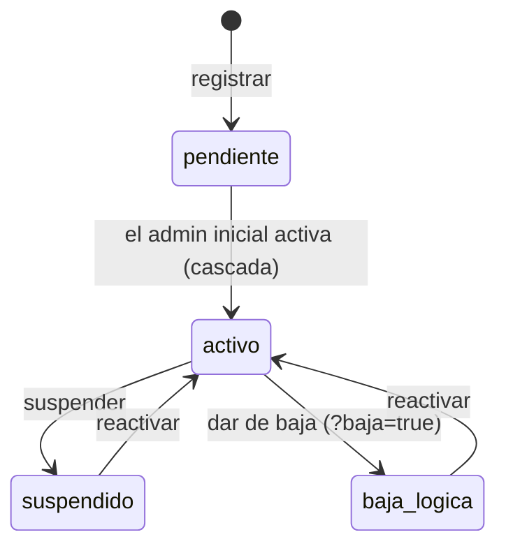

# NovaERP — Flujo de la aplicación: Plataforma (SysAdmin)

Flujo del **portal de plataforma**: el SysAdmin da de alta y administra las
organizaciones (tenants). Es una **superficie separada** de la app de tenant —
normalmente un frontend distinto (consola interna).

> Prerrequisitos: [GUIA-FRONTEND.md](./GUIA-FRONTEND.md) · Referencia: [openapi.yaml](./openapi.yaml).
> Rutas bajo `/api/admin/` (+ la activación pública `/api/auth/activar-tenant/`).
> El **ciclo de vida completo** de una organización — incluidas las partes que ocurren
> en la app de tenant (activación, licencias, política de seguridad, aislamiento por
> petición) — está en [FLUJO-TENANTS.md](./FLUJO-TENANTS.md).

---

## 1. Qué distingue a esta superficie

- **Login de una fase** (sin MFA): `POST /api/admin/login/ {correo, password}` → `{token}`.
- El token trae `typ:"sysadmin"` y **solo** sirve en `/api/admin/…`. Un token de tenant aquí
  da `401`, y viceversa.
- El SysAdmin **no pertenece a ningún tenant**: no pasa por el RBAC de tenant; es superusuario
  sobre la gestión de organizaciones.

---

## 2. Estados de un tenant



Mientras un tenant no esté `activo`, **ningún** usuario suyo puede autenticarse.

---

## 3. Alta de una organización (onboarding)

```mermaid
sequenceDiagram
  participant SA as SysAdmin (portal)
  participant API
  participant TA as Admin inicial (app de tenant)
  SA->>API: POST /api/admin/tenants/ {slug, razon_social, correo, nombre_completo, plan}
  Note right of API: Valida unicidad (dominio, razón social, correo)<br/>y palabras reservadas. Nace 'pendiente'.<br/>Crea el TENANT_ADMIN inicial + token 24h.
  API-->>SA: 201 {tenant, admin_inicial, activacion_token}
  Note over SA: En dev el token viene aquí; en prod llega por correo al admin.
  TA->>API: POST /api/auth/activar-tenant/ {token, password}
  Note right of API: Cascada: usuario Y tenant → 'activo'.
  API-->>TA: 200 {tenant activo}
  Note over TA: El admin inicial ya puede entrar por la app de tenant<br/>(login de dos fases; enrola MFA en el primer login).
```

- **`slug`** es el “dominio” de la organización: `[a-z0-9-]`, 3–50, único en toda la
  plataforma y no puede ser una palabra reservada (→ `422`).
- **`correo`** del admin inicial debe ser único en toda la plataforma.
- **`plan`** (`STARTER`/`BUSINESS`/`ENTERPRISE`) determina qué módulos se activan.
- La **activación la hace el admin inicial** (no el SysAdmin), por el endpoint público.

---

## 4. Consultar y editar tenants

| Acción | Endpoint |
|---|---|
| Listar (`?estado= ?plan= ?search=`) | `GET /api/admin/tenants/` |
| Detalle (módulos activos, licencias) | `GET /api/admin/tenants/{id}/` |
| Editar datos / plan / módulos | `PATCH /api/admin/tenants/{id}/` |

**Edición de módulos** (`PATCH` con `{modulos: {activar:[], desactivar:[]}}`):
- El **núcleo** (identidad, usuarios, RBAC…) **no** se puede desactivar (→ `422`).
- Solo se pueden activar módulos **incluidos en el plan** del tenant (→ `422` si no).
- Activar un módulo cuya **dependencia** no está activa → `422` (p. ej. Ventas requiere
  Inventario).
- Desactivar un módulo del que **dependen otros** activos → `422` que lista los afectados y
  pide `confirmar_cascada: true`; con eso se apagan en cascada (atómico).

---

## 5. Suspender, dar de baja, reactivar

```
POST /api/admin/tenants/{id}/suspender/            {tipo, motivo}   → suspendido
POST /api/admin/tenants/{id}/suspender/?baja=true  {tipo, motivo}   → baja_logica
POST /api/admin/tenants/{id}/reactivar/                             → activo
```

- `tipo` ∈ `cumplimiento` | `administrativa`; `motivo` es obligatorio.
- Suspender/baja **invalida de inmediato todas las sesiones** de los usuarios del tenant y
  bloquea su login; es **reversible** sin pérdida de información.

---

## 6. Reglas que el FE (consola) debe reflejar

- **Dos frontends, dos sesiones.** No mezcles el token de SysAdmin con el de tenant.
- **La activación no la hace el SysAdmin.** Tras crear el tenant, entrega/rastrea el
  `activacion_token`; el admin inicial la completa desde la app de tenant.
- **Validaciones de alta:** anticipa en el formulario el formato del `slug`, las palabras
  reservadas y la unicidad de correo/dominio; maneja los `422` con el `campo` en conflicto.
- **Cascada de módulos:** si un `PATCH` de módulos responde con `requiere_confirmar_cascada`,
  muestra la lista de `modulos_afectados` y reintenta con `confirmar_cascada: true`.
