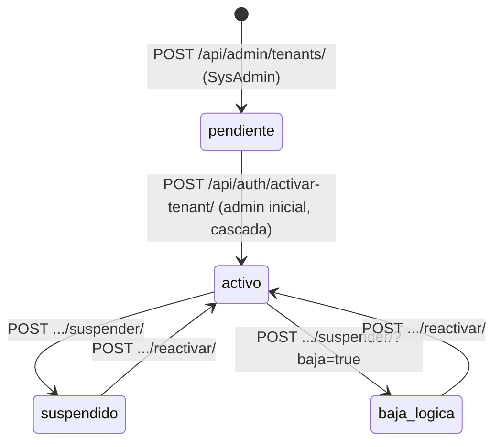
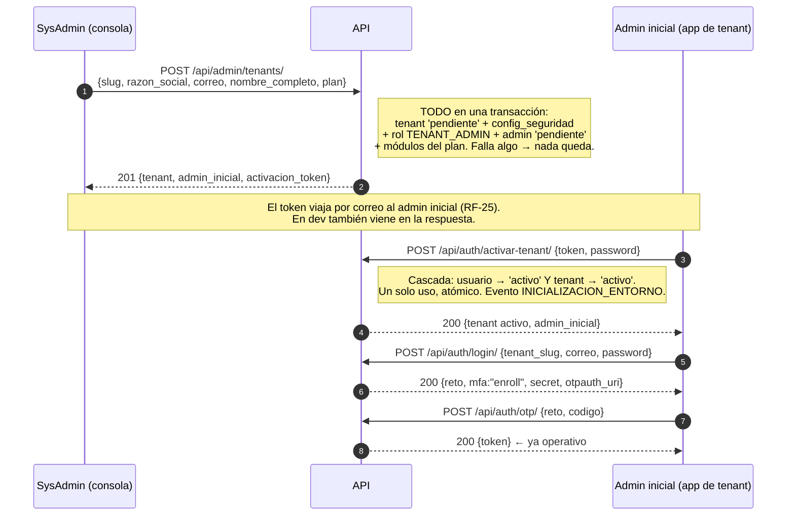
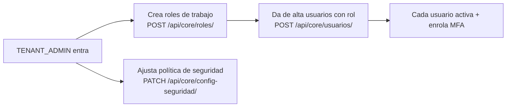
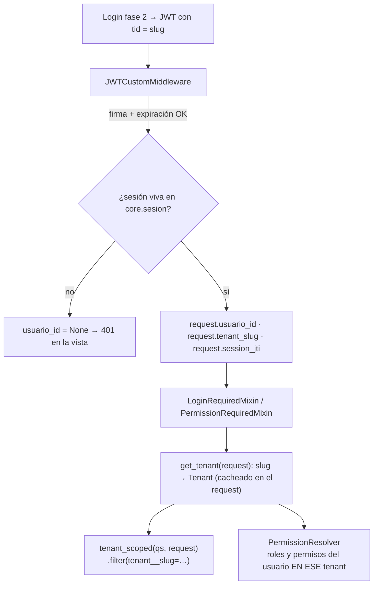
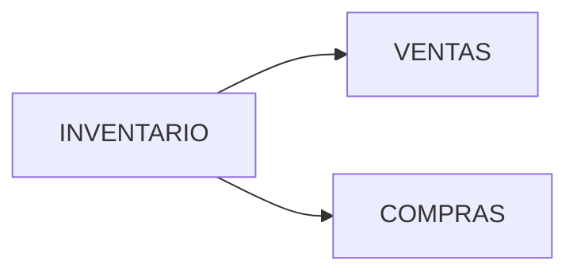
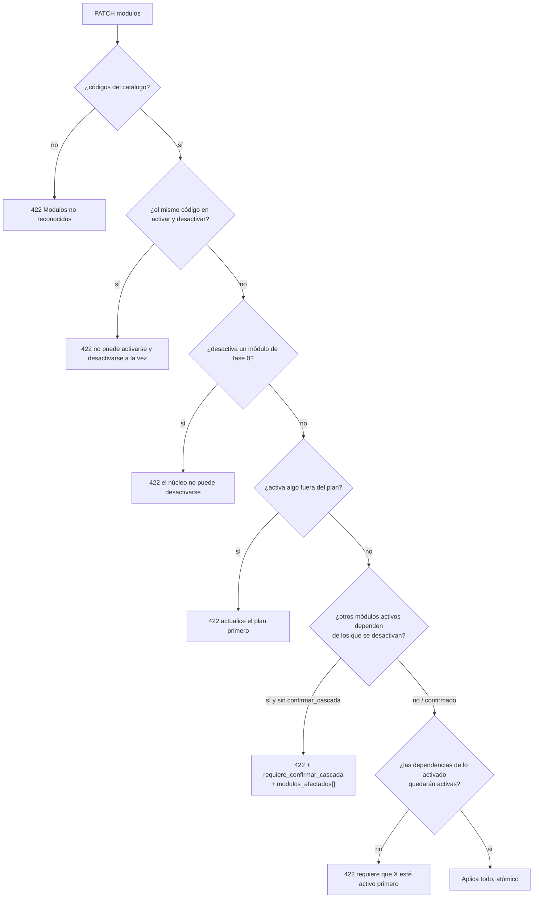

# NovaERP — Flujo de la aplicación: Tenants (organizaciones)

Ciclo de vida **completo** de una organización, de punta a punta: desde que el
SysAdmin la registra hasta que se suspende o se reactiva, pasando por cómo cada
petición de cada usuario queda atada a su tenant.

Es una guía **transversal a las dos superficies**: parte de los pasos los ejecuta
la consola de plataforma (`/api/admin/`) y parte la app de tenant (`/api/auth/`,
`/api/core/`).

> Prerrequisitos: [GUIA-FRONTEND.md](./GUIA-FRONTEND.md) · Referencia: [openapi.yaml](./openapi.yaml).
> Vista operativa de la consola de plataforma: [FLUJO-PLATAFORMA.md](./FLUJO-PLATAFORMA.md).
> El modelo de autorización dentro del tenant: [PERMISOS.md](./PERMISOS.md).

---

## 1. Qué es un tenant

Un **tenant** es una organización cliente: la **unidad de aislamiento** de toda la
plataforma. Prácticamente cada tabla de negocio tiene una columna `tenant_id`, y
ningún dato cruza esa frontera.

| Concepto | Qué es | Dónde vive |
|---|---|---|
| **`slug`** | El "dominio" de la organización (`acme`). Identidad pública, única en toda la plataforma, inmutable. | `core.tenant.slug` |
| **`razon_social`** | Nombre legal. También único en la plataforma. | `core.tenant.razon_social` |
| **`plan`** | `STARTER` / `BUSINESS` / `ENTERPRISE`. Define **qué módulos puede activar** y **cuántas licencias** tiene. | `core.plan_comercial` |
| **Módulos activos** | Qué partes del producto ve esta organización. | `core.tenant_modulo` |
| **Config. de seguridad** | Política de contraseñas, bloqueo por intentos, expiración del JWT. **Una por tenant.** | `core.config_seguridad_tenant` |
| **`estado`** | `pendiente` / `activo` / `suspendido` / `baja_logica`. Gobierna si alguien puede entrar. | `core.tenant.estado` |

El `slug` es lo que el usuario teclea en el login (`tenant_slug`) y lo que viaja
en el JWT como claim `tid`. **No se edita**: cambiarlo dejaría huérfanas todas las
sesiones vivas.

### 1.1 Tres actores, tres alcances

| Actor | Superficie | Alcance | Cómo se autoriza |
|---|---|---|---|
| **SysAdmin** | `/api/admin/` | **Todas** las organizaciones. No pertenece a ninguna. | `SysAdminRequiredMixin` (superusuario plano, sin RBAC) |
| **TENANT_ADMIN** | `/api/core/`, `/api/ventas/`… | **Su** organización, completa | Rol de sistema → bypass de permisos |
| **Usuario** | `/api/core/`, `/api/ventas/`… | **Su** organización, acotado por sus roles | Permisos `dominio:recurso:accion` |

El aislamiento entre superficies es simétrico: un token de tenant en `/api/admin/`
da `401`, y un token de SysAdmin en `/api/core/` también.

---

## 2. Máquina de estados



| Estado | ¿Login de sus usuarios? | ¿Sesiones vivas? | ¿Editable por el SysAdmin? | Reversible |
|---|---|---|---|---|
| `pendiente` | **No** | — | Sí | — |
| `activo` | Sí | Sí | Sí | — |
| `suspendido` | **No** | **Revocadas al suspender** | Sí | Sí (`reactivar`) |
| `baja_logica` | **No** | **Revocadas** | **No** (`422`: reactive primero) | Sí (`reactivar`) |

Dos cosas que conviene tener claras desde el principio:

- **Nunca hay borrado físico.** `baja_logica` conserva absolutamente toda la
  información; es una suspensión con otra etiqueta contable.
- **El gate del tenant vive dentro del validador de credenciales.**
  `core.intentar_login()` lo primero que hace es buscar el tenant por slug y, si no
  está `activo`, responde `credenciales` **sin llegar a mirar el usuario**. Por eso
  un tenant suspendido no filtra ni siquiera si un correo existe.

---

## 3. Flujo A — Alta y onboarding de una organización

Cuatro pasos, dos superficies, dos actores.



### 3.1 Qué se crea exactamente en el paso 1

El alta **no** crea sólo una fila. En la misma transacción nacen:

| Se crea | Detalle |
|---|---|
| `core.tenant` | estado `pendiente` |
| `core.config_seguridad_tenant` | con los `DEFAULT` de la política (la inserta Postgres, no Django) |
| `core.rol` **TENANT_ADMIN** | `es_sistema = true` → autoriza por bypass, **sin filas en `rol_permiso`** |
| `core.usuario` (admin inicial) | estado `pendiente`, **sin contraseña**, con hash del token de activación (24 h) |
| `core.usuario_rol` | el admin inicial ← TENANT_ADMIN |
| `core.tenant_modulo` | una fila **activa** por cada módulo incluido en el plan |

Si cualquier validación falla a mitad, **no queda ningún registro parcial**.

### 3.2 Validaciones del alta (todas → `422` con `campo`)

| Campo | Regla |
|---|---|
| `slug` | `[a-z0-9-]`, 3–50 caracteres · único en **toda** la plataforma (incluidos suspendidos y dados de baja) · no puede ser una **palabra reservada** (`admin`, `api`, `www`, `app`, `root`, `sysadmin`, `billing`, `dev`, `test`… 30 en total) |
| `razon_social` | Obligatoria · única en toda la plataforma (mensaje diferenciado del `slug`) |
| `correo` | Formato válido · **único en toda la plataforma**, no sólo en el tenant |
| `nombre_completo` | Obligatorio |
| `plan` | Debe existir y estar vigente en `core.plan_comercial` |

### 3.3 Detalles de la activación

- El `activacion_token` dura **24 h**, es de **un solo uso** y en la tabla sólo vive
  su **hash**: la respuesta del alta es el único momento en que existe en claro.
- La contraseña debe cumplir la **política del propio tenant** (ver §7). El hash lo
  calcula Postgres (`crypt` + `bcrypt`), nunca Django.
- **La activación la hace el admin inicial, no el SysAdmin.** Es un endpoint público
  a propósito: el admin todavía no puede autenticarse.
- Token inválido, consumido o vencido devuelven **el mismo mensaje** — no revelan
  cuál de los tres casos es.
- Este endpoint es **exclusivo del alta de tenant**: exige que el tenant esté
  `pendiente`. Un usuario normal de un tenant ya activo se activa por
  `POST /api/auth/activar/` (ver [FLUJO-USUARIOS.md](./FLUJO-USUARIOS.md)).
- El **MFA se enrola en el primer login**, no en la activación (desviación
  documentada de RN07).

### 3.4 Y a partir de aquí, el tenant se administra solo

Con el admin inicial dentro, el resto del onboarding ya no toca la consola de
plataforma:



---

## 4. Flujo B — Cómo cada petición queda atada a su tenant

Este es el flujo que más importa en el día a día, y el que hay que respetar al
escribir cualquier endpoint nuevo.



Las tres reglas que se derivan:

1. **El tenant sale siempre del JWT**, nunca del cuerpo ni de la query string de la
   petición. Un cliente no puede pedir datos "de otro tenant" porque nunca elige el
   tenant.
2. **Toda consulta a una tabla con FK `tenant` se filtra**, con `tenant_scoped()` o
   con un `.filter(tenant__slug=request.tenant_slug)` explícito.
3. **Los permisos también son por tenant.** El resolutor acota los roles con
   `r.tenant_id = <tenant del JWT>`: ni siquiera el bypass del rol de sistema
   atraviesa la frontera.

### 4.1 Las capas de aislamiento

| Capa | Qué hace | Estado |
|---|---|---|
| **JWT (`tid`)** | El cliente nunca elige el tenant | Activa |
| **`tenant_scoped()` / filtros** | Toda consulta se acota al tenant del token | Activa |
| **`PermissionResolver`** | Los roles se resuelven acotados a `r.tenant_id` | Activa |
| **RLS de Postgres** | 50 políticas `tenant_isolation` (`USING tenant_id = core.current_tenant_id()`) | **Definida, hoy no efectiva** |

> **Nota honesta sobre RLS.** Las políticas existen en la base (50 policies creadas
> en `05_rls_multitenant.sql`) y son *fail-closed* por diseño, pero en el entorno
> actual la API se conecta como `postgres`, un rol **superusuario**, y los
> superusuarios **saltan RLS** siempre. Además, la GUC `app.current_tenant_id` sólo
> se publica dentro de `audit_context` (las escrituras), no en el camino de lectura.
> Es decir: **hoy el aislamiento lo garantiza la capa de aplicación**, y RLS es una
> segunda línea de defensa que se activará cuando el despliegue use un rol dedicado
> sin `BYPASSRLS` y se publique la GUC también en las lecturas. Vale la pena tenerlo
> presente al revisar RNF-02.

---

## 5. Flujo C — Plan y módulos

El plan es el contrato comercial; los módulos son lo que el tenant ve encendido.
El plan **acota** qué se puede encender, pero no lo enciende todo por sí solo.

### 5.1 Catálogo actual

| Plan | Licencias | Módulos incluidos |
|---|---|---|
| `STARTER` | 10 | Núcleo (fase 0) + **Inventario** |
| `BUSINESS` | 50 | Núcleo + **Ventas, Compras, Inventario** |
| `ENTERPRISE` | 500 | Núcleo + **Ventas, Compras, Inventario** |

**Núcleo (fase 0, en todos los planes, indesactivable):** `MULTITENANCIA`,
`USUARIOS`, `RBAC`, `AUTH`, `AUDITORIA`, `SEGURIDAD`, `REPORTERIA`.

**Fase 2 (`RRHH`, `FINANZAS`, `PROYECTOS`, `BPM`, `REGLAS`, `BI`):** existen en el
catálogo de módulos pero **no están en ningún plan** todavía (RF-65..93, fuera de
alcance). Consecuencia práctica: no se pueden activar en ningún tenant — y eso tiene
un efecto colateral sobre el permiso `finanzas:credito:autorizar` que se explica en
[PERMISOS.md §9](./PERMISOS.md).

### 5.2 Dependencias entre módulos



Ventas factura y descuenta stock; la recepción de Compras genera entradas. Ambos
**dependen funcionalmente de Inventario**.

### 5.3 Flujo de edición de módulos

`PATCH /api/admin/tenants/{id}/` con `{"modulos": {"activar": [...], "desactivar": [...]}}`.



Notas:

- La **cascada es transitiva**: se calcula el cierre completo de dependientes activos.
- Con `confirmar_cascada: true` se apagan también los dependientes, **todo o nada**,
  en la misma transacción.
- Las dependencias de una activación se validan contra el conjunto **resultante**
  (activos + activar − desactivar), no contra el estado previo. Se puede reorganizar
  módulos en una sola llamada.
- **Cambiar de plan no borra nada** ni desactiva módulos automáticamente: sólo cambia
  qué se puede activar de ahí en adelante, y el tope de licencias.
- Un tenant en `baja_logica` no se puede editar (`422`): hay que reactivarlo primero.

### 5.4 Efecto de un módulo desactivado

Apagar un módulo **no borra ni un dato ni un permiso**. Lo que ocurre es:

- El módulo desaparece de `modulos[]` en `/api/core/me/` → el menú deja de pintarlo.
- Sus permisos quedan **inertes**: siguen en `core.rol_permiso`, pero no entran al
  conjunto efectivo de nadie. Volver a encender el módulo los revive tal cual.
- El catálogo (`GET /api/core/permisos/`) sigue mostrándolos, marcados con
  `inerte: true`, para que el TENANT_ADMIN entienda por qué no puede elegirlos.

---

## 6. Flujo D — Licencias

```
licencias_consumidas = usuarios en estado  pendiente | pendiente_verificacion | activo
licencias_max        = plan.licencias_max
```

- Un usuario **`suspendido` no consume licencia** — esa es la vía para liberar cupo
  sin perder información.
- El alta de usuario valida el tope **antes** de crear: si está lleno → `422` con
  `licencias_max` y `licencias_consumidas` en el cuerpo.
- El consumo actual se consulta en `GET /api/admin/tenants/{id}/` →
  `usuarios: { registrados, licencias_consumidas, licencias_max }`.
- Subir de plan amplía el tope de inmediato; **bajar de plan no expulsa a nadie**,
  simplemente bloquea altas nuevas hasta que se baje del tope.

---

## 7. Flujo E — Configuración de seguridad del tenant (RF-22)

Cada tenant afina su propia política. La administra el TENANT_ADMIN, no el SysAdmin:
`GET`/`PATCH /api/core/config-seguridad/` (permisos `core:politicas:leer` / `:editar`).

| Parámetro | Default | Rango permitido | Qué gobierna |
|---|---|---|---|
| `politica_password_min_len` | 12 | 8 – 128 | Activación, reset y cambio de contraseña |
| `politica_password_regex` | `null` | — | Complejidad adicional (opcional) |
| `jwt_expiracion_horas` | 8 | 1 – 720 | Vida de la sesión emitida en el login |
| `intentos_max_ventana` | 5 | 3 – 20 | Intentos fallidos antes de bloquear |
| `ventana_minutos` | 15 | 1 – 1440 | Ventana de conteo |
| `bloqueo_minutos` | 30 | 1 – 1440 | Duración del bloqueo |

- Un tenant puede **endurecer** su política dentro de esos límites, **nunca ablandarla
  por debajo del mínimo de plataforma**.
- `jwt_expiracion_horas` se lee **en el momento del login**: bajarlo no acorta las
  sesiones ya emitidas.
- El contador de intentos es **uno solo** para la fase 1 (contraseña) y la fase 2
  (OTP): fallar el código TOTP acerca al bloqueo igual que fallar la contraseña.
- La respuesta incluye `limites_plataforma` para que el FE pinte los rangos del
  formulario sin hardcodearlos.

---

## 8. Flujo F — Suspensión, baja y reactivación

```
POST /api/admin/tenants/{id}/suspender/            {tipo, motivo}   → suspendido
POST /api/admin/tenants/{id}/suspender/?baja=true  {tipo, motivo}   → baja_logica
POST /api/admin/tenants/{id}/reactivar/                             → activo
```

`tipo` ∈ `cumplimiento` | `administrativa`; `motivo` es **obligatorio** y queda en la
bitácora. Volver a suspender un tenant ya suspendido → `422`.

### Radio de impacto de una suspensión

| Efecto | Qué pasa |
|---|---|
| Sesiones vivas | **Todas revocadas en el acto.** El siguiente request de cualquier usuario → `401` |
| Login | Bloqueado en el validador (responde `credenciales`, sin revelar nada) |
| Datos | **Intactos.** Cero borrado |
| Usuarios, roles, módulos | Intactos |
| Bitácora | Evento `TENANT_SUSPEND` / `TENANT_BAJA`, criticidad **ALTA**, con `tipo`, `motivo`, `sysadmin_id` y nº de sesiones revocadas |
| Reversión | `reactivar` deja el tenant como estaba; el login vuelve a funcionar de inmediato |

La reactivación **no recrea sesiones**: los usuarios vuelven a autenticarse
normalmente (dos fases, sin re-enrolar MFA).

> **Desviación documentada (RN06/CA07):** el bloqueo diferenciado de *exportación de
> datos de negocio* durante una suspensión no está implementado, porque no existe hoy
> ningún endpoint de exportación de datos de negocio del TENANT_ADMIN que bloquear
> (RF-24 exporta la bitácora, no datos).

Y una advertencia de coherencia: `reactivar` **no sirve** para un tenant `pendiente`
(→ `422`). Ese camino es la activación por token, no la reactivación.

---

## 9. Flujo G — Rastro de auditoría del tenant

Cada acción sobre una organización deja dos rastros complementarios:

1. **Automático (trigger `fn_auditar`).** Toda escritura CUD sobre las tablas de
   `core` se audita sola. Pero cuando el actor es el SysAdmin, `usuario_id` queda
   `NULL`: el SysAdmin no vive en `core.usuario`.
2. **Explícito (evento de plataforma).** Por eso cada operación emite además un evento
   con el **responsable** dentro de `valores_despues.sysadmin_id`:

| Evento | Cuándo | Criticidad |
|---|---|---|
| `CREATE_TENANT` | Alta de la organización | NORMAL |
| `INICIALIZACION_ENTORNO` | El admin inicial activa (cascada) | **ALTA** |
| `UPDATE_TENANT` | Edición de datos, plan o módulos (con el diff en `cambios`) | NORMAL |
| `TENANT_SUSPEND` / `TENANT_BAJA` | Suspensión / baja lógica | **ALTA** |
| `TENANT_REACTIVATE` | Reactivación | NORMAL |

Dentro del tenant, el TENANT_ADMIN consulta su propia bitácora con
`GET /api/core/bitacora/` (`core:bitacora:leer`) y la exporta con
`/api/core/bitacora/export/` (`core:bitacora:exportar`).

---

## 10. Errores por flujo (referencia rápida)

| Situación | Código | Cuerpo |
|---|---|---|
| Slug/razón social/correo duplicado, palabra reservada, plan inexistente | `422` | `{detail, campo}` |
| Módulo del núcleo en `desactivar` | `422` | `{detail, campo:"modulos", modulos:[…]}` |
| Activar módulo fuera del plan | `422` | `{detail, campo:"modulos", modulos:[…]}` |
| Desactivación con dependientes | `422` | `{…, requiere_confirmar_cascada:true, modulos_afectados:[…]}` |
| Activar sin dependencia | `422` | `{…, modulo, requiere:[…]}` |
| Editar un tenant en `baja_logica` | `422` | `{detail, campo:"estado"}` |
| Tope de licencias alcanzado (alta de usuario) | `422` | `{…, licencias_max, licencias_consumidas}` |
| Token de activación inválido / usado / vencido | `422` | `{detail, campo:"token"}` (mensaje único) |
| Tenant inexistente | `404` | `{detail:"No encontrado"}` |
| Token de tenant en `/api/admin/` (o al revés) | `401` | `{detail:"No autorizado o sesion expirada"}` |

---

## 11. Reglas que el frontend debe reflejar

**Consola de plataforma**

- **Dos frontends, dos sesiones.** No mezcles el token de SysAdmin con el de tenant.
- **La activación no la hace el SysAdmin.** Tras el `201`, entrega o rastrea el
  `activacion_token`; la completa el admin inicial desde la app de tenant.
- Anticipa en el formulario el formato del `slug`, las palabras reservadas y la
  unicidad de correo/razón social — pero maneja igualmente el `422` con su `campo`.
- Ante `requiere_confirmar_cascada`, muestra `modulos_afectados` y reintenta con
  `confirmar_cascada: true`.
- Pide siempre `motivo` al suspender, y advierte que **cierra todas las sesiones**.

**App de tenant**

- **El menú se pinta con `modulos[]` de `/api/core/me/`**, nunca hardcodeado: el plan
  del tenant puede cambiar sin desplegar nada.
- **Cualquier `401` es fin de sesión** → volver al login. Puede venir de una
  suspensión del tenant, no sólo de un token vencido.
- El formulario de política de seguridad debe leer sus rangos de
  `limites_plataforma`, no de constantes del cliente.
- La pantalla de administración de usuarios debería mostrar el consumo de licencias
  y anticipar el `422` de tope alcanzado.

---

## 12. Mapa de endpoints del ciclo de vida

```
Consola de plataforma (token typ:"sysadmin")
  POST   /api/admin/login/                        una fase, sin MFA
  POST   /api/admin/logout/
  GET    /api/admin/me/                           identidad + sesión en curso (rehidratar el shell)
  GET    /api/admin/catalogos/                    planes · módulos · dependencias · dominios reservados
  GET    /api/admin/tenants/                      ?estado= ?plan= ?search= ?desde= ?hasta=
                                                  ?orden=razon_social|created_at|estado|plan &desc=
                                                  paginado, máx. 50/página
  POST   /api/admin/tenants/                      alta (→ activacion_token)
  GET    /api/admin/tenants/{id}/                 detalle: módulos activos + licencias
  PATCH  /api/admin/tenants/{id}/                 datos · plan · módulos (cascada)
  POST   /api/admin/tenants/{id}/suspender/       {tipo, motivo}  (?baja=true → baja lógica)
  POST   /api/admin/tenants/{id}/reactivar/
  POST   /api/admin/tenants/{id}/reenviar-activacion/   reemite el enlace (rota el token)

Público (sin sesión)
  POST   /api/auth/activar-tenant/                {token, password} → activa en cascada

App de tenant (token de sesión)
  GET    /api/core/me/                            tenant + plan + módulos + permisos
  GET    /api/core/config-seguridad/              core:politicas:leer
  PATCH  /api/core/config-seguridad/              core:politicas:editar
  GET    /api/core/bitacora/                      core:bitacora:leer
  GET    /api/core/bitacora/export/               core:bitacora:exportar
```
