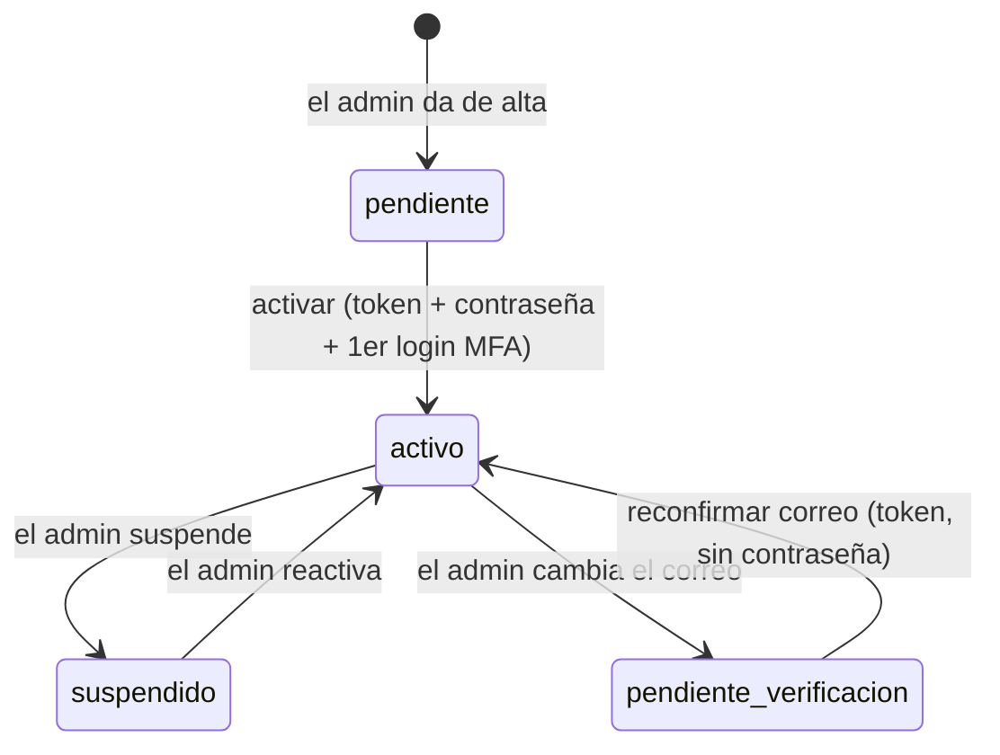
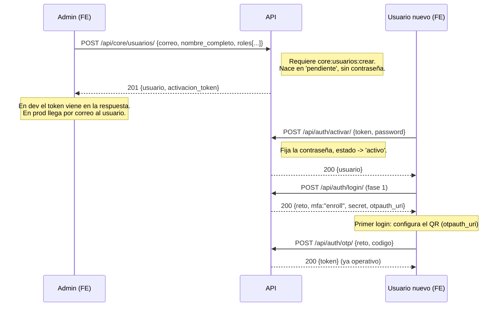
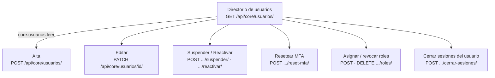
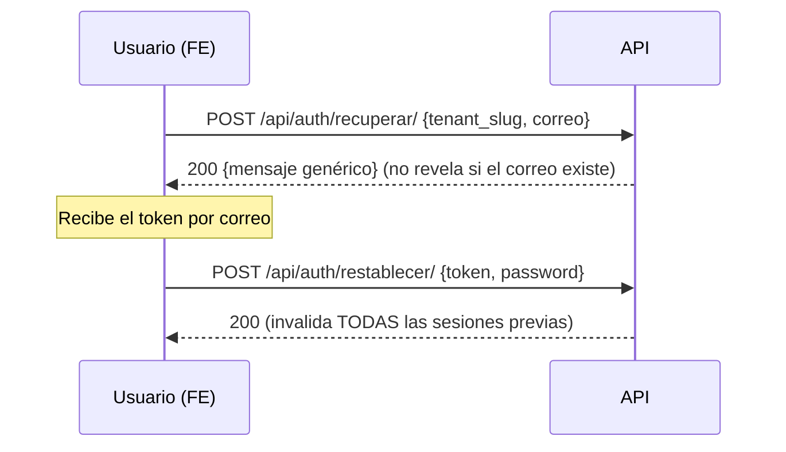

# NovaERP — Flujo de la aplicación: Usuarios

Guía de **flujo** del dominio de Usuarios para el frontend de la app de tenant.
Explica el ciclo de vida de un usuario, qué hace el administrador, qué hace cada
usuario sobre su propia cuenta, y qué permiso/estado gobierna cada acción (para
que el FE sepa qué pantallas y botones mostrar).

> Prerrequisitos de lectura: [GUIA-FRONTEND.md](./GUIA-FRONTEND.md) (autenticación,
> token, permisos, errores). Referencia de endpoints: [openapi.yaml](./openapi.yaml).

---

## 1. Panorama: dos actores

Sobre el dominio de usuarios operan **dos actores** con alcances distintos, y el
FE debe distinguirlos:

| Actor | Quién | Sobre quién actúa | Cómo se autoriza |
|---|---|---|---|
| **Administrador** | Usuario con permisos `core:usuarios:*` (típicamente `TENANT_ADMIN`) | Cualquier usuario del tenant | Por **permiso** de catálogo |
| **Propietario** | Cualquier usuario autenticado | Solo su propia cuenta | Por **ser el dueño** del registro (sin permiso de catálogo) |

Un usuario común, sin permisos de administración, **solo** ve su perfil y gestiona
sus propios datos y sesiones. El menú de "Administración de usuarios" se muestra
solo si `/api/core/me/` trae `core:usuarios:leer` (o `es_admin`).

---

## 2. Estados de un usuario

El campo `estado` gobierna qué puede hacer el usuario. **El login solo funciona en
`activo`** (y con el tenant también `activo`).



| Estado | Significado | ¿Puede entrar? |
|---|---|---|
| `pendiente` | Recién creado, sin contraseña | No — debe activar |
| `activo` | Operativo | Sí |
| `suspendido` | Bloqueado por el admin | No |
| `pendiente_verificacion` | Cambió su correo, falta reconfirmarlo | No — debe reconfirmar |

---

## 3. Ciclo de vida: alta → activación → primer login

El alta la hace el **administrador**; la activación (fijar contraseña) la hace el
**propio usuario** con un enlace de un solo uso. El **segundo factor (MFA) se
enrola en el primer login**, no en la activación.



**Para el FE:**
- El **alta** exige al menos un **rol** (`roles: [rolId, ...]`) y respeta el límite de
  licencias del plan (si se alcanza → `422`).
- El `activacion_token` tiene **24 h** de vigencia y es de un solo uso.
- La pantalla de **activación** pide la nueva contraseña (debe cumplir la política del
  tenant: longitud mínima, etc. — un `422` con `campo:"password"` indica el problema).
- El **enrolamiento de MFA** ocurre en el **primer login** (ver la guía, §3). La pantalla
  de activación **no** pide el MFA.

---

## 4. Gestión por el administrador

Todas estas acciones requieren el permiso indicado; el FE las muestra según `/me`.



| Acción | Endpoint | Permiso | Notas para el FE |
|---|---|---|---|
| **Directorio** | `GET /api/core/usuarios/` | `core:usuarios:leer` | Paginado; `?search=` (nombre/correo/puesto), filtros `?estado= ?rol= ?departamento=`, orden `?orden=nombre\|created_at\|ultimo_acceso&desc=`. |
| **Alta** | `POST /api/core/usuarios/` | `core:usuarios:crear` | Cuerpo: `correo`, `nombre_completo`, `roles[]` (obligatorio), opc. `telefono/puesto/departamento`. Devuelve `activacion_token`. |
| **Editar** | `PATCH /api/core/usuarios/{id}/` | `core:usuarios:editar` | El admin edita `nombre_completo`, `telefono`, `correo`, `puesto`, `departamento`. **Cambiar el correo** pone al usuario en `pendiente_verificacion` y devuelve `verificacion_token`. |
| **Suspender** | `POST /api/core/usuarios/{id}/suspender/` | `core:usuarios:suspender` | Cierra **todas** las sesiones del usuario y bloquea su login. **No** se puede suspender al **último** administrador activo (→ `422`). |
| **Reactivar** | `POST /api/core/usuarios/{id}/reactivar/` | `core:usuarios:suspender` | Conserva los roles; el login vuelve a funcionar. |
| **Resetear MFA** | `POST /api/core/usuarios/{id}/reset-mfa/` | `core:usuarios:reset_mfa` | Para pérdida de dispositivo: el usuario re-enrola en su próximo login. Acción exclusiva del admin. |
| **Asignar roles** | `POST /api/core/usuarios/{id}/roles/` | `core:asignaciones:crear` | Cuerpo `{roles: [rolId, ...]}`. Solo roles activos del tenant. |
| **Revocar rol** | `DELETE /api/core/usuarios/{id}/roles/{rolId}/` | `core:asignaciones:eliminar` | No deja al usuario sin roles; no revoca al último admin. |
| **Cerrar sesiones** | `POST /api/core/usuarios/{id}/cerrar-sesiones/` | `core:sesiones:revocar` | Fuerza el cierre de todas las sesiones del usuario (solo devuelve el conteo). |

---

## 5. Autoservicio del usuario (su propia cuenta)

Estas acciones **no** requieren permisos de catálogo: basta estar autenticado y ser
el dueño. El FE las muestra para cualquier usuario.

| Acción | Endpoint | Notas |
|---|---|---|
| **Ver mi perfil** | `GET /api/core/me/` | Perfil + tenant + roles + permisos + módulos + `ultimo_acceso`. Es la fuente para armar la UI. |
| **Editar mis datos** | `PATCH /api/core/usuarios/{miId}/` | El **propietario** solo puede cambiar `nombre_completo` y `telefono`. Cualquier otro campo → `422`. (Cambiar su propio correo o puesto lo hace el admin.) |
| **Mis sesiones** | `GET /api/core/sesiones/` | Lista sus sesiones activas (dispositivo, IP, inicio); marca la actual. |
| **Cerrar una sesión** | `DELETE /api/core/sesiones/{jti}/` | Logout remoto de un dispositivo. |
| **Cerrar las demás** | `POST /api/core/sesiones/cerrar-otras/` | Cierra todas menos la actual. |
| **Cerrar la actual** | `POST /api/auth/logout/` | Logout normal. |

### Recuperación de contraseña (sin sesión)



---

## 6. Roles y permisos (para las pantallas de administración)

> El modelo RBAC completo (resolución por petición, bypass del `TENANT_ADMIN`,
> permisos inertes, segregación de funciones y el catálogo de los 74 permisos) está
> en **[PERMISOS.md](./PERMISOS.md)**. Aquí van sólo los endpoints.

Si el FE incluye administración de roles (RBAC), estos son los endpoints:

| Acción | Endpoint | Permiso |
|---|---|---|
| Catálogo de permisos (para el selector) | `GET /api/core/permisos/` | `core:roles:leer` |
| Listar roles | `GET /api/core/roles/` | `core:roles:leer` |
| Crear rol | `POST /api/core/roles/` | `core:roles:crear` |
| Editar rol (nombre + permisos) | `PATCH /api/core/roles/{id}/` | `core:roles:editar` |
| Desactivar rol | `DELETE /api/core/roles/{id}/` | `core:roles:eliminar` |

- Los permisos siguen el patrón `dominio:recurso:accion`. El selector de permisos de un
  rol se arma con `GET /api/core/permisos/` (agrupa por dominio y marca los "inertes" de
  módulos desactivados).
- **Efecto inmediato:** editar los permisos de un rol surte efecto en la **siguiente**
  petición de cualquier usuario con ese rol, sin necesidad de re-login.

---

## 7. Reglas que el FE debe reflejar

- **El login solo funciona en `activo`.** En cualquier otro estado, la fase 1 responde
  `401` con el motivo (pendiente/suspendido/etc.).
- **MFA se enrola en el primer login**, no en la activación (ver guía §3).
- **Cambiar el correo** (por el admin) manda al usuario a `pendiente_verificacion`: debe
  reconfirmar con el `verificacion_token` (vía `POST /api/auth/activar/`, sin contraseña)
  antes de volver a entrar.
- **Sesión revocada = 401 inmediato.** Al suspender un usuario, restablecer su contraseña
  o cerrar sus sesiones, su token deja de servir al instante. El FE debe tratar el `401`
  como fin de sesión.
- **Protección del último administrador:** no se puede suspender ni dejar sin rol de
  administrador al último `TENANT_ADMIN` activo (→ `422`). El FE debería anticiparlo
  (deshabilitar el botón) además de manejar el error.
- **Límite de licencias del plan:** el alta puede fallar con `422` si el tenant llegó a su
  tope de usuarios (un usuario `suspendido` no consume licencia).
- **Autorización doble:** aunque ocultes un botón por permiso, maneja siempre el `403` (la
  autorización real se evalúa en cada request).

---

## 8. Mapa rápido de endpoints del dominio Usuarios

```
Autenticación / activación (sin sesión)
  POST /api/auth/login/            fase 1 (password -> reto)
  POST /api/auth/otp/              fase 2 (código TOTP -> token)
  POST /api/auth/activar/          activar cuenta / reconfirmar correo
  POST /api/auth/recuperar/        solicitar reset de contraseña
  POST /api/auth/restablecer/      fijar nueva contraseña
  POST /api/auth/logout/           cerrar la sesión actual

Perfil y sesiones (autenticado, propio)
  GET    /api/core/me/
  GET    /api/core/sesiones/
  DELETE /api/core/sesiones/{jti}/
  POST   /api/core/sesiones/cerrar-otras/

Administración de usuarios (por permiso)
  GET    /api/core/usuarios/                       leer
  POST   /api/core/usuarios/                       crear
  PATCH  /api/core/usuarios/{id}/                  editar (o propio)
  POST   /api/core/usuarios/{id}/suspender/        suspender
  POST   /api/core/usuarios/{id}/reactivar/        suspender
  POST   /api/core/usuarios/{id}/reset-mfa/        reset_mfa
  POST   /api/core/usuarios/{id}/cerrar-sesiones/  sesiones:revocar
  POST   /api/core/usuarios/{id}/roles/            asignaciones:crear
  DELETE /api/core/usuarios/{id}/roles/{rolId}/    asignaciones:eliminar

Roles / permisos (por permiso)
  GET    /api/core/permisos/                       roles:leer
  GET    /api/core/roles/                          roles:leer
  POST   /api/core/roles/                          roles:crear
  PATCH  /api/core/roles/{id}/                     roles:editar
  DELETE /api/core/roles/{id}/                     roles:eliminar
```
