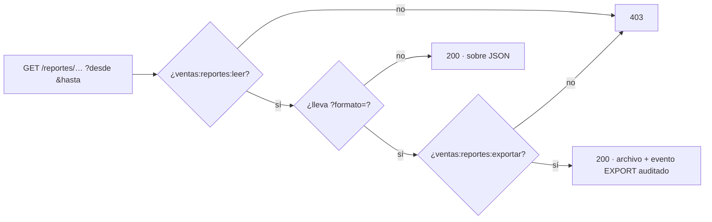

# NovaERP — Flujo de la aplicación: Reportes de Ventas

Los seis reportes agregados del dominio comercial (RV-01…06): qué mide cada uno,
qué permiso lo gatea, cómo se exporta y —sobre todo— **qué NO significa cada
cifra**. Un reporte que se lee mal es peor que no tenerlo.

> Prerrequisitos: [GUIA-FRONTEND.md](./GUIA-FRONTEND.md) · Ciclo comercial:
> [FLUJO-VENTAS.md](./FLUJO-VENTAS.md) · Referencia: [openapi.yaml](./openapi.yaml).
> Todas las rutas cuelgan de `/api/ventas/reportes/`.

---

## 1. Lo común a los seis



**Sobre de respuesta** (igual en los seis, salvo cartera que usa `corte` en vez de `rango`):

```json
{
  "rango":   {"desde": "2026-07-01", "hasta": "2026-07-31"},
  "filtros": {"cliente_id": null, "vendedor_id": null},
  "alcance_vendedor": null,
  "totales": {"venta_neta": "1250340.55", "num_facturas": 412},
  "resultados": [ ... ],
  "nota": "…",
  "generado_en": "2026-08-04T12:00:00+00:00"
}
```

- **No es el sobre paginado** de los listados (`{count, page, …}`): un agregado no
  es una página. Solo RV-05 con `?detalle=true` añade un bloque paginado.
- **`totales` agrega todo el rango**, nunca solo el top: cambiar `?limit=` no
  cambia los totales.
- **`nota`** lleva la advertencia metodológica del reporte. Muéstrala; está ahí
  porque la cifra tiene un matiz que el usuario necesita saber.
- **Importes como string decimal.** Parséalos con librería decimal, nunca float.

### Rango y errores

| Situación | Código |
|---|---|
| Falta `desde`/`hasta`, fecha no ISO, `agrupar`/`orden`/`formato` fuera del enum, `limit` no numérico | `400` |
| Sin `ventas:reportes:leer` (o sin `:exportar` al pedir archivo) | `403` |
| `desde` posterior a `hasta`, o rango mayor a **366 días** | `422` |

El rango es **obligatorio y acotado** a propósito: sin tope, un reporte sin filtros
barrería toda la historia del tenant en una sola petición.

### Alcance por vendedor

`alcance_vendedor` dice **a quién quedó acotado el reporte de verdad**:

- `null` → toda la organización (el actor tiene `ventas:pipeline:ver_todo`).
- un UUID → solo ese vendedor.

Quien **no** tiene `ventas:pipeline:ver_todo` ve siempre sus propias cifras, aunque
pida `?vendedor_id=<otro>` — y no recibe un `403`, recibe su propio dato. Píntalo en
la UI: sin ese aviso, un vendedor puede creer que está viendo las cifras de la empresa.

---

## 2. RV-01 · Ventas por periodo

`GET /ventas-por-periodo/?desde=&hasta=&agrupar=dia|semana|mes&cliente_id=&vendedor_id=`

Facturación agregada por cubo temporal. Por cubo: `num_facturas`, `subtotal`,
`impuestos`, `total_facturado`, `notas_credito`, `venta_neta`, `ticket_promedio`.

```
venta_neta = total facturado − notas de crédito
```

- **Las facturas `cancelada` no entran** en ningún agregado. Las
  `con_nota_credito` **sí**: la NC se resta aparte, porque descartar la factura
  entera borraría también la parte de la venta que no se devolvió.
- **Una NC se imputa al periodo de SU fecha**, no al de la factura que corrige.
  Una devolución en agosto de una venta de julio baja agosto y **no altera julio**,
  que ya se reportó. Un cubo puede tener venta neta **negativa** si solo tuvo
  devoluciones.
- **Solo se devuelven cubos con movimiento.** Si tu gráfica necesita la serie
  completa, rellena los huecos en el cliente.

---

## 3. RV-02 · Ranking de clientes

`GET /clientes/?desde=&hasta=&orden=monto|volumen&limit=10&vendedor_id=`

Por cliente: `num_facturas`, `total_facturado`, `notas_credito`, `venta_neta`,
`participacion_pct`, `ultima_compra`.

- `orden=monto` ordena por venta neta; `orden=volumen`, por número de facturas.
- **`participacion_pct` es `null`** cuando la venta neta total del rango no es
  positiva (un rango que solo tuvo devoluciones): un porcentaje sobre base cero o
  negativa no significa nada.
- Un cliente puede aparecer **solo por una devolución** de una compra anterior al
  rango, con venta neta negativa.

---

## 4. RV-03 · Ranking de productos

`GET /productos/?desde=&hasta=&orden=monto|cantidad&limit=10&cliente_id=&vendedor_id=`

Por producto: `cantidad`, `importe`, `participacion_pct`, `num_facturas`.

> ⚠️ **El importe es BRUTO.** Una nota de crédito no tiene desglose por línea, así
> que una devolución **no se puede imputar a un producto** y **no se descuenta**
> aquí. Por eso el importe de RV-03 **no cuadra** con la venta neta de RV-01, y es
> correcto que no cuadre. La advertencia viaja en `nota` y en la cabecera del
> CSV/PDF: no la ocultes en la UI.

Las líneas de facturas canceladas quedan fuera, igual que en el resto.

---

## 5. RV-04 · Embudo comercial

`GET /embudo/?desde=&hasta=&vendedor_id=`


`resultados` trae las cuatro etapas con `conteo`, `monto` y `conversion_pct`
(respecto de la etapa **anterior**; `null` en la primera). `totales` añade el
desenlace: ganadas/perdidas, `tasa_cierre_ganado_pct`, aprobadas/rechazadas/vencidas,
`tasa_aprobacion_pct`, pedidos cancelados. Y `motivos_perdida` desglosa el porqué.

- **Cada etapa cuenta los documentos CREADOS en el rango**, no los que hoy están en
  ese estado. Mide el **flujo del periodo**, no una foto del inventario comercial:
  un documento puede contarse en una etapa y no en la siguiente aunque acabe
  convirtiéndose más tarde. Por eso `conversion_pct` **no** es un seguimiento
  documento a documento — no lo etiquetes como "tasa de conversión real".
- **Pedidos** cuenta solo los vivos (`confirmado`, `pendiente_surtido`,
  `facturado_*`); los `borrador` y `cancelado` quedan fuera del embudo, y los
  cancelados se reportan aparte en `totales`.
- **`cotizaciones_vencidas`** se deriva de `vigente_hasta` (no es un estado
  almacenado), igual que en RF-35.

---

## 6. RV-05 · Cartera por antigüedad

`GET /cartera/?corte=&cliente_id=&detalle=true&page=&page_size=`

**No usa rango: es una foto a la fecha de `corte`** (por defecto, hoy). Por cliente:
`saldo_total` y el reparto en `dias_0_30`, `dias_31_60`, `dias_61_90`, `dias_90_mas`.
Con `?detalle=true` añade el bloque `detalle` paginado, factura a factura.

- **El saldo se reconstruye a la fecha de corte**: monto original menos los abonos
  **anteriores al corte**. No se lee el saldo de hoy, así que pedir el corte del mes
  pasado devuelve lo que realmente se debía entonces. Una factura pagada después del
  corte sigue apareciendo completa.
- ⚠️ **La antigüedad cuenta DÍAS DESDE LA EMISIÓN, no días vencidos.** El esquema no
  modela fecha de vencimiento ni días de crédito, así que **esto no es un reporte de
  mora**. La respuesta lo declara en `criterio` y el archivo exportado lo lleva en la
  cabecera. No lo etiquetes como "vencido a 30/60/90 días" en la UI.
- Las cuentas ya saldadas a la fecha de corte no aparecen.

---

## 7. RV-06 · Desempeño de vendedores

`GET /vendedores/?desde=&hasta=&vendedor_id=`

Por vendedor: oportunidades ganadas/perdidas, `tasa_conversion_pct`, cotizaciones
emitidas/aprobadas, pedidos confirmados, `num_facturas`, `facturado`,
`notas_credito` y `venta_neta`. Ordenado por venta neta.

- La atribución sale de `responsable_id` (oportunidades) y de `vendedor_id`
  (cotizaciones, pedidos, facturas). Un vendedor aparece si tiene actividad en
  **cualquiera** de las cuatro.
- **Fila "Sin asignar"** (`vendedor_id: null`): documentos sin atribución — el
  histórico anterior a que existiera la columna `vendedor_id`. **Nunca se reparte
  entre los vendedores reales** y **no cuenta** en `totales.num_vendedores`.
  Píntala como una fila más, claramente etiquetada; si es grande, es una señal de
  datos históricos, no de un vendedor fantasma.
- `tasa_conversion_pct` es ganadas / (ganadas + perdidas); `null` si no cerró
  ninguna en el rango.

---

## 8. Exportación

Cualquiera de los seis acepta `?formato=csv|pdf` y devuelve el **reporte completo**
(sin recortar por `limit`, sin paginar) como descarga.

- Exige **`ventas:reportes:exportar`**, un permiso aparte de `:leer`: exportar saca
  datos del sistema. Un rol con `:leer` y sin `:exportar` recibe `403` con
  `permiso_requerido: ventas:reportes:exportar` — úsalo para ocultar el botón.
- Cada exportación se registra como evento **`EXPORT`** en la bitácora de auditoría
  **antes** de entregar el archivo, con el reporte y los filtros usados.
- El archivo lleva cabecera de trazabilidad (tenant, quién exportó, cuándo, con qué
  filtros) **y la advertencia metodológica del reporte**, para que siga siendo
  legible fuera del sistema.

---

## 9. Permisos, de un vistazo

| Acción | Permiso |
|---|---|
| Ver cualquiera de los seis reportes | `ventas:reportes:leer` |
| Descargar CSV/PDF | `ventas:reportes:exportar` |
| Ver cifras de otros vendedores | `ventas:pipeline:ver_todo` |

`ventas:pipeline:ver_todo` es el mismo permiso que ya gobierna el pipeline de
oportunidades (RF-31): quien lo tiene ve toda la organización en el pipeline **y**
en los reportes.
