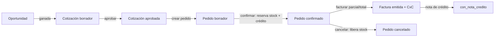
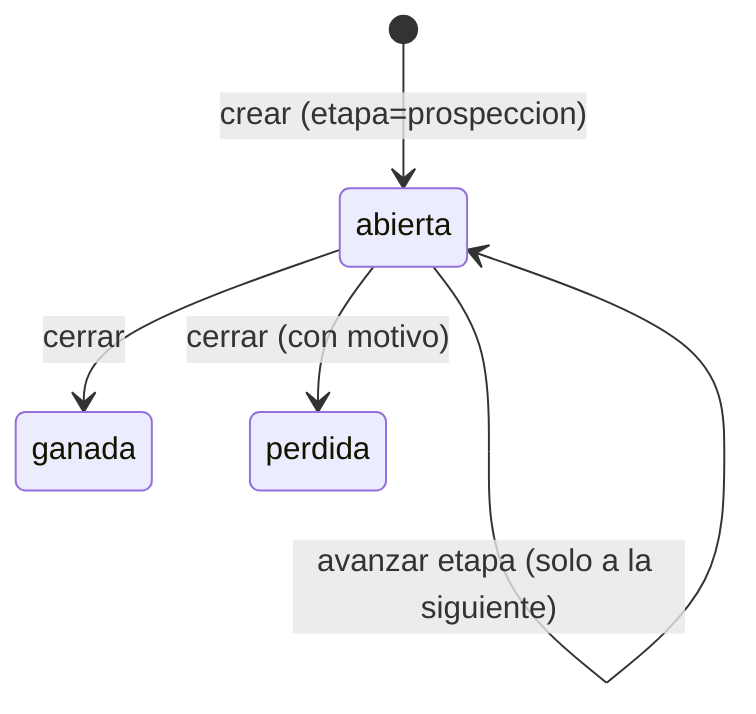
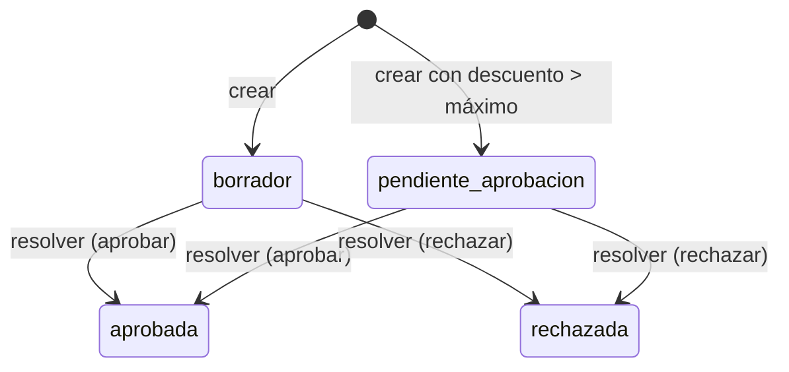
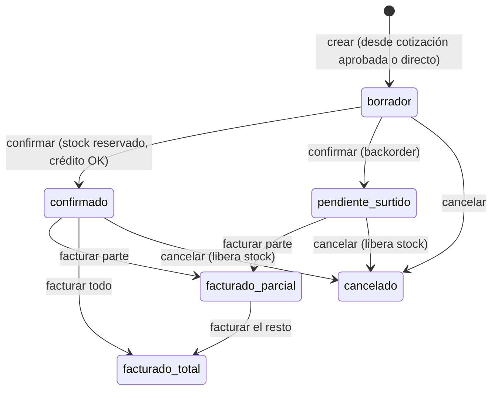
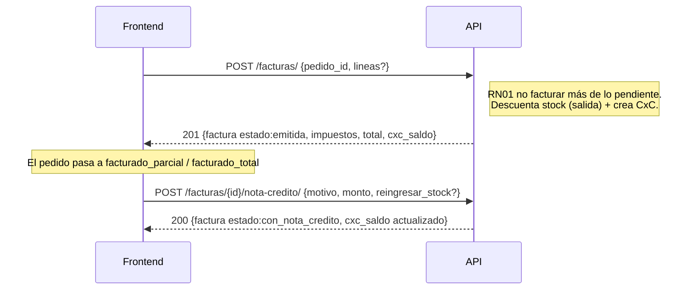

# NovaERP — Flujo de la aplicación: Ventas / CRM

Flujo del ciclo comercial completo para el frontend: oportunidad → cotización →
pedido → factura → nota de crédito. Explica estados, qué transición está permitida
y qué permiso/regla gobierna cada paso.

> Prerrequisitos: [GUIA-FRONTEND.md](./GUIA-FRONTEND.md) · Referencia: [openapi.yaml](./openapi.yaml).
> Todas las rutas cuelgan de `/api/ventas/`.

---

## 1. La cadena comercial de un vistazo

Cada eslabón es opcional como punto de entrada: puedes crear una cotización sin
oportunidad, o un pedido directo sin cotización. Lo que **no** cambia son las reglas
de cada transición.

---

## 2. Oportunidades (pipeline)

- **Etapas** (en orden): `prospeccion` → `calificacion` → `propuesta` → `negociacion` → `cierre`.
  Solo se avanza **a la siguiente** (no se salta ni se retrocede → `422`).
- **Cierre** (`ganada`/`perdida`) es terminal; `perdida` exige `motivo_perdida` del catálogo
  (Precio, Competencia, Tiempo, Presupuesto, Sin respuesta, Otro).
- **Visibilidad:** un vendedor ve/opera **solo las suyas**, salvo que tenga
  `ventas:pipeline:ver_todo`. Cada respuesta incluye `probabilidad` (derivada de la etapa)
  y `valor_ponderado`.

| Acción | Endpoint | Permiso |
|---|---|---|
| Listar (tabla) | `GET /oportunidades/` | `ventas:oportunidades:leer` |
| Pipeline kanban | `GET /oportunidades/pipeline/` | `ventas:oportunidades:leer` |
| Registrar | `POST /oportunidades/` | `ventas:oportunidades:crear` |
| Editar / detalle | `PATCH`·`GET /oportunidades/{id}/` | `ventas:oportunidades:editar` / `:leer` |
| Avanzar etapa | `POST /oportunidades/{id}/etapa/` | `ventas:oportunidades:editar` |
| Cerrar | `POST /oportunidades/{id}/cerrar/` | `ventas:oportunidades:cerrar` |

---

## 3. Cotizaciones

- **Precio** por defecto del catálogo del producto (`producto.precio_venta`). Enviar un
  `precio_unitario` distinto exige `ventas:cotizaciones:ajustar_precio` (→ `403` si no).
- **Totales automáticos:** `subtotal` y `total` (= subtotal − descuento). La cotización
  **no** desglosa impuestos (eso ocurre en la factura).
- **RN03:** si el descuento supera el máximo del tenant, nace en `pendiente_aprobacion`.
- **`vencida`** es un booleano **derivado** de `vigente_hasta` (no un estado almacenado);
  una vencida **no se puede aprobar** (→ `422`).
- **Editar** solo en `borrador`/`pendiente_aprobacion`. Una aprobada/rechazada se regenera.

| Acción | Endpoint | Permiso |
|---|---|---|
| Listar (`?estado= ?vencida=true`) | `GET /cotizaciones/` | `ventas:cotizaciones:leer` |
| Generar | `POST /cotizaciones/` | `ventas:cotizaciones:crear` |
| Editar / detalle | `PATCH`·`GET /cotizaciones/{id}/` | `ventas:cotizaciones:editar` / `:leer` |
| Aprobar / rechazar | `POST /cotizaciones/{id}/resolver/` | `ventas:cotizaciones:aprobar` |

---

## 4. Pedidos (reserva de stock y crédito)

**El paso clave es `confirmar`.** Crear un pedido solo arma el borrador; la reserva de
stock y la validación de crédito ocurren al confirmar:

- **`almacen_id` es obligatorio** al confirmar (de qué almacén se surte).
- **Crédito (RN02):** si el pedido excede el límite del cliente → `422`. Para forzarlo,
  reintenta con `{almacen_id, autorizar_credito: true}`; requiere que el actor tenga
  `finanzas:credito:autorizar` (si no → `403`).
- **Stock (RN03):** si hay stock, reserva y pasa a `confirmado`. Si no alcanza y el tenant
  permite backorder → `pendiente_surtido` (reserva lo disponible). Si no permite → `422`.
- **Cancelar** libera el stock reservado. Un pedido **con facturas no se cancela** (→ `422`,
  va por nota de crédito).

Cada línea del pedido expone `cantidad`, `cantidad_reservada`, `cantidad_facturada` y
`pendiente_facturar` — útiles para pintar el estado de surtido/facturación.

| Acción | Endpoint | Permiso |
|---|---|---|
| Listar | `GET /pedidos/` | `ventas:pedidos:leer` |
| Crear (borrador) | `POST /pedidos/` | `ventas:pedidos:crear` |
| Editar / detalle | `PATCH`·`GET /pedidos/{id}/` | `ventas:pedidos:editar` / `:leer` |
| Confirmar | `POST /pedidos/{id}/confirmar/` | `ventas:pedidos:editar` |
| Cancelar | `POST /pedidos/{id}/cancelar/` | `ventas:pedidos:cancelar` |

---

## 5. Facturas y notas de crédito

- **Factura parcial o total:** sin `lineas` factura todo lo pendiente y reservado; con
  `lineas` factura cantidades específicas. **No** más de lo pendiente por línea (→ `422`).
- Al facturar: el **stock reservado pasa a salida definitiva** (movimiento de inventario) y
  se crea la **cuenta por cobrar** automáticamente. `impuestos` = subtotal × IVA del tenant.
- Una factura **emitida no se edita ni elimina** (integridad fiscal): toda corrección es una
  **nota de crédito** ligada. `monto` ≤ saldo de la CxC; una NC **total** con
  `reingresar_stock: true` reingresa el stock facturado.

| Acción | Endpoint | Permiso |
|---|---|---|
| Listar | `GET /facturas/` | `ventas:facturas:leer` |
| Generar | `POST /facturas/` | `ventas:facturas:crear` |
| Detalle | `GET /facturas/{id}/` | `ventas:facturas:leer` |
| Nota de crédito | `POST /facturas/{id}/nota-credito/` | `ventas:facturas:cancelar` |

---

## 6. Clientes (catálogo base)

| Acción | Endpoint | Permiso |
|---|---|---|
| Listar / buscar | `GET /clientes/` | `ventas:clientes:leer` |
| Registrar | `POST /clientes/` | `ventas:clientes:crear` |
| Editar / baja | `PATCH`·`DELETE /clientes/{id}/` | `ventas:clientes:editar` / `:eliminar` |

- `rfc_o_id_fiscal` es único por tenant; `limite_credito` ≥ 0.
- La **baja se bloquea** si el cliente tiene saldo pendiente en cuentas por cobrar.

---

## 7. Reglas que el FE debe reflejar

- **`disponible = cantidad − reservado`.** Al confirmar un pedido, el stock reservado sube;
  al cancelar, baja; al facturar, se convierte en salida.
- **Backorder configurable por tenant.** Si está deshabilitado, confirmar sin stock falla
  (`422`); si está habilitado, el pedido queda `pendiente_surtido`.
- **Autorización de crédito** es una acción con permiso propio (`finanzas:credito:autorizar`):
  el vendedor que la necesite y no lo tenga verá `403`; muéstrale que requiere autorización.
- **La cotización no desglosa impuestos; la factura sí.** No sumes IVA en la cotización.
- **Montos como string** (decimales): parséalos con librería decimal, nunca float.
