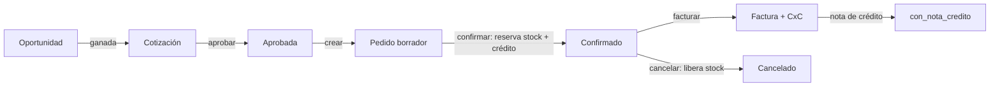

# NovaERP — Guía de la aplicación para Frontend & App Móvil

Explicación integral de cómo funciona NovaERP de cara a los clientes (web y
móvil): arquitectura, autenticación, permisos y roles, convenciones, y los flujos
de cada módulo. Es el **documento maestro**; para el detalle técnico están:

- [`GUIA-FRONTEND.md`](./GUIA-FRONTEND.md) — contrato transversal (referencia rápida).
- [`FLUJO-USUARIOS.md`](./FLUJO-USUARIOS.md) — flujo del dominio de usuarios en detalle.
- [`openapi.yaml`](./openapi.yaml) — referencia de endpoints (Swagger/Postman/gen de cliente).
- [`../../test.http`](../../test.http) — ejemplos ejecutables de cada endpoint.

---

## 1. Qué es NovaERP

NovaERP es un **ERP SaaS multi-tenant**: una sola API sirve a muchas
organizaciones (*tenants*), con los datos de cada una **aislados**. Se consume por
API REST + JSON, con autenticación JWT.

### 1.1 Dos superficies (dos apps distintas)

| Superficie | Prefijo | Quién la usa | Login |
|---|---|---|---|
| **App de tenant** | `/api/auth/`, `/api/core/`, `/api/ventas/`, `/api/compras/`, `/api/inventario/` | Empleados de una organización | Dos fases (password + MFA) |
| **Portal de plataforma** | `/api/admin/` | SysAdmin (gestiona las organizaciones) | Una fase (password) |

Son **dos frontends separados**. La app web/móvil que construyes para los clientes
es la **app de tenant**. El portal de plataforma es una consola interna aparte.

### 1.2 Módulos y planes

Cada organización contrata un **plan** (`STARTER`, `BUSINESS`, `ENTERPRISE`) que
determina qué **módulos** tiene activos. El núcleo (identidad, usuarios, RBAC,
sesiones, auditoría, seguridad, reportería) **siempre** está activo; los módulos de
negocio (Ventas, Compras, Inventario) dependen del plan.

> **Regla de oro de la UI:** el menú y las secciones se pintan con los **módulos
> activos** y los **permisos** que devuelve `GET /api/core/me/` (ver §3). Nunca
> hardcodees el menú.

---

## 2. Autenticación y sesión

### 2.1 Login del usuario de tenant — dos fases con MFA

```
Fase 1  POST /api/auth/login/  {tenant_slug, correo, password}
        └─ 200 {reto, mfa:"enroll"|"otp", secret?, otpauth_uri?}
Fase 2  POST /api/auth/otp/     {reto, codigo}
        └─ 200 {token}
```

- El usuario primero elige/ingresa su **organización** (`tenant_slug`), correo y
  contraseña.
- La fase 1 **no** entrega el token de sesión: devuelve un **reto** efímero (~5 min).
- En el **primer login** (`mfa:"enroll"`), la respuesta trae `secret` y `otpauth_uri`
  **una sola vez** para configurar el segundo factor (TOTP). En los siguientes
  (`mfa:"otp"`) solo se pide el código.
- La fase 2 valida el código de 6 dígitos y devuelve el **token JWT** de sesión.

### 2.2 Uso del token

- Manda `Authorization: Bearer <token>` en cada petición protegida.
- El token **expira** (configurable por tenant, default 8 h) **y** puede revocarse del
  lado servidor (logout, cambio de contraseña, suspensión). No hay refresh token.
- **Trata cualquier `401` como “sesión terminada” → volver a login.**

### 2.3 Gestión de sesión

| Acción | Endpoint |
|---|---|
| Cerrar la sesión actual | `POST /api/auth/logout/` |
| Ver mis sesiones activas | `GET /api/core/sesiones/` |
| Cerrar una sesión (otro dispositivo) | `DELETE /api/core/sesiones/{jti}/` |
| Cerrar todas menos la actual | `POST /api/core/sesiones/cerrar-otras/` |
| Recuperar contraseña | `POST /api/auth/recuperar/` → `POST /api/auth/restablecer/` |

### 2.4 Portal de plataforma (SysAdmin)

`POST /api/admin/login/ {correo, password}` → `{token}` (una fase). Este token solo
sirve en `/api/admin/…`; no cruza a la app de tenant y viceversa.

---

## 3. Permisos y roles (RBAC)

### 3.1 El modelo

- Un usuario tiene uno o más **roles**; cada rol agrupa **permisos**.
- Los permisos son códigos **`dominio:recurso:accion`** (p. ej. `ventas:pedidos:crear`).
- El rol de sistema **`TENANT_ADMIN`** puede todo (bypass): en `/me` viene `es_admin: true`.

### 3.2 Cómo dirige la UI — `GET /api/core/me/`

Llama a `/me` justo después del login y guarda el resultado:

```jsonc
{
  "usuario":  { "id", "nombre_completo", "correo", "estado", "mfa_enrolado", "ultimo_acceso" },
  "tenant":   { "id", "slug", "razon_social", "estado", "plan" },
  "roles":    ["TENANT_ADMIN", ...],
  "es_admin": true,
  "permisos": [ { "codigo": "ventas:pedidos:crear", "dominio", "recurso", "accion" }, ... ],
  "modulos":  [ { "codigo": "VENTAS", "nombre", "fase" }, ... ]
}
```

- **Menú:** un ítem por cada `modulos[].codigo` activo.
- **Botones/acciones:** habilítalos si `es_admin` **o** el `codigo` está en `permisos`.
- **Efecto inmediato:** si un admin cambia los permisos de un rol, surten efecto en la
  **siguiente** petición, sin re-login. Conviene refrescar `/me` periódicamente o tras
  operaciones sensibles.
- **Autorización doble:** ocultar el botón por permiso es UX; el backend **igual** valida
  y puede responder `403`. Manéjalo siempre.

### 3.3 Dominios de permisos (resumen)

| Dominio | Recursos (acciones típicas: `leer`, `crear`, `editar`, `eliminar`) |
|---|---|
| `core` | `usuarios`, `roles`, `asignaciones`, `sesiones`, `politicas`, `bitacora`, `reportes` |
| `ventas` | `clientes`, `oportunidades`, `pipeline:ver_todo`, `cotizaciones` (+ `aprobar`, `ajustar_precio`), `pedidos` (+ `cancelar`), `facturas` (+ `cancelar`), `reportes` (`leer`, `exportar`) |
| `compras` | `proveedores`, `ordenes` (+ `aprobar`, `cancelar`), `recepciones`, `cuentas_por_pagar`, `config_aprobacion` |
| `inventario` | `productos`, `almacenes`, `movimientos`, `ajustes`, `transferencias`, `stock`, `kardex`, `valuacion`, `alertas` (+ `notificar`) |
| `finanzas` | `credito:autorizar` (autorizar excepción de límite de crédito) |

Administración de roles: `GET /api/core/roles/`, `POST/PATCH/DELETE`, y el catálogo
para el selector en `GET /api/core/permisos/`.

---

## 4. Convenciones transversales (¡importantes para móvil!)

- **Errores.** Códigos: `400` (JSON inválido), `401` (no autenticado/sesión expirada),
  `403` (sin permiso, trae `permiso_requerido`), `404` (no encontrado), `422` (regla de
  negocio, trae `campo` y a veces datos extra). Cuerpo: `{"detail": ...}` en todo, **salvo**
  los endpoints de auth que usan `{"mensaje": ...}` → lee `error.detail ?? error.mensaje`.
- **Paginación.** Listados devuelven `{count, page, page_size, num_pages, results[]}`.
  Params: `?page= &page_size= &search= &desde= &hasta=` + filtros por campo.
- **Aislamiento por tenant.** El tenant va **dentro del token**; nunca envíes `tenant_id`.
- **Decimales como string.** Montos y cantidades viajan como **texto** (`"1450.00"`) para
  no perder precisión. **Parséalos con una librería decimal, no como float.**
- **Fechas ISO 8601 en UTC** (`2026-07-25T19:10:02Z`). Convierte a la zona del usuario en
  la UI.
- **UUIDs** para los ids de negocio.

---

## 5. Flujos por módulo

### 5.1 Núcleo — Usuarios, roles y sesiones
Ciclo de vida del usuario (alta → activación → primer login con MFA), gestión por el
admin (directorio, suspender/reactivar, reset MFA, roles) y autoservicio (perfil,
sesiones, recuperación). **Detalle completo con diagramas en
[`FLUJO-USUARIOS.md`](./FLUJO-USUARIOS.md).**

### 5.2 Núcleo — Seguridad, auditoría y reportes
| Área | Endpoint | Permiso |
|---|---|---|
| Políticas de seguridad del tenant | `GET/PATCH /api/core/config-seguridad/` | `core:politicas:leer` / `:editar` |
| Bitácora de auditoría | `GET /api/core/bitacora/` · export `…/export/?formato=csv\|pdf` | `core:bitacora:leer` / `:exportar` |
| Reporte de actividad | `GET /api/core/reportes/actividad/` | `core:reportes:leer` |

### 5.3 Plataforma — Tenants (SysAdmin, solo `/api/admin/`)
Alta de organización → activación en cascada, edición de datos/plan/módulos (con
dependencias entre módulos), suspensión/baja/reactivación.
| Acción | Endpoint |
|---|---|
| Contexto de la sesión de plataforma | `GET /api/admin/me/` |
| Catálogo (planes, módulos, dependencias) | `GET /api/admin/catalogos/` |
| Registrar tenant | `POST /api/admin/tenants/` |
| Listar / detalle | `GET /api/admin/tenants/[{id}/]` |
| Editar (datos, plan, módulos) | `PATCH /api/admin/tenants/{id}/` |
| Suspender / baja / reactivar | `POST /api/admin/tenants/{id}/suspender/` · `.../reactivar/` |
| Activar (público, lo hace el admin inicial) | `POST /api/auth/activar-tenant/` |
| Reemitir el enlace de activación | `POST /api/admin/tenants/{id}/reenviar-activacion/` |

### 5.4 Ventas / CRM
La cadena comercial. **Estados y reglas detalladas en `GUIA-FRONTEND.md` §9 y en OpenAPI.**



| Recurso | Endpoints base | Notas clave |
|---|---|---|
| Clientes | `GET/POST /api/ventas/clientes/`, `PATCH/DELETE .../{id}/` | RFC único; baja bloqueada si hay saldo por cobrar. |
| Oportunidades | `.../oportunidades/` + `…/pipeline/`, `…/{id}/etapa/`, `…/{id}/cerrar/` | Etapa solo avanza; visibilidad propia salvo `ventas:pipeline:ver_todo`. |
| Cotizaciones | `.../cotizaciones/` + `…/{id}/resolver/` | Precio del catálogo; descuento alto → aprobación; `vencida` derivada. |
| Pedidos | `.../pedidos/` + `…/{id}/confirmar/`, `…/{id}/cancelar/` | **Confirmar** reserva stock (`almacen_id`) y valida crédito. |
| Facturas | `.../facturas/` + `…/{id}/nota-credito/` | Parcial/total; descuenta stock, crea CxC; NC revierte. |
| Reportes | `.../reportes/{ventas-por-periodo,clientes,productos,embudo,cartera,vendedores}/` | `ventas:reportes:leer`; `?formato=csv\|pdf` exige `:exportar`. Alcance por vendedor según `ventas:pipeline:ver_todo`. |

**Detalle de los reportes en [`FLUJO-VENTAS-REPORTES.md`](./FLUJO-VENTAS-REPORTES.md)** —
incluye qué NO mide cada cifra (el ranking de productos no descuenta devoluciones; la
cartera mide días desde emisión, no vencidos), que es justo lo que hay que reflejar en
las etiquetas de la UI.

### 5.5 Compras
Del proveedor a la cuenta por pagar. La **recepción** mueve el inventario y genera la
**CxP** automáticamente.
| Recurso | Endpoints | Permiso base |
|---|---|---|
| Proveedores | `GET/POST /api/compras/proveedores/`, `PATCH/DELETE .../{id}/`, `…/{id}/historial/` | `compras:proveedores:*` |
| Órdenes de compra | `GET/POST /api/compras/ordenes/`, `PATCH .../{id}/`, `…/{id}/cancelar/` | `compras:ordenes:*` (+ `aprobar`, `cancelar`) |
| Recepciones | `GET/POST /api/compras/recepciones/` | `compras:recepciones:*` |
| Cuentas por pagar | `GET /api/compras/cuentas-por-pagar/` | `compras:cuentas_por_pagar:leer` |
| Config. de aprobación | `GET/PATCH /api/compras/config-aprobacion/` | `compras:config_aprobacion:*` |

Reglas para el FE:
- Si el **total de la orden supera el umbral** del tenant, nace en `pendiente_aprobacion`
  (no en `enviada`); requiere aprobación antes de recibirse.
- La **recepción** valida cantidad ≤ pendiente por línea, **suma stock** (movimiento de
  entrada) y crea la **cuenta por pagar**; la orden pasa a `recibida_parcial`/`recibida_total`.

### 5.6 Inventario
Fuente de verdad del stock (el **kardex** es la bitácora inmutable de movimientos).
| Recurso | Endpoints | Permiso base |
|---|---|---|
| Productos | `GET/POST /api/inventario/productos/`, `PATCH/DELETE .../{id}/` | `inventario:productos:*` |
| Almacenes | `GET/POST /api/inventario/almacenes/`, `PATCH/DELETE .../{id}/` | `inventario:almacenes:*` |
| Movimientos (entrada/salida) | `GET/POST /api/inventario/movimientos/` | `inventario:movimientos:*` |
| Ajustes | `GET/POST /api/inventario/ajustes/` | `inventario:ajustes:*` |
| Transferencias | `GET/POST /api/inventario/transferencias/` | `inventario:transferencias:*` |
| Stock disponible | `GET /api/inventario/stock-disponible/` | `inventario:stock:leer` |
| Kardex | `GET /api/inventario/kardex/` | `inventario:kardex:leer` |
| Valuación | `GET /api/inventario/valuacion/` | `inventario:valuacion:leer` |
| Alertas de stock mínimo | `GET /api/inventario/alertas-stock-minimo/` · `…/{id}/notificar/` | `inventario:alertas:*` |

Reglas para el FE:
- **`disponible = cantidad − reservado`.** Lo reservado son pedidos de venta confirmados.
- **Ninguna salida** puede dejar el stock por debajo de cero (el backend lo rechaza → 422).
- Movimientos y kardex son **inmutables**: para corregir se hace un ajuste, no se edita.

---

## 6. Consideraciones para la app móvil

Todo lo anterior aplica igual en móvil; además:

1. **Guarda el token en almacenamiento seguro** — Keychain (iOS) / Keystore o
   EncryptedSharedPreferences (Android). Nunca en almacenamiento en claro.
2. **Segundo factor (TOTP).** En el enrolamiento recibes `otpauth_uri` (`otpauth://totp/…`):
   - Muestra el **QR** para que el usuario lo escanee con su app autenticadora, **o**
   - ofrece un botón que abra el `otpauth_uri` en la app autenticadora del dispositivo.
   - Evita generar el TOTP dentro de la misma app (reduce el segundo factor a un solo
     dispositivo); si lo haces, documenta el riesgo.
3. **Activación y recuperación por enlace.** Los tokens de activación de cuenta y de
   restablecimiento llegan **por correo**. Implementa **deep links / universal links**
   (`app-links` en Android, Universal Links en iOS) para abrir la pantalla de activación
   con el token embebido.
4. **Expiración y re-login.** No hay refresh token: al recibir `401`, cierra sesión y
   vuelve a autenticar. Puedes ofrecer **re-login biométrico** guardando las credenciales
   en el almacén seguro y re-autenticando con huella/Face ID.
5. **Selección de organización.** El login pide `tenant_slug`. Recuérdalo por dispositivo
   (p. ej. la última organización usada) para no pedirlo cada vez.
6. **Reintentos de red con cuidado.** Reintenta libremente los `GET`. Los `POST` que crean
   o cambian estado (confirmar pedido, generar factura, recepción) **no son idempotentes**:
   no los reintentes a ciegas tras un timeout; consulta el estado antes.
7. **Caché offline por tenant.** Si cacheas datos, inválidalos al cerrar sesión o cambiar de
   organización — nunca mezcles datos de dos tenants.
8. **Precisión monetaria.** Usa tipos decimales (BigDecimal / Decimal), nunca `double`, para
   los montos que llegan como string.
9. **Notificaciones.** Las alertas de seguridad y de negocio se entregan por correo del lado
   servidor; si en el futuro se agrega push, será un canal adicional (hoy no existe endpoint
   de registro de dispositivo).

---

## 7. Recursos y cómo empezar

1. Lee esta guía y el contrato transversal ([`GUIA-FRONTEND.md`](./GUIA-FRONTEND.md)).
2. Abre [`openapi.yaml`](./openapi.yaml) en Swagger UI / Redoc, o impórtalo a Postman.
3. Prueba el flujo con [`../../test.http`](../../test.http) (usuario sembrado: tenant
   `acme`, `admin@acme.com`).
4. Implementa **primero** el login de dos fases y `/me`; con eso ya puedes armar el menú y
   las pantallas por permiso.
5. Genera un cliente tipado (TypeScript, Kotlin, Swift) desde el OpenAPI para no escribir
   los DTOs a mano.
