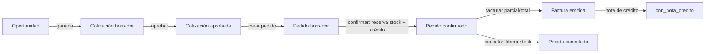

# NovaERP API — Guía para el Frontend

Contrato transversal del API de NovaERP: lo que **todo** cliente frontend debe
entender antes de tocar un endpoint concreto. La referencia endpoint por endpoint
está en [`openapi.yaml`](./openapi.yaml) (ábrelo en Swagger UI / Redoc, o impórtalo
a Postman). Ejemplos ejecutables en [`../../test.http`](../../test.http) *(REST
Client de VS Code)*.

> Estado de esta guía: **plantilla de referencia**. El contrato transversal está
> completo; en OpenAPI está detallado el módulo **Ventas** como modelo. Los demás
> módulos (núcleo, plataforma, compras, inventario) se documentan con el mismo
> patrón.

---

## 1. Fundamentos

- **Base URL:** `http://<host>:8000/` (dev). Todas las rutas cuelgan de `/api/`.
- **Formato:** JSON en request y response. Envía `Content-Type: application/json`.
- **Autenticación:** JWT por cabecera `Authorization: Bearer <token>`. No hay cookies
  ni sesión de servidor tradicional.
- **Multi-tenant:** el tenant va **dentro del token**. El frontend **nunca** envía
  `tenant_id` en el body ni en la query; el backend lo resuelve solo y aísla los datos.

---

## 2. Dos superficies distintas

El API tiene **dos portales separados** que no comparten sesión:

| Superficie | Prefijo | Quién | Login | Token |
|---|---|---|---|---|
| **Tenant** (la app del cliente) | `/api/auth/`, `/api/core/`, `/api/ventas/`, `/api/compras/`, `/api/inventario/` | Usuarios de una organización | **Dos fases** (password + MFA) | `{sub, tid, jti}` |
| **Plataforma** (SysAdmin) | `/api/admin/` | Administrador global (gestiona tenants) | **Una fase** (password) | `{sub, typ:"sysadmin", jti}` |

Un token de una superficie **no sirve** en la otra (responde 401). Normalmente son
dos frontends distintos (la app del ERP vs. la consola de administración).

---

## 3. Autenticación del usuario de tenant (dos fases + MFA)

El login es de **dos fases**. En el **primer** login el usuario **enrola su segundo
factor (TOTP)**; en los siguientes solo lo ingresa.

```mermaid
sequenceDiagram
  participant FE as Frontend
  participant API
  FE->>API: POST /api/auth/login/ {tenant_slug, correo, password}
  alt password válida, primer login (sin MFA)
    API-->>FE: 200 {reto, mfa:"enroll", secret, otpauth_uri, mensaje}
    Note over FE: Muestra el QR (otpauth_uri) para configurar<br/>la app autenticadora (Google Authenticator...)
  else password válida, ya enrolado
    API-->>FE: 200 {reto, mfa:"otp", mensaje}
  else password inválida / bloqueado / inactivo
    API-->>FE: 401 {mensaje}
  end
  FE->>API: POST /api/auth/otp/ {reto, codigo}
  alt código correcto
    API-->>FE: 200 {token, mensaje}
    Note over FE: Guarda token; úsalo en Authorization: Bearer
  else código incorrecto
    API-->>FE: 401 {mensaje}
  end
```

**Puntos clave para el FE:**
- El `reto` es un JWT efímero (~5 min) que **no** sirve como token de sesión; solo
  para la fase 2. No lo guardes como credencial.
- En modo `enroll`, `secret` y `otpauth_uri` llegan **una sola vez**. Genera el QR con
  `otpauth_uri`. El código de la fase 2 confirma el enrolamiento.
- El **bloqueo por intentos** (RN02) es global: varios fallos de password u OTP
  bloquean la cuenta temporalmente; el mensaje lo indica.

**Otros endpoints de sesión:**
- `POST /api/auth/logout/` — cierra la sesión actual (idempotente).
- `POST /api/auth/recuperar/` — solicita restablecer contraseña (responde siempre lo
  mismo, exista o no el correo).
- `POST /api/auth/restablecer/` — fija nueva contraseña con el token recibido; invalida
  todas las sesiones previas.
- `GET /api/core/sesiones/` · `DELETE /api/core/sesiones/<jti>/` · `POST /api/core/sesiones/cerrar-otras/`
  — el usuario gestiona sus sesiones activas.

### SysAdmin (portal de plataforma)
`POST /api/admin/login/ {correo, password}` → `200 {token}` (una fase, sin MFA por
ahora). `POST /api/admin/logout/` cierra la sesión.

---

## 4. Uso del token y expiración

- Manda `Authorization: Bearer <token>` en cada request protegido.
- El token expira (configurable por tenant, default 8 h) **y** puede ser revocado del
  lado servidor (logout, cambio de contraseña, suspensión). Por eso:
  - **Trata cualquier `401` como "sesión terminada" → redirige a login.** No asumas que
    el token es válido solo porque no expiró criptográficamente.
- No hay refresh token todavía: al expirar, el usuario vuelve a autenticarse.

---

## 5. UI dirigida por permisos (RBAC)

Tras el login, llama a **`GET /api/core/me/`** para armar la UI:

```jsonc
{
  "usuario": { "id", "nombre_completo", "correo", "estado", "mfa_enrolado", "ultimo_acceso" },
  "tenant":  { "id", "slug", "razon_social", "estado", "plan" },
  "roles":   ["TENANT_ADMIN", ...],
  "es_admin": true,                 // atajo: el rol de sistema puede todo
  "permisos": [ { "codigo": "ventas:cotizaciones:crear", "dominio", "recurso", "accion" }, ... ],
  "modulos":  [ { "codigo": "VENTAS", "nombre", "fase" }, ... ]   // módulos activos del tenant
}
```

- **Menú lateral:** píntalo con `modulos` (solo los activos del plan del tenant).
- **Acciones (botones):** habilítalas con `permisos` (o `es_admin`). Los códigos siguen
  el patrón **`dominio:recurso:accion`** (p. ej. `ventas:pedidos:crear`).
- **Importante:** `permisos` es solo para *pintar* la UI. La autorización real se evalúa
  en **cada** request; un endpoint puede responder **`403`** aunque hayas ocultado el
  botón (p. ej. si cambiaron los permisos). Maneja siempre el 403.

---

## 6. Formato de errores

Los códigos HTTP tienen semántica fija:

| Código | Significado | Cuerpo |
|---|---|---|
| `400` | JSON inválido / faltan campos base | `{"detail": "..."}` o `{"mensaje": "..."}` |
| `401` | No autenticado o sesión expirada/revocada | `{"detail": "No autorizado o sesion expirada"}` (o `{"mensaje"}` en auth) |
| `403` | Autenticado pero sin permiso | `{"detail": "...", "permiso_requerido": "ventas:..."}` |
| `404` | No encontrado (o de otro tenant) | `{"detail": "No encontrado"}` |
| `422` | Violación de regla de negocio | `{"detail": "...", "campo"?: "...", ...extra}` |

**Nota de consistencia (documentada):** los endpoints de **autenticación**
(`/api/auth/login`, `/otp`) usan la clave **`mensaje`**; el resto usa **`detail`**.
El FE debe leer `error.detail ?? error.mensaje`.

En **422**, cuando aplica, viene `campo` (el campo del formulario en conflicto) y a veces
`extra` con datos útiles (p. ej. `maximo_facturable`, `saldo`, `requiere_confirmar_cascada`,
`modulos_afectados`). Úsalos para señalar el error en el formulario.

---

## 7. Listados: paginación, búsqueda y filtros

Todos los listados devuelven el **mismo envelope**:

```json
{ "count": 128, "page": 1, "page_size": 20, "num_pages": 7, "results": [ ... ] }
```

Query params comunes:
- `?page=` y `?page_size=` (máx. 100; algunos listados topan en 50).
- `?search=` — búsqueda de texto (donde aplica).
- Filtros exactos por campo (varían por endpoint; ver OpenAPI).
- `?desde=` y `?hasta=` — rango de fechas (donde aplica).

---

## 8. Enumeraciones (valores fijos)

El FE debe tratar estos como catálogos cerrados:

| Entidad | Campo | Valores |
|---|---|---|
| Tenant | `estado` | `pendiente`, `activo`, `suspendido`, `baja_logica` |
| Usuario | `estado` | `pendiente`, `activo`, `suspendido`, `pendiente_verificacion` |
| Oportunidad | `etapa` | `prospeccion`, `calificacion`, `propuesta`, `negociacion`, `cierre` |
| Oportunidad | `estado` | `abierta`, `ganada`, `perdida` |
| Cotización | `estado` | `borrador`, `pendiente_aprobacion`, `aprobada`, `rechazada` (+ `vencida` derivada) |
| Pedido | `estado` | `borrador`, `confirmado`, `pendiente_surtido`, `cancelado`, `facturado_parcial`, `facturado_total` |
| Factura | `estado` | `emitida`, `cancelada`, `con_nota_credito` |
| Plan | `codigo` | `STARTER`, `BUSINESS`, `ENTERPRISE` |
| Módulo | `codigo` | `MULTITENANCIA`, `USUARIOS`, `RBAC`, `AUTH`, `AUDITORIA`, `SEGURIDAD`, `REPORTERIA`, `VENTAS`, `COMPRAS`, `INVENTARIO` (+ fase 2, fuera de alcance) |

---

## 9. Módulo modelo: Ventas / CRM

El flujo comercial es una cadena de estados. El FE debe reflejar qué transición está
permitida y traducir los `422` a mensajes de formulario.



### 9.1 Oportunidades (RF-30..33)
- `POST /api/ventas/oportunidades/` — nace en `prospeccion`/`abierta`. `fecha_cierre_estimada`
  no puede ser anterior a hoy.
- `POST .../{id}/etapa/` — la etapa **solo avanza a la siguiente** (no salta ni retrocede);
  intentar saltar → `422`.
- `POST .../{id}/cerrar/` — `{estado:"ganada"|"perdida"}`. `perdida` exige `motivo_perdida`
  del catálogo. Estados terminales (no se reabren).
- **Visibilidad:** un vendedor ve/opera solo **sus** oportunidades salvo que tenga
  `ventas:pipeline:ver_todo`. `GET .../pipeline/` da el kanban por etapa con valor ponderado.
- Cada respuesta incluye `probabilidad` (derivada de la etapa) y `valor_ponderado`.

### 9.2 Cotizaciones (RF-34..37)
- `POST /api/ventas/cotizaciones/` — precio por defecto del catálogo del producto;
  enviar `precio_unitario` distinto exige `ventas:cotizaciones:ajustar_precio`. Totales
  automáticos (`subtotal`, `descuento_pct`, `total`); **no** desglosa impuestos.
- Si el descuento supera el máximo del tenant, nace `pendiente_aprobacion`.
- `PATCH .../{id}/` solo en `borrador`/`pendiente_aprobacion`.
- `POST .../{id}/resolver/` — `{decision:"aprobar"|"rechazar"}`. Una **vencida** no se aprueba.
- `vencida` es un booleano derivado de `vigente_hasta`; no es un estado almacenado.

### 9.3 Pedidos (RF-38..41)
- `POST /api/ventas/pedidos/` — desde `cotizacion_id` **aprobada** (copia líneas) o directo
  con `cliente_id` + `lineas`. Nace en `borrador` (sin reservar).
- `POST .../{id}/confirmar/` — **`almacen_id` obligatorio**. Valida crédito y reserva stock:
  - Crédito excedido → `422` con `permiso_requerido: finanzas:credito:autorizar`. Reintenta
    con `{almacen_id, autorizar_credito:true}` si el usuario tiene ese permiso.
  - Stock suficiente → `confirmado`. Insuficiente y el tenant permite backorder →
    `pendiente_surtido` (reserva lo disponible). Sin backorder → `422`.
- `POST .../{id}/cancelar/` — libera el stock reservado. Un pedido con facturas **no** se
  cancela (usar nota de crédito).

### 9.4 Facturas y notas de crédito (RF-42..44)
- `POST /api/ventas/facturas/` — `{pedido_id, lineas?}`. Sin `lineas`, factura todo lo
  pendiente y reservado. Calcula `impuestos` (IVA del tenant), descuenta stock (salida) y
  crea la **cuenta por cobrar** automáticamente. No se puede facturar más de lo pendiente.
- Una factura **no se edita ni elimina** (integridad fiscal).
- `POST /api/ventas/facturas/{id}/nota-credito/` — `{motivo, monto, reingresar_stock?}`.
  `monto` ≤ saldo de la CxC; una NC **total** con `reingresar_stock:true` reingresa el stock.

---

## 10. Cómo consumir la referencia OpenAPI

- **Swagger UI / Redoc:** carga [`openapi.yaml`](./openapi.yaml) para explorar y probar.
- **Postman / Insomnia:** importa el mismo archivo.
- **Cliente TypeScript:** genera tipos y cliente con `openapi-typescript` u `openapi-generator`.
- El esquema de seguridad `bearerAuth` corresponde al `Authorization: Bearer <token>` del
  paso 4.
