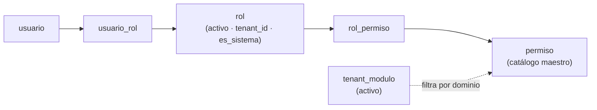
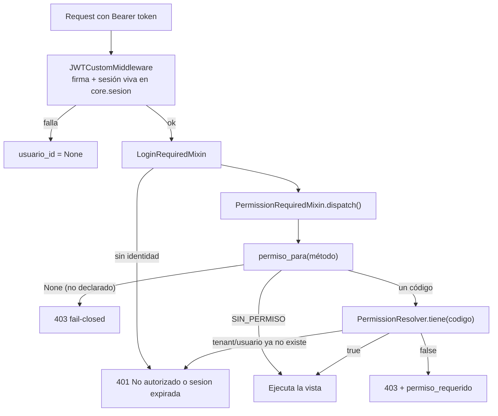
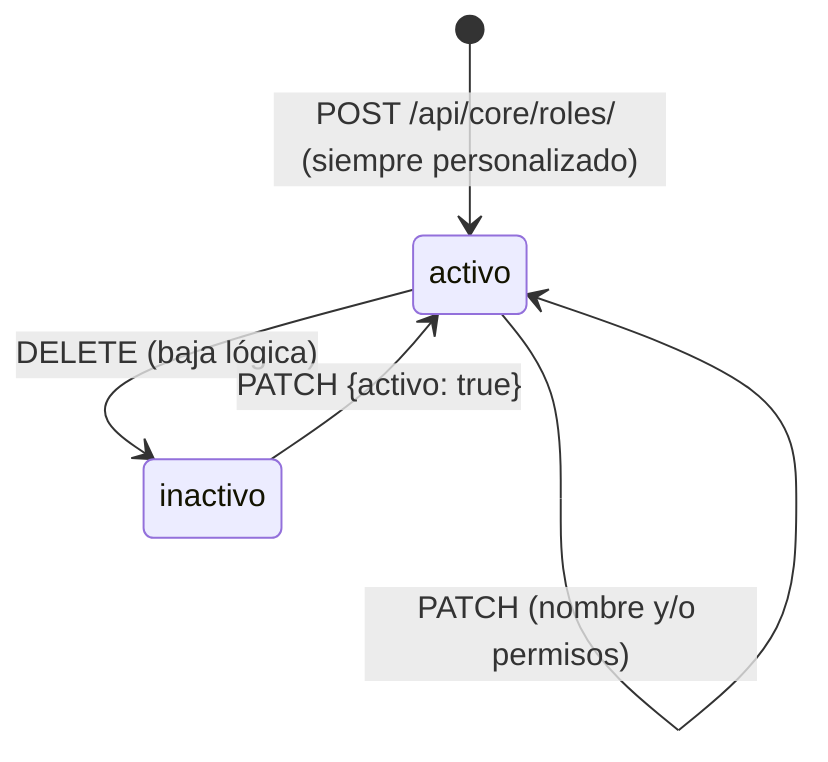

# NovaERP — Permisos y roles (RBAC), explicado

Cómo NovaERP decide, en cada petición, si el usuario puede hacer lo que pide.
Esta guía explica el **modelo completo**: cómo se resuelve un permiso, qué reglas
lo modulan, cómo se administran los roles y cuál es el catálogo real de permisos.

> Contexto: [FLUJO-TENANTS.md](./FLUJO-TENANTS.md) (de dónde sale el tenant) ·
> [FLUJO-USUARIOS.md](./FLUJO-USUARIOS.md) (alta y asignación de roles) ·
> [openapi.yaml](./openapi.yaml) (qué permiso pide cada endpoint).

---

## 1. La idea central

> **El token identifica. La base de datos autoriza.**

El JWT sólo dice *quién eres* (`sub`) y *de qué organización* (`tid`). **No lleva
ni un permiso dentro.** Cada vez que llega una petición, el conjunto de permisos se
vuelve a resolver contra la base de datos.

Esto tiene una consecuencia muy concreta y muy útil:

- Si un admin cambia los permisos de un rol, el cambio surte efecto en la
  **siguiente petición** de cualquier usuario con ese rol. Sin re-login, sin esperar
  a que caduque el token, sin invalidar sesiones.
- Y al revés: **quitar un permiso quita el acceso de inmediato**.

El coste es una consulta SQL por petición — pero sólo si el endpoint comprueba algo,
y **una sola** aunque compruebe veinte permisos: el resolutor se cachea en el propio
objeto `request`.

---

## 2. Anatomía de un permiso

```
                ventas : pedidos : crear
                  │        │        │
        dominio ──┘        │        └── acción
     (≈ el módulo)         └── recurso
```

- **`dominio`** — `core`, `ventas`, `compras`, `inventario`, `finanzas`. Salvo `core`,
  cada dominio corresponde a un **módulo** (`upper(dominio) == modulo.codigo`).
- **`recurso`** — la entidad o la vista sobre la que se opera.
- **`accion`** — `leer`, `crear`, `editar`, `eliminar`, y verbos específicos del
  negocio: `aprobar`, `cancelar`, `cerrar`, `suspender`, `revocar`, `exportar`,
  `notificar`, `autorizar`, `reset_mfa`, `ajustar_precio`, `ver_todo`.

Los permisos son **atómicos y del catálogo maestro**: no se inventan, no se
parametrizan, no admiten comodines. `core.permiso` es la única fuente.

---

## 3. Las piezas y cómo encajan



| Tabla | Qué guarda | Ámbito |
|---|---|---|
| `core.permiso` | Catálogo maestro, 74 códigos | **Global** — igual para toda la plataforma |
| `core.rol` | Roles, con `tenant_id`, `activo`, `es_sistema` | **Por tenant** |
| `core.rol_permiso` | Qué permisos tiene cada rol | Por tenant (vía el rol) |
| `core.usuario_rol` | Qué roles tiene cada usuario | Por tenant |
| `core.tenant_modulo` | Qué módulos están encendidos | Por tenant |

El catálogo es global; **el reparto es por tenant**. Dos organizaciones pueden tener
un rol con el mismo nombre y permisos completamente distintos.

---

## 4. Cómo se resuelve una petición



La vista **no escribe lógica de autorización**: sólo declara qué pide cada método.

```python
class ProductoListCreateView(CatalogListCreateView):
    permisos = {
        "GET":  "inventario:productos:leer",
        "POST": "inventario:productos:crear",
    }
```

o, si todos los métodos piden lo mismo, `permiso_requerido = "core:roles:leer"`.

Cuando el permiso depende de los **datos** y no sólo del endpoint (por ejemplo,
autorizar sólo por encima de cierto umbral), el servicio llama a
`exigir_permiso(request, "compras:ordenes:aprobar")`, que lanza un error que la
vista traduce a `403`.

---

## 5. Las seis reglas del motor

### 5.1 Unión de roles

Los privilegios de un usuario son la **unión** de los permisos de **todos** sus
roles. No hay precedencia, ni jerarquía, ni denegaciones explícitas: un permiso lo
tienes o no lo tienes. Añadir un rol **sólo puede añadir** acceso.

### 5.2 Sólo cuentan los roles activos

Un rol con `activo = false` **no concede nada**. La asignación (`usuario_rol`) se
conserva, así que reactivar el rol devuelve los permisos tal cual estaban.

> **Desviación deliberada de la ERS (RF-13/CA02).** La ERS dice que al desactivar
> un rol sus usuarios "conservan sus permisos de forma inerte y pueden seguir
> operando con normalidad". Aquí se implementa lo contrario, a propósito: seguir la
> ERS al pie de la letra dejaría a la desactivación sin ningún efecto de seguridad,
> contradiría RF-12/RN01 (un cambio de permisos debe surtir efecto en la siguiente
> petición) y violaría el principio de menor privilegio. La primera mitad de la CA02
> sí se cumple: un rol inactivo no puede asignarse a usuarios nuevos y la baja es
> reversible.

### 5.3 El bypass del TENANT_ADMIN

`TENANT_ADMIN` es un **rol de sistema** (`es_sistema = true`). No tiene ni una fila
en `rol_permiso`: se le reconoce por la bandera y **pasa todas las comprobaciones**.

Es así por diseño — es un rol protegido que *no puede* perder permisos, y sembrarle
74 filas lo haría editable por accidente. Consecuencias:

- Los roles de sistema **no se editan ni se desactivan** (→ `403`, no `422`: es una
  restricción sobre el recurso, no sobre los datos enviados).
- El bypass **no atraviesa el aislamiento multi-tenant**: la consulta ya acota los
  roles a `r.tenant_id`. Un TENANT_ADMIN lo puede todo *dentro de su organización*.
- `/api/core/me/` devuelve `es_admin: true` y, para que el frontend no se encuentre
  una lista vacía, **expande** los permisos al catálogo aplicable al tenant.

### 5.4 Filtro por módulo activo: los permisos "inertes"

Un permiso cuyo **dominio corresponde a un módulo desactivado** en el tenant **no
entra al conjunto efectivo**. Su fila en `rol_permiso` se conserva intacta: queda
*inerte*, no se borra.

El dominio **`core` está exento**: el núcleo nunca puede desactivarse, así que sus
permisos jamás quedan inertes.

Dónde se nota:

| Superficie | Comportamiento |
|---|---|
| `GET /api/core/me/` → `permisos[]` | Los inertes **no aparecen** |
| `GET /api/core/permisos/` (catálogo) | Aparecen, marcados `inerte: true` |
| `GET /api/core/roles/{id}/` | Aparecen en el rol, marcados `inerte: true` |
| Crear/editar un rol con un permiso inerte | `422` + `permisos_de_modulo_inactivo: [...]` |

Reactivar el módulo revive todos sus permisos sin tocar ningún rol.

### 5.5 Fallo cerrado

Si un método de `GET/POST/PUT/PATCH/DELETE` **no tiene permiso declarado**, la
respuesta es `403`. Olvidar una declaración **cierra** el endpoint, nunca lo abre.
(`OPTIONS` y `HEAD` quedan fuera para no romper CORS ni los health checks.)

### 5.6 Autorización por propiedad

Algunas acciones no se gobiernan por permiso de catálogo sino por **ser el dueño del
registro**. La vista devuelve el centinela `SIN_PERMISO` y el **servicio** acota qué
puede tocar el propietario:

```python
class UsuarioDetailView(PermissionRequiredMixin, View):
    permisos = {"PATCH": "core:usuarios:editar"}

    def permiso_para(self, metodo):
        if str(self.kwargs.get("pk")) == str(self.request.usuario_id):
            return SIN_PERMISO          # es su propio registro
        return super().permiso_para(metodo)
```

Saltarse el permiso **no es saltarse las reglas de negocio**: sobre sí mismo un
usuario sólo puede cambiar `nombre_completo` y `telefono`; cualquier otro campo → `422`.

Los endpoints que la ERS define para "todos los usuarios autenticados" (RF-17) no
usan este mixin: usan `LoginRequiredMixin` directamente. Son `/api/core/me/`,
`/api/core/sesiones/…` y `/api/auth/logout/`.

---

## 6. `401` frente a `403`

| Código | Significado | Qué debe hacer el frontend |
|---|---|---|
| **`401`** | No hay identidad: sin token, token inválido, **sesión revocada**, tenant suspendido, o el usuario/tenant del token ya no existe | Tratar como **fin de sesión** → volver al login |
| **`403`** | Identidad válida, **falta el permiso** | Mostrar "no autorizado". **No** cerrar sesión |

```jsonc
// 403
{ "detail": "No cuenta con permisos para esta operacion",
  "permiso_requerido": "ventas:pedidos:crear" }
```

`permiso_requerido` viene `null` cuando el endpoint no declaró permiso (fallo
cerrado). Un caso especial y deliberado: si el JWT es válido pero su usuario o
tenant ya no existen, la respuesta es `401` (sesión obsoleta), **no** `403`.

---

## 7. Administración de roles

### 7.1 Ciclo de vida



| Acción | Endpoint | Permiso |
|---|---|---|
| Catálogo de permisos (para el selector) | `GET /api/core/permisos/` | `core:roles:leer` |
| Listar roles | `GET /api/core/roles/` | `core:roles:leer` |
| Crear rol | `POST /api/core/roles/` | `core:roles:crear` |
| Editar (nombre y/o permisos) | `PATCH /api/core/roles/{id}/` | `core:roles:editar` |
| Desactivar | `DELETE /api/core/roles/{id}/` | `core:roles:eliminar` |

Reglas:

- El nombre es **único dentro del tenant** (repetible entre tenants).
- Un rol necesita **al menos un permiso** (`422` si la lista viene vacía).
- Los permisos deben existir en el catálogo maestro y **pertenecer a módulos activos**.
- Todo rol creado por API es **personalizado** (`es_sistema = false`). Los roles de
  sistema los define el aprovisionamiento del tenant.
- El conjunto de permisos se **reemplaza completo**, no se parchea: eso es lo que
  hace auditables los permisos agregados y retirados sin mantener un diff a mano.
- **Nunca hay borrado físico**: "eliminar" es desactivar. Con usuarios asignados se
  bloquea y exige confirmación explícita (`DELETE …?desactivar=true`), devolviendo
  antes un `422` con `usuarios_asignados`.

### 7.2 Lo que devuelve un rol

```jsonc
{
  "id": "…", "nombre": "Vendedor",
  "es_sistema": false,
  "activo": true,
  "acceso_total": false,        // true en un rol de sistema (autoriza por bypass)
  "usuarios_asignados": 7,
  "permisos": [ { "dominio": "ventas",
                  "permisos": [ { "codigo": "ventas:pedidos:crear", …, "inerte": false } ] } ]
}
```

`acceso_total` existe para que el frontend no pinte al TENANT_ADMIN como "un rol sin
permisos" — que es literalmente lo que dice su fila en `rol_permiso`.

---

## 8. Asignación de roles a usuarios

| Acción | Endpoint | Permiso |
|---|---|---|
| Asignar | `POST /api/core/usuarios/{id}/roles/` `{roles:[id,…]}` | `core:asignaciones:crear` |
| Revocar | `DELETE /api/core/usuarios/{id}/roles/{rolId}/` | `core:asignaciones:eliminar` |

Cuatro reglas que el frontend debería anticipar:

1. **Sólo roles activos del propio tenant.** Cualquier otro → `422`.
2. **Ningún usuario se queda sin roles.** Revocar el último → `422`.
3. **Protección del último administrador.** No se puede revocar el rol de sistema al
   único administrador activo del tenant → `422`. (Tampoco se le puede suspender.)
4. **Segregación de funciones (Auditor).** Quien tiene `core:bitacora:leer` **no
   puede** tener a la vez ningún permiso de mutación. Se evalúa sobre el conjunto
   **resultante** (roles previos + los nuevos), y sólo sobre permisos **explícitos**
   — el bypass de un rol de sistema no cuenta, porque ése es el TENANT_ADMIN, no un
   Auditor. Acciones consideradas de lectura: `leer` y `exportar`; **todas** las demás
   mutan.

Además, los triggers `core.validar_usuario_rol_minimo` son la red de seguridad a
nivel de motor para cualquier escritura que no pase por estos servicios.

---

## 9. Tres detalles que sorprenden

**`finanzas:credito:autorizar` es inerte en todos los tenants.** El módulo `FINANZAS`
es de fase 2 y **no está incluido en ningún plan**, así que nunca está activo. Como
los permisos de módulos inactivos no pueden asignarse a un rol, hoy **sólo el
TENANT_ADMIN puede autorizar una excepción de límite de crédito** (pasa por el
bypass, que no consulta el catálogo). Y como la lista de `/me` sí filtra por módulo
activo, ese código **no aparecerá en `permisos[]` ni siquiera para el admin**: el
frontend debe habilitar esa acción con `es_admin`, no buscando el código, o
simplemente manejar el `422`/`403` que llega al reintentar.

**`permisos[]` de `/me` es sólo para pintar.** La autorización real se evalúa en cada
petición. Un endpoint puede responder `403` aunque hubieras ocultado el botón — por
ejemplo si el admin cambió los permisos hace dos segundos. Maneja siempre el `403`.

**El rol de sistema no aparece en `rol_permiso`.** Si lees la base directamente, un
TENANT_ADMIN parece no tener permisos. Los tiene todos: por `es_sistema`.

---

## 10. Catálogo completo de permisos (74)

### `core` — Núcleo (17). Siempre aplicable: nunca queda inerte

| Código | Qué habilita | RF |
|---|---|---|
| `core:usuarios:leer` | Consultar el directorio de usuarios | RF-06 |
| `core:usuarios:crear` | Registrar usuario dentro del tenant | RF-05 |
| `core:usuarios:editar` | Editar usuario (cualquiera) | RF-07 |
| `core:usuarios:suspender` | Suspender / reactivar usuario | RF-08 |
| `core:usuarios:reset_mfa` | Resetear el segundo factor de un usuario | RF-07/RN07 |
| `core:roles:leer` | Consultar catálogo de roles y permisos | RF-11 |
| `core:roles:crear` | Registrar rol personalizado | RF-10 |
| `core:roles:editar` | Editar rol (modificar permisos) | RF-12 |
| `core:roles:eliminar` | Eliminar / desactivar rol | RF-13 |
| `core:asignaciones:crear` | Asignar roles a un usuario | RF-14 |
| `core:asignaciones:eliminar` | Revocar un rol de un usuario | RF-15 |
| `core:sesiones:revocar` | Forzar el cierre de sesiones de un usuario | RF-19 |
| `core:politicas:leer` | Consultar políticas de seguridad del tenant | RF-22 |
| `core:politicas:editar` | Configurar políticas de seguridad del tenant | RF-22 |
| `core:bitacora:leer` | Consultar la bitácora de auditoría | RF-21 |
| `core:bitacora:exportar` | Exportar la bitácora a archivo | RF-24 |
| `core:reportes:leer` | Generar el reporte de actividad de usuarios | RF-23 |

### `ventas` — módulo `VENTAS` (23)

| Código | Qué habilita | RF |
|---|---|---|
| `ventas:clientes:leer` | Consultar / buscar clientes | RF-27 |
| `ventas:clientes:crear` | Registrar cliente | RF-26 |
| `ventas:clientes:editar` | Editar cliente | RF-28 |
| `ventas:clientes:eliminar` | Baja lógica de cliente | RF-29 |
| `ventas:oportunidades:leer` | Consultar el pipeline | RF-31 |
| `ventas:oportunidades:crear` | Registrar oportunidad | RF-30 |
| `ventas:oportunidades:editar` | Actualizar etapa | RF-32 |
| `ventas:oportunidades:cerrar` | Cerrar (ganada / perdida) | RF-33 |
| `ventas:pipeline:ver_todo` | Ver el pipeline de **todos** los vendedores, no sólo el propio | — |
| `ventas:cotizaciones:leer` | Consultar cotizaciones | RF-35 |
| `ventas:cotizaciones:crear` | Generar cotización | RF-34 |
| `ventas:cotizaciones:editar` | Editar cotización | RF-36 |
| `ventas:cotizaciones:aprobar` | Aprobar / rechazar cotización | RF-37 |
| `ventas:cotizaciones:ajustar_precio` | Ajustar manualmente el precio de una línea | — |
| `ventas:pedidos:leer` | Consultar pedidos | RF-39 |
| `ventas:pedidos:crear` | Registrar pedido (reserva stock, valida crédito) | RF-38 |
| `ventas:pedidos:editar` | Editar pedido | RF-40 |
| `ventas:pedidos:cancelar` | Cancelar pedido | RF-41 |
| `ventas:facturas:leer` | Consultar facturas | RF-43 |
| `ventas:facturas:crear` | Generar factura de venta | RF-42 |
| `ventas:facturas:cancelar` | Cancelar factura / nota de crédito | RF-44 |
| `ventas:reportes:leer` | Consultar los reportes de ventas | RV-01..06 |
| `ventas:reportes:exportar` | Exportar los reportes a CSV/PDF | RV-01..06 |

### `compras` — módulo `COMPRAS` (14)

| Código | Qué habilita | RF |
|---|---|---|
| `compras:proveedores:leer` | Consultar proveedor e historial de compras | RF-46/51 |
| `compras:proveedores:crear` | Registrar proveedor | RF-45 |
| `compras:proveedores:editar` | Editar proveedor | RF-46 |
| `compras:proveedores:eliminar` | Dar de baja proveedor | RF-46 |
| `compras:ordenes:leer` | Consultar orden de compra | RF-48 |
| `compras:ordenes:crear` | Registrar orden de compra | RF-47 |
| `compras:ordenes:editar` | Editar orden de compra | RF-48 |
| `compras:ordenes:cancelar` | Cancelar orden de compra | RF-48 |
| `compras:ordenes:aprobar` | Aprobar una orden **por encima del umbral** | — |
| `compras:recepciones:leer` | Consultar recepciones de mercancía | RF-49 |
| `compras:recepciones:crear` | Registrar recepción (suma stock + CxP) | RF-49 |
| `compras:cuentas_por_pagar:leer` | Consultar cuentas por pagar generadas | RF-50 |
| `compras:config_aprobacion:leer` | Consultar el umbral de aprobación | RF-52 |
| `compras:config_aprobacion:editar` | Configurar el umbral de aprobación | RF-52 |

### `inventario` — módulo `INVENTARIO` (19)

| Código | Qué habilita | RF |
|---|---|---|
| `inventario:productos:leer` | Consultar catálogo de productos | RF-54 |
| `inventario:productos:crear` | Registrar producto / artículo | RF-53 |
| `inventario:productos:editar` | Editar producto | RF-55 |
| `inventario:productos:eliminar` | Dar de baja / descontinuar producto | RF-56 |
| `inventario:almacenes:leer` | Consultar almacenes | RF-57 |
| `inventario:almacenes:crear` | Registrar almacén / bodega | RF-57 |
| `inventario:almacenes:editar` | Editar almacén | RF-57 |
| `inventario:almacenes:eliminar` | Dar de baja almacén | RF-57 |
| `inventario:movimientos:leer` | Consultar movimientos | RF-58 |
| `inventario:movimientos:crear` | Registrar movimiento manual | — |
| `inventario:stock:leer` | Consultar stock actual / disponibilidad | RF-59 |
| `inventario:ajustes:leer` | Consultar ajustes de inventario | RF-60 |
| `inventario:ajustes:crear` | Registrar ajuste de inventario | RF-60 |
| `inventario:transferencias:leer` | Consultar transferencias entre almacenes | RF-61 |
| `inventario:transferencias:crear` | Registrar transferencia entre almacenes | RF-61 |
| `inventario:kardex:leer` | Consultar kardex / historial | RF-62 |
| `inventario:alertas:leer` | Consultar alertas de stock mínimo | RF-63 |
| `inventario:alertas:notificar` | Marcar alerta como notificada | RF-63 |
| `inventario:valuacion:leer` | Consultar valuación de inventario | RF-64 |

### `finanzas` — módulo `FINANZAS` (1)

| Código | Qué habilita | Nota |
|---|---|---|
| `finanzas:credito:autorizar` | Autorizar una excepción de límite de crédito al confirmar un pedido | **Inerte hoy** — ver §9 |

---

## 11. Receta: crear un rol "Vendedor"

```jsonc
// 1) El selector se arma con el catálogo, agrupado por dominio y con los inertes marcados
GET /api/core/permisos/            // requiere core:roles:leer

// 2) Crear el rol
POST /api/core/roles/              // requiere core:roles:crear
{
  "nombre": "Vendedor",
  "permisos": [
    "ventas:clientes:leer",   "ventas:clientes:crear",
    "ventas:oportunidades:leer", "ventas:oportunidades:crear", "ventas:oportunidades:editar",
    "ventas:cotizaciones:leer",  "ventas:cotizaciones:crear",
    "ventas:pedidos:leer",       "ventas:pedidos:crear",
    "inventario:stock:leer",     "inventario:productos:leer"
  ]
}

// 3) Asignarlo
POST /api/core/usuarios/{id}/roles/    // requiere core:asignaciones:crear
{ "roles": ["<rolId>"] }
```

Fíjate en que se incluyen dos permisos de `inventario`: sin ellos el vendedor no
podría consultar existencias al cotizar. Los permisos **no se heredan entre
dominios**.

---

## 12. Checklist para el frontend

- [ ] Llamar a `GET /api/core/me/` justo después del login y guardar el resultado.
- [ ] **Menú** ← `modulos[]`. **Acciones** ← `es_admin || permisos.includes(codigo)`.
- [ ] Refrescar `/me` tras operaciones sensibles (cambio de roles propio, cambio de
      plan) o periódicamente: los permisos cambian sin re-login.
- [ ] Tratar `401` como fin de sesión; `403` como "no autorizado", sin cerrar sesión.
- [ ] Mostrar `permiso_requerido` del `403` en entornos de desarrollo: acelera mucho
      el diagnóstico.
- [ ] En las pantallas de roles: no permitir editar ni desactivar donde
      `es_sistema: true`, y pintar `acceso_total: true` como "acceso completo".
- [ ] Marcar visualmente los permisos `inerte: true` en el selector, explicando que
      el módulo no está activo.
- [ ] Anticipar las reglas duras (último admin, último rol, segregación del Auditor)
      deshabilitando el control **además** de manejar el `422`.
